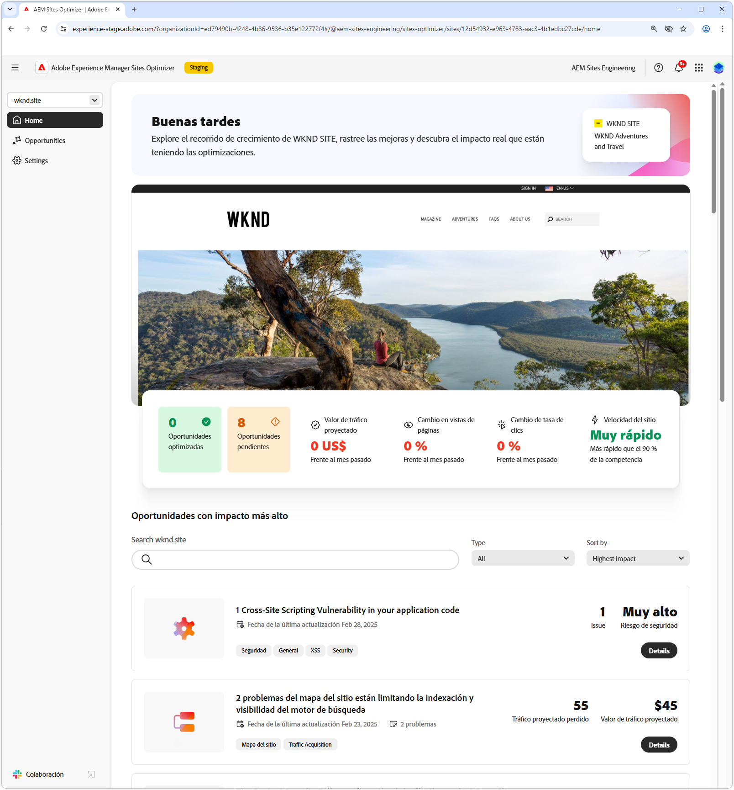
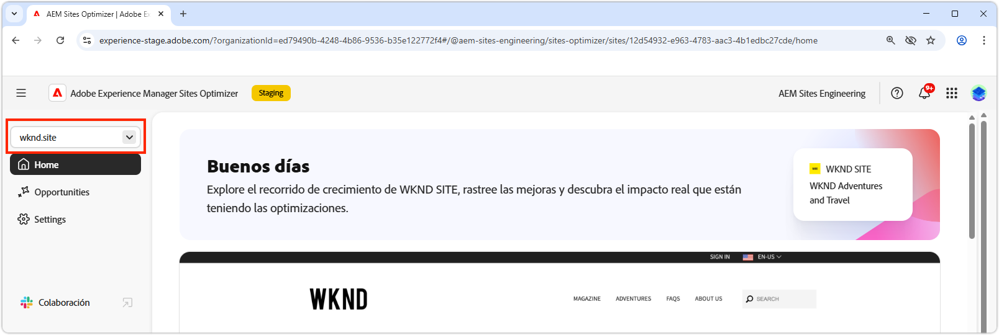
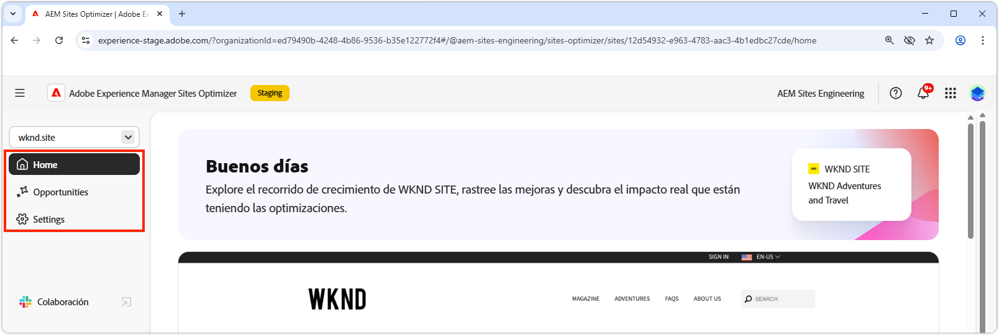
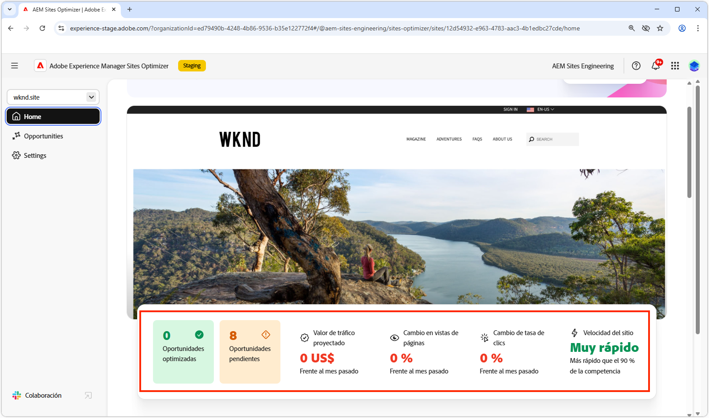
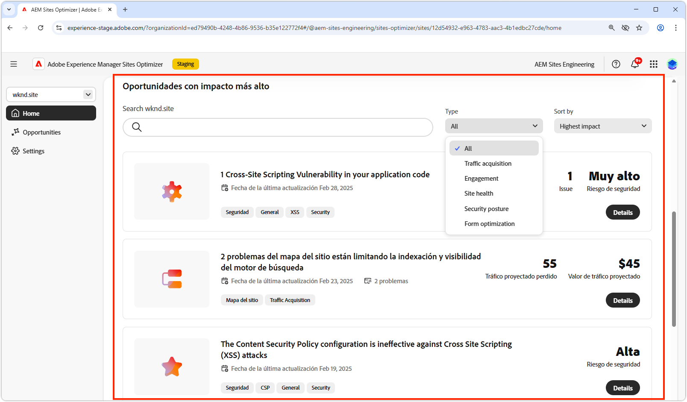
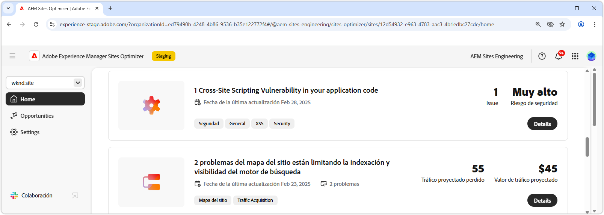

# Conceptos básicos de Sites Optimizer

{align="center"}

El panel de Sites Optimizer proporciona información general de alto nivel sobre el rendimiento de su sitio y las oportunidades de mejora.

## Administrador de dominios

{align="center"}

El menú contextual del administrador de dominios le permite elegir el sitio de AEM, por dominio, que desea evaluar y optimizar. Sites Optimizer proporciona una lista de todos los sitios de AEM de producción registrados en [Cloud Manager](https://experienceleague.adobe.com/es/docs/experience-manager-cloud-service/content/implementing/using-cloud-manager/edge-delivery-sites/add-edge-delivery-site).

## Navegación

{align="center"}

La sección Navegación proporciona acceso rápido y persistente a áreas clave de Sites Optimizer desde cualquier lugar de Sites Optimizer, como:

* **Inicio**: el panel principal, que proporciona información general de alto nivel sobre el rendimiento del sitio y las oportunidades de mejora.
* **Oportunidades**: vea y administre las oportunidades identificadas por Sites Optimizer, incluidas las que se han optimizado y las que siguen sin optimizarse.
* **Configuración** : realice la configuración de Sites Optimizer, incluidos los sitios que estás monitorizando y las notificaciones que recibe.

## Resumen del sitio

{align="center"}

La sección Resumen del sitio proporciona una instantánea del rendimiento del sitio, cómo Sites Optimizer ha mejorado el sitio con el paso del tiempo y las oportunidades de mejora. Las métricas clave incluyen:

* **Oportunidades optimizadas**: el número de oportunidades identificadas que se han mejorado para mejorar el rendimiento empresarial.
* **Oportunidades pendientes**: el número de mejoras potenciales que permanecen sin optimizar, lo que representa áreas para ganancias comerciales.
* **Valor de tráfico del proyecto**: el cambio en el valor estimado del tráfico de su sitio web en comparación con el mes pasado, lo que ayuda a medir la contribución de Site Optimizer a los objetivos comerciales.
* **Cambio en las vistas de página**: el porcentaje de cambio en la frecuencia de visualización de su sitio, que refleja el interés de los usuario y la eficacia de los contenidos.
* **Cambio de tasa de clics**: el porcentaje de cambio en la frecuencia con la que los usuarios hacen clic. lo que indica cambios en la participación y el potencial de conversión.
* **Velocidad del sitio**: un indicador clave de la velocidad y la facilidad de uso del sitio, que afecta la experiencia del usuario y las clasificaciones de búsqueda.

## Oportunidades de alto impacto

{align="center"}

La sección Oportunidades de alto impacto destaca las oportunidades pendientes más significativas para la mejora, basadas en su impacto potencial en el rendimiento del sitio. Estas oportunidades están organizadas por tipo, lo que facilita la priorización de los esfuerzos de optimización.

Filtre las oportunidades por palabras clave, etiquetas, direcciones URL o [tipo de oportunidad](../opportunity-types/overview.md) para centrarse en las áreas de mejora más esenciales.

### Detalles de la oportunidad

{align="center"}

Cada oportunidad proporciona una breve descripción del problema, su impacto potencial en su sitio y un vínculo a todos los detalles. También puede ver su estado, que indica si se ha optimizado o si aún está pendiente.

* **Título de la oportunidad**: una breve descripción del problema y su impacto potencial en el rendimiento de su sitio.
* **Última actualización**: Sites Optimizer actualizó por última vez la oportunidad con nuevos datos en esta fecha.
* **Número de problemas**: el número de instancias del problema identificadas en el sitio.
* **Tipos de oportunidad** - Los [tipos de oportunidad](../opportunity-types/overview.md) de los que forma parte esta oportunidad, como la adquisición de tráfico, la participación, la conversión o el estado del sitio.

La información de resumen de cada oportunidad varía según el tipo y puede incluir detalles sobre el impacto en los ingresos, el tráfico, la participación del usuario o las amenazas a la seguridad.

Para ver los detalles de una oportunidad, haga clic en el botón **Detalles**.

Para excluir una oportunidad del panel de Sites Optimizer y de los informes, haga clic en el botón **Ignorar**.
