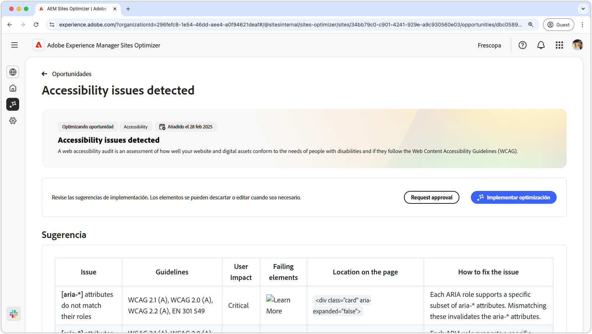
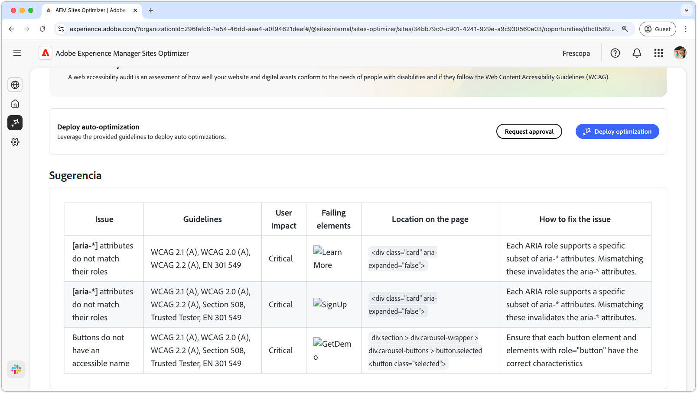
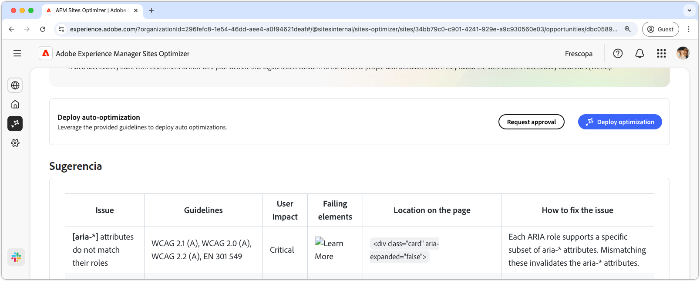

# Oportunidad de problemas de accesibilidad

{align="center"}

La oportunidad de problemas de accesibilidad identifica en qué medida su sitio web se ajusta a las necesidades de las personas con discapacidades y si siguen las [pautas de accesibilidad para el contenido web (WCAG)](https://www.w3.org/TR/WCAG21/). Al evaluar la conformidad de su sitio con WCAG, ayudará a crear una experiencia en línea integradora que permitirá a las personas con deficiencias visuales, auditivas, cognitivas y motoras navegar por su contenido, interactuar con él y beneficiarse de él. Esto no solo es esencial por razones éticas, sino que también promueve el cumplimiento de los requisitos legales, mejora la optimización de los motores de búsqueda y puede aumentar el alcance del público, mejorando tanto la experiencia del usuario como el rendimiento empresarial.

## Identificación automática

{align="center"}

La **oportunidad de problemas de accesibilidad** identifica los problemas de accesibilidad en su sitio web e incluye lo siguiente:

* **Problemas**: se ha encontrado el problema de accesibilidad específico.
* **Pautas**: el [ID de las pautas WCAG](https://www.w3.org/TR/WCAG21/) que el problema infringe.
* **Impacto en el usuario**: una evaluación del impacto en los usuarios con discapacidades.
* **Elementos con error**: los elementos HTML de la página web afectados por el problema.
* **Ubicación en la página**: el fragmento HTML del elemento en la página afectada por el problema.

## Sugerencia automática

{align="center"}

La sugerencia automática ofrece recomendaciones generadas por IA en el campo **Cómo solucionar el problema**, que proporciona instrucciones normativas sobre qué hacer para solucionar el problema.

## Optimización automática

[!BADGE Ultimate]{type=Positive tooltip="Ultimate"}

{align="center"}

Sites Optimizer Ultimate añade la posibilidad de implementar la optimización automática para las vulnerabilidades encontradas.

>[!BEGINTABS]

>[!TAB Implementar optimización]

{{auto-optimize-deploy-optimization-slack}}

>[!TAB Solicitar aprobación]

{{auto-optimize-request-approval}}

>[!ENDTABS]
