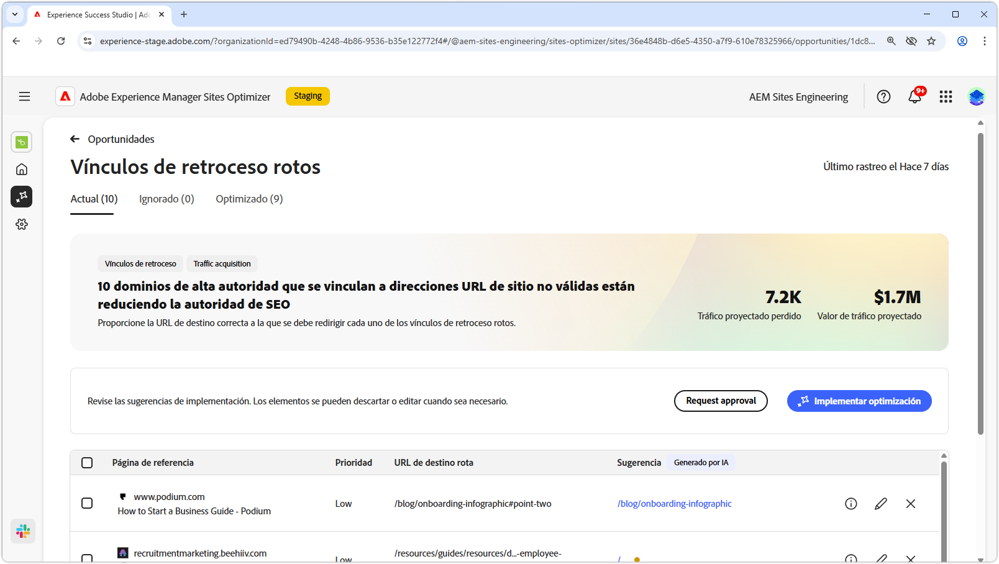
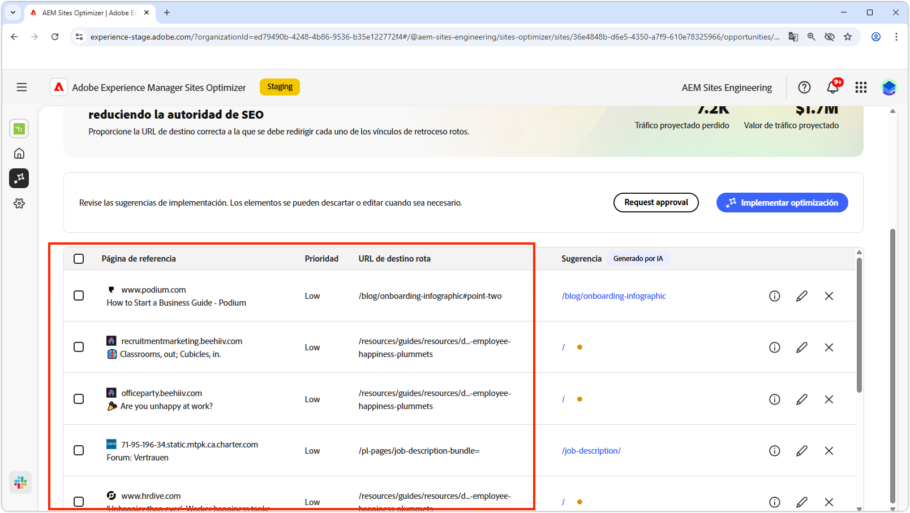
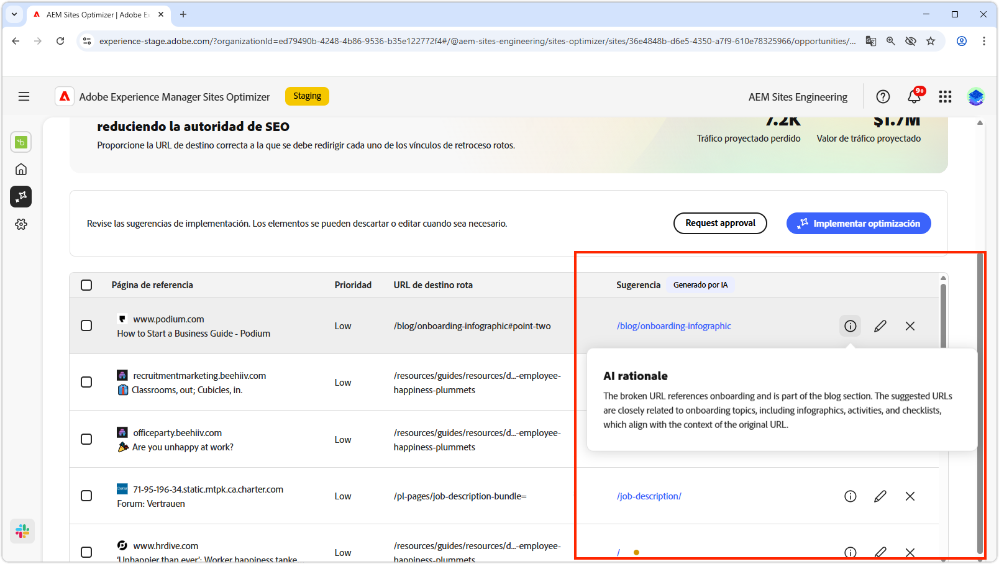
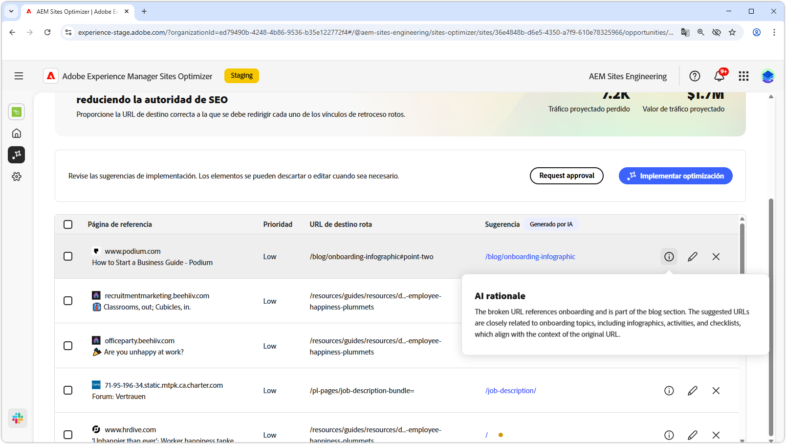
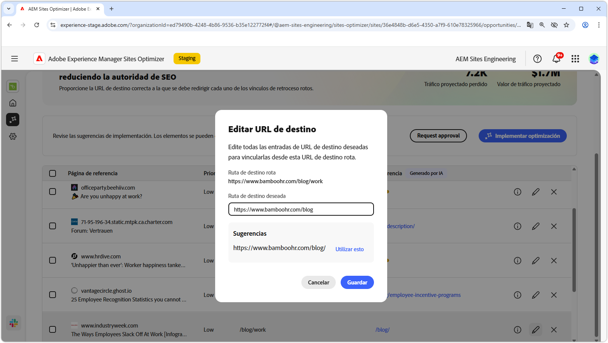
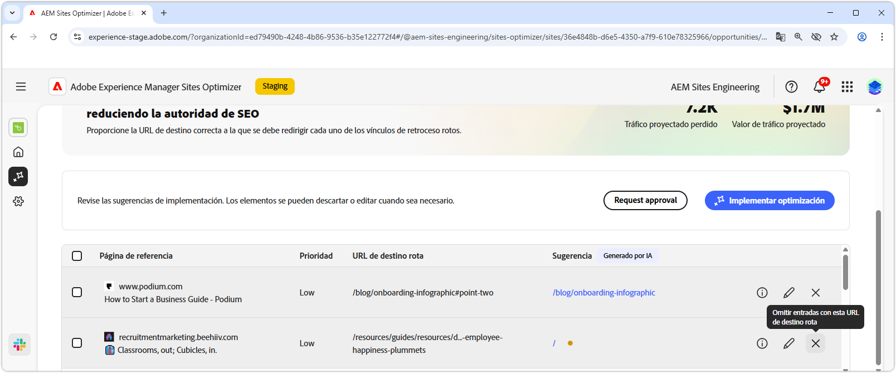
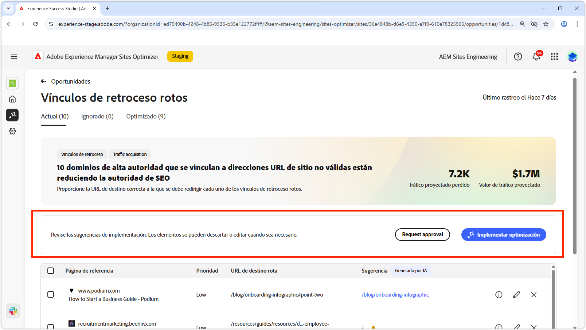
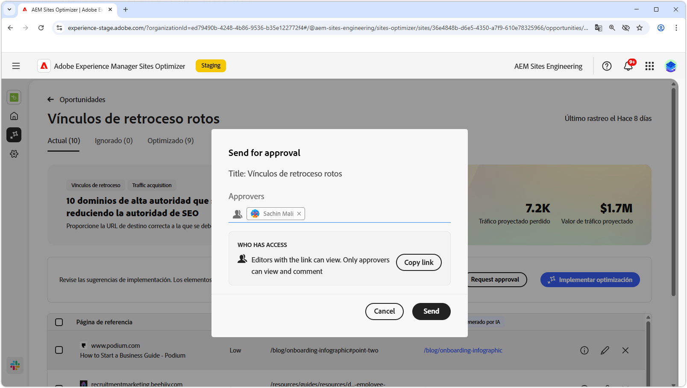

# Oportunidad de vínculos de retroceso rotos

{align="center"}

La oportunidad de vínculos de retroceso rotos identifica los vínculos de otros sitios web hasta su sitio que generan un error 404. Dado que los motores de búsqueda utilizan vínculos de retroceso para determinar la relevancia de la búsqueda, los vínculos rotos pueden afectar negativamente a la SEO y la capacidad de detección de su sitio. Estos problemas pueden deberse a factores como los cambios de URL o la eliminación de la página vinculada.

La oportunidad de vínculos de retroceso rotos muestra un resumen en la parte superior de la página, que incluye una sinopsis del problema y su impacto en el sitio y en la empresa.

* **Tráfico proyectado perdido**: la pérdida de tráfico estimada debido a vínculos de retroceso rotos.
* **Valor de tráfico proyectado**: el valor estimado del tráfico perdido.

## Identificación automática

{align="center"}

La oportunidad de vínculos de retroceso rotos enumera todos los vínculos de retroceso rotos del sitio, incluidos los siguientes elementos:

* **Página de referencia**: el dominio del sitio web que contiene el vínculo roto.
* **Prioridad**: alta, media o baja, lo que indica el impacto que tiene el vínculo roto en SEO basado en TODO.
* **URL de destino rota**: la dirección URL no existente del sitio a la que se está vinculando.

## Sugerencia automática

{align="center"}

La oportunidad de vínculos de retroceso rotos también proporciona sugerencias generadas por IA sobre a qué página del sitio web debe redirigirse la URL rota. Las sugerencias se basan en el texto que incluye la dirección URL rota y el contenido de la página sugerida.

>[!BEGINTABS]

>[!TAB Motivo de la IA]

{align="center"}

Seleccione el icono **información** para ver los motivos de IA para la URL sugerida. El motivo explica por qué la IA cree que la URL sugerida es la mejor opción para el vínculo roto. Esto puede ayudarle a comprender el proceso de toma de decisiones de la IA y a tomar una decisión fundamentada sobre si aceptar o rechazar la sugerencia.

>[!TAB Editar URL de destino]

{align="center"}

Si no está de acuerdo con la sugerencia generada por IA, puede editar la URL sugerida seleccionando el **icono de edición**. Esto le permite introducir manualmente la dirección URL que crea que es la mejor opción para el vínculo roto. Sites Optimizer también enumerará otras direcciones URL del sitio que crea que pueden ser adecuadas para el vínculo roto.

>[!TAB Ignorar entradas]

{align="center"}

Puede optar por ignorar las entradas con la URL de destino rota. Al seleccionar el **icono de ignorar**, se eliminará el vínculo de retroceso roto de la lista de oportunidades. Los vínculos de retroceso rotos ignorados se pueden volver a activar desde la pestaña **Ignorado** en la parte superior de la página de la oportunidad.

>[!ENDTABS]

## Optimización automática

[!BADGE Ultimate]{type=Positive tooltip="Ultimate"}

{align="center"}

Sites Optimizer Ultimate añade la posibilidad de implementar la optimización automática de vínculos de retroceso rotos. Al seleccionar el botón **Optimización automática**, se actualizan automáticamente las reglas de redireccionamiento del sitio de AEM para asignar la **URL de destino rota** a la **URL sugerida**. Esto garantiza que los visitantes del sitio web y los bots de búsqueda que siguen los vínculos rotos en las **páginas de referencia** se redirijan a la página correcta del sitio, lo que mejora la optimización de los motores de búsqueda y la experiencia del usuario.

>[!BEGINTABS]

>[!TAB Implementar optimización]

{align="center"}

Si se selecciona **Implementar optimización**, se actualizan las reglas de redireccionamiento del sitio de AEM para asignar la **URL de destino rota** a la **URL sugerida**. Esto garantiza que los visitantes del sitio web y los bots de búsqueda que siguen los vínculos rotos en las **páginas de referencia** se redirijan a la página correcta del sitio, lo que mejora la optimización de los motores de búsqueda y la experiencia del usuario.

>[!TAB Solicitar aprobación]

{align="center"}

{{auto-optimize-request-approval}}

>[!ENDTABS]
