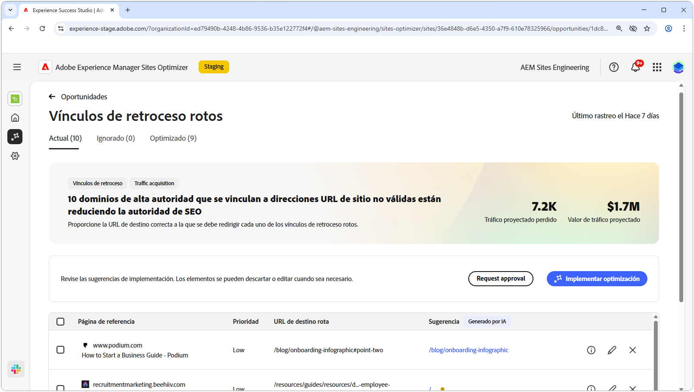
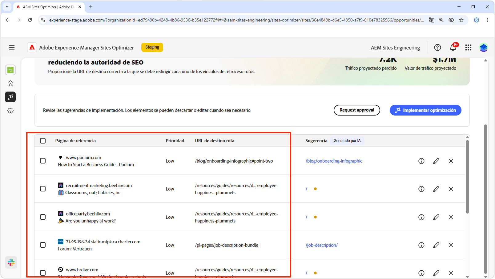
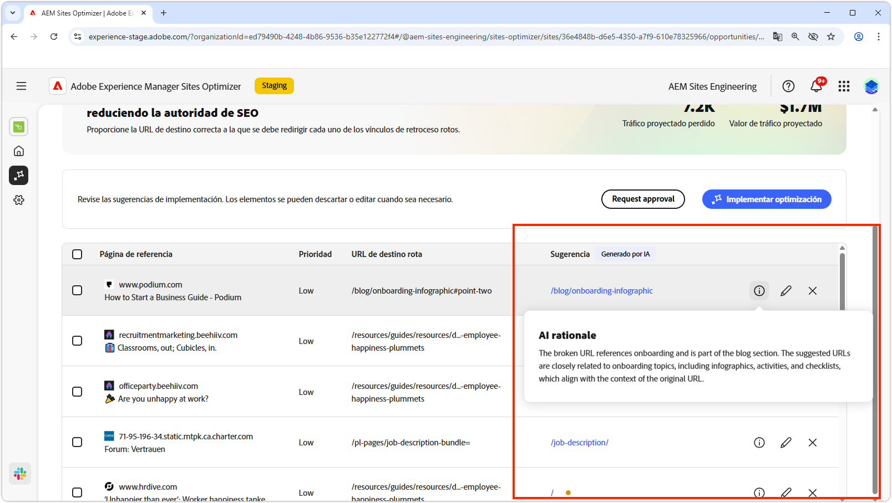
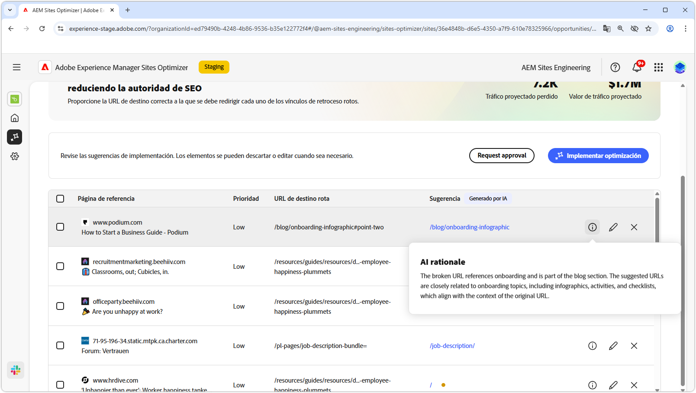
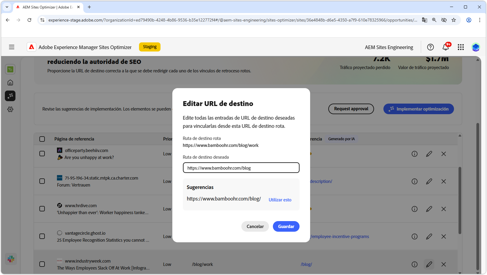
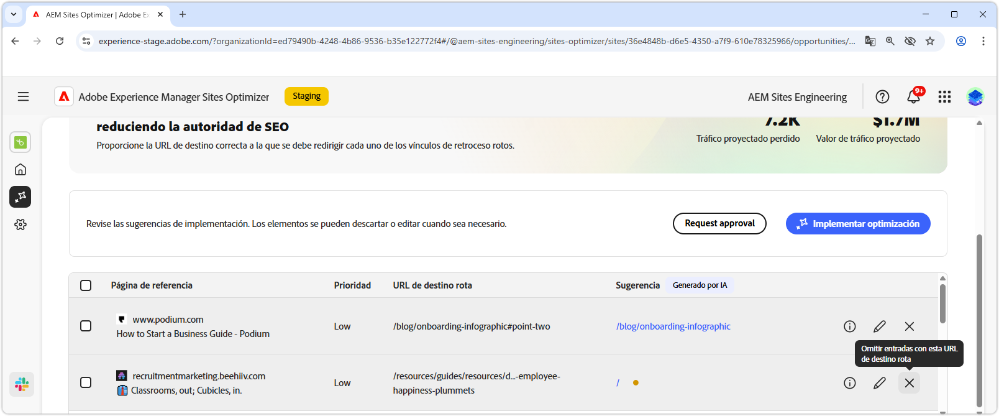

# Oportunidad de vínculos de retroceso rotos

<!--{align="center"}-->

>[!VIDEO](https://video.tv.adobe.com/v/3483250/?learn=on&enablevpops)

La oportunidad de vínculos de retroceso rotos identifica vínculos externos que apuntan a páginas inexistentes (404) del sitio. Estos vínculos provocan una pérdida del tráfico de referencia y reducen el valor del SEO, ya que los motores de búsqueda dependen de los vínculos de retroceso para evaluar la relevancia y la autoridad. Estos problemas se producen cuando se cambian las direcciones URL, se quita el contenido o las páginas ya no están disponibles sin las redirecciones adecuadas. AEM Sites Optimizer identifica todos los vínculos de retroceso rotos, ofrece recomendaciones de IA específicas y permite una implementación con un solo clic para corregirlos, todo ello en una sola vista centralizada.

## Identificación automática

<!--{align="center"}-->

AEM Sites Optimizer analiza continuamente las fuentes de datos externas para detectar los vínculos de retroceso que apuntan a páginas 404 inexistentes en el sitio. Se añaden datos de múltiples fuentes, como Google Search Console, [Operational Telemetry](https://experienceleague.adobe.com/es/docs/experience-manager-cloud-service/content/sites/operational-telemetry-for-aem-as-a-cloud-service) y plataformas de optimización de motores de búsqueda de terceros. La oportunidad de identificación automática identifica los dominios externos que se vinculan a direcciones URL rotas y los clasifica por orden de prioridad en función de su impacto, incluyendo la autoridad de dominio y las pérdidas previstas de tráfico y de valor de los vínculos.

Esta oportunidad enumera todos los problemas identificados, entre ellos la siguiente información:

* **Dominio y página de referencia**: la página o dominio externo que contiene el vínculo roto.
* **Prioridad**: alta, media o baja, lo que indica el impacto que tiene el vínculo roto en el proceso del SEO.
* **URL de destino rota**: la dirección URL no existente del sitio a la que se está vinculando.

## Sugerencia automática

<!--{align="center"}-->

Para cada vínculo de retroceso roto identificado, AEM Sites Optimizer recomienda el destino más adecuado para restaurar el tráfico y el valor del SEO. Determina la intención del vínculo de retroceso analizando lo siguiente:

* Estructura y tokens de la URL
* Texto de anclaje
* Título y contexto de la página de referencia

Esta intención se compara con el contenido existente del sitio para identificar la página de destino más relevante. Cada URL rota se asigna a una página de reemplazo exacta o a la correspondiente más cercana. Si no se puede determinar un destino adecuado, se expone el problema para su revisión manual.

>[!BEGINTABS]

>[!TAB Motivo de la IA]

<!--{align="center"}-->

Seleccione el icono **información** para ver los motivos de IA para la URL sugerida. El motivo explica por qué la IA cree que la URL sugerida es la mejor opción para el vínculo roto. Esto puede ayudarle a comprender el proceso de toma de decisiones de la IA y a tomar una decisión fundamentada sobre si aceptar o rechazar la sugerencia.

>[!TAB Editar URL de destino]

<!--{align="center"}-->

Si no está de acuerdo con la sugerencia generada por IA, puede editar la URL sugerida seleccionando el **icono de edición**. Esto le permite introducir manualmente la dirección URL que crea que es la mejor opción para el vínculo roto. Sites Optimizer también enumerará otras direcciones URL del sitio que crea que pueden ser adecuadas para el vínculo roto.

>[!TAB Ignorar entradas]

<!--{align="center"}-->

Puede elegir ignorar las entradas con las direcciones URL rotas indicadas. Al seleccionar el , se eliminará el vínculo de retroceso roto de la lista de oportunidades. Los vínculos de retroceso rotos ignorados se pueden volver a activar desde la pestaña **Ignorado** en la parte superior de la página de la oportunidad.

>[!ENDTABS]

## Optimización automática

<!--[!BADGE Ultimate]{type=Positive tooltip="Ultimate"}-->

Una vez revisadas y aprobadas las sugerencias, puede hacer clic en **Implementar optimización**. A continuación, AEM Sites Optimizer aplica las correcciones en el entorno de creación, en función de cómo se administran las redirecciones en la implementación. A continuación, el autor de AEM puede publicar los cambios desde el sistema de gestión de contenidos (CMS).

Según la configuración, las correcciones se aplican como cambios de contenido o código dentro de los flujos de trabajo de implementación existentes. El proceso de optimización incluye los siguientes pasos:

* **Validación**: garantiza que los cambios funcionen según lo previsto y no introduzcan regresiones antes de la implementación.
* **Implementación**: aplica cambios a través de procesos existentes, como actualizaciones de contenido en AEM o implementación de código a través de canalizaciones de CI/CD.
* **Comprobación de permisos**: comprueba que el usuario tiene los permisos adecuados para implementar los cambios. Si no es así, se proporcionan salidas alternativas como listas de redireccionamiento descargables o parches de código.

Este proceso garantiza que las redirecciones se implementen con precisión, se validen antes de su publicación y se ajusten a las configuraciones y los procesos de gobernanza existentes.
