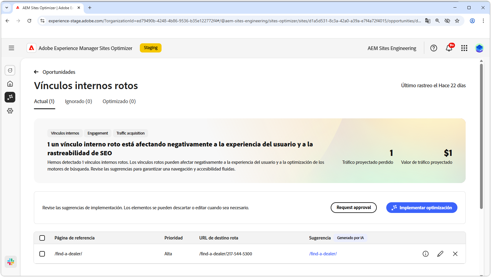
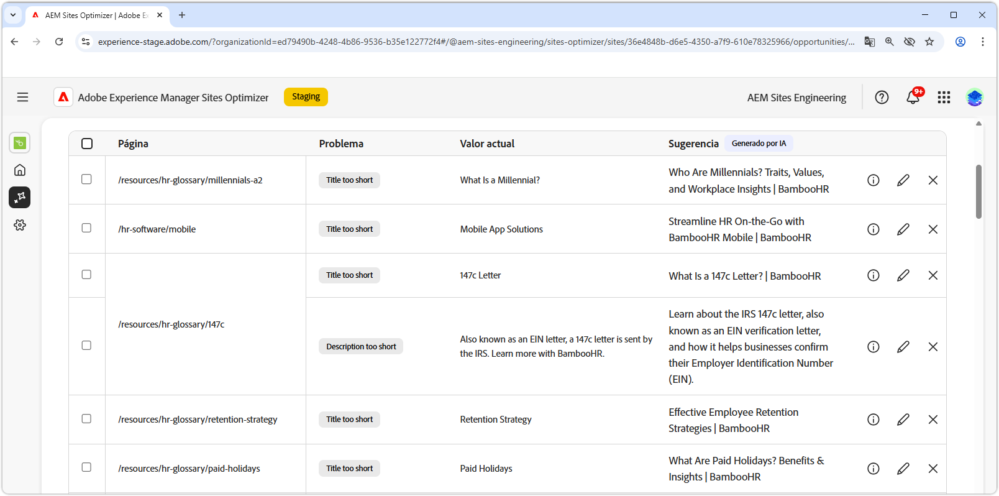

# Oportunidad de metadatos no válida o inexistente

{align="center"}

Los vínculos internos rotos afectan a la capacidad del motor de búsqueda para indexar el sitio y afectan negativamente a la experiencia del usuario y a la optimización del motor de búsqueda. Para ayudar a solucionar este problema, la oportunidad de vínculos internos rotos señala direcciones URL rotas y proporciona sugerencias para actualizaciones de vínculos válidas. Abordar estos problemas mejorará la participación del usuario y garantizará una navegación y accesibilidad fluidas.

La oportunidad de vínculos internos rotos muestra un resumen en la parte superior de la página, que incluye una sinopsis del problema y su impacto en el sitio y en la empresa.

* **Tráfico proyectado perdido** - La pérdida de tráfico estimada debido a enlaces internos rotos.
* **Valor de tráfico proyectado** - Valor estimado del tráfico perdido.

## Identificar automáticamente

<!---{align="center"}-->

La oportunidad de vínculos internos rotos identifica y enumera automáticamente todos los vínculos internos rotos de las páginas, e incluye lo siguiente:

* **Página de referencia**: la página que contiene el vínculo roto.
* **URL de destino rota**: el vínculo interno roto.
* **Sugerencia**: Una sugerencia generada por IA sobre cómo actualizar el vínculo interrumpido. Consulte la sección Sugerencia automática para obtener más información.

## Sugerir automáticamente

<!--{align="center"}-->

La oportunidad de vínculos internos rotos proporciona sugerencias generadas por IA sobre cómo actualizar los vínculos rotos. Estas sugerencias se basan en la dirección URL interrumpida de destino y proporcionan un reemplazo adecuado. Al seleccionar el **icono de información**, se proporciona una justificación generada por IA para la actualización sugerida.

>[!BEGINTABS]

>[!TAB Fundamento de IA]

<!--[AI rationale of broken internal links](./assets/broken-internal-links/auto-suggest-ai-rationale.png) -->

Seleccione el icono **information** para ver los motivos de IA para la URL sugerida. La justificación explica por qué la IA cree que la URL sugerida es la mejor opción para el vínculo roto. Esto puede ayudarle a comprender el proceso de toma de decisiones de la IA y a tomar una decisión informada sobre si aceptar o rechazar la sugerencia.

>[!TAB Editar URL de destino]

<!--{align="center"}-->

Si no está de acuerdo con la sugerencia generada por IA, puede editar el valor de vínculo sugerido seleccionando el **icono de edición**. Esto le permite introducir manualmente el vínculo deseado. La ventana de edición contiene la **Ruta de destino rota** del vínculo, la **Ruta de destino deseada** donde puede editar manualmente el vínculo y un campo con la sugerencia generada por IA. Una vez que haya terminado de editar, haga clic en **Guardar** para actualizar la entrada de vínculo interrumpido. Aparecerá un punto amarillo en el campo de entrada para indicar que el vínculo se ha editado.

>[!TAB Omitir entradas]

<!--{align="center"}-->

Puede elegir ignorar las entradas con las direcciones URL rotas objetivo. Al seleccionar el **icono de omitir**, se eliminará la entrada de la lista de oportunidades. Las entradas ignoradas se pueden volver a activar desde la ficha **Ignorado** en la parte superior de la página de la oportunidad.

>[!ENDTABS]

## Optimización automática

[!BADGE Ultimate]{type=Positive tooltip="Ultimate"}

<!---{align="center"}-->

Sites Optimizer Ultimate añade la capacidad de implementar la optimización automática para los vínculos rotos que ha encontrado la oportunidad. <!--- TBD-need more in-depth and opportunity specific information here. What does the auto-optimization do?-->

>[!BEGINTABS]

>[!TAB Implementar optimización]

{{auto-optimize-deploy-optimization-slack}}

>[!TAB Solicitar aprobación]

{{auto-optimize-request-approval}}

>[!ENDTABS]

