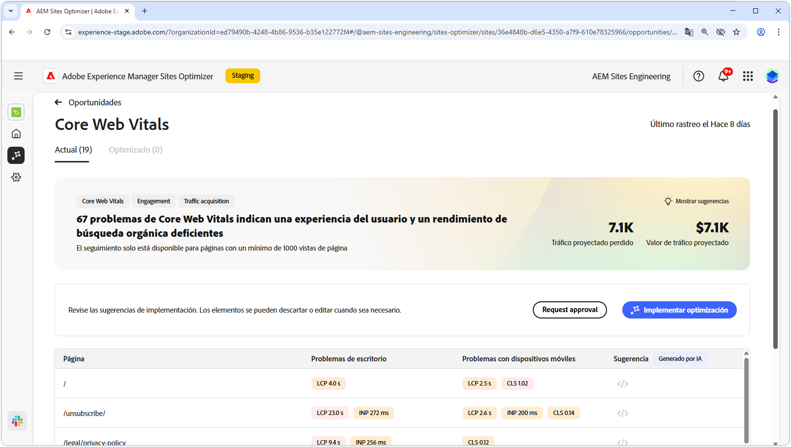
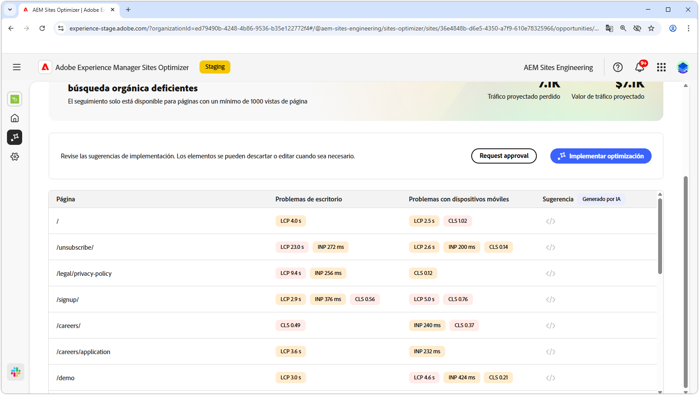
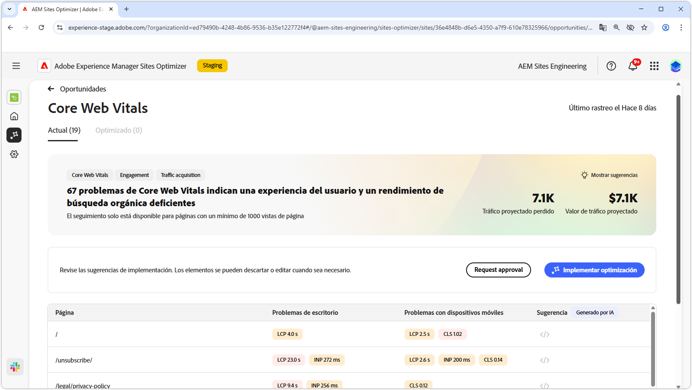

# Oportunidad de Core Web Vitals

{align="center"}

La oportunidad de Core Web Vitals identifica problemas que pueden degradar la experiencia del usuario y el rendimiento de búsqueda orgánica de sus páginas web. Estos problemas surgen de una amplia gama de factores como: fuentes personalizadas, dependencias de javascript no optimizadas, scripts de terceros, etc. La oportunidad de Web Core Vitals apunta a estos elementos defectuosos y sugiere correcciones que pueden aumentar el rendimiento de su página web. Tenga en cuenta que solo se pueden analizar las páginas que tienen al menos 1000 vistas de página.

Para empezar, la oportunidad de Core Web Vitals muestra un resumen en la parte superior de la página, incluida una sinopsis del problema y su impacto en el sitio y en la empresa.

* **Tráfico proyectado perdido**: la pérdida de tráfico estimada debido a Core Web Vitals que están por debajo de los umbrales de rendimiento.
* **Valor de tráfico proyectado**: el valor estimado del tráfico perdido.

## Identificación automática

{align="center"}

En la parte inferior de la página, tiene una lista de todos los problemas actuales agrupados como:

* **Problemas con dispositivos móviles**: una lista de problemas que afectan a la versión de dispositivo móvil de la página.
* **Problemas de escritorio**: una lista de problemas que afectan a la versión de escritorio de la página.

Cada problema se muestra en una tabla, con la columna **Página** que identifica la entrada de la página afectada.

Además, estos problemas también se agrupan por las métricas de rendimiento estándar del informe de Core Web Vitals: mayor pintura de contenido **LCP**, interacción con la siguiente pintura **INP** y desplazamiento de diseño acumulativo **CLS**.

## Sugerencia automática

{align="center"}

La oportunidad Core Web Vitals proporciona sugerencias de correcciones generadas por IA. Al hacer clic en el botón de sugerencias, aparece una nueva ventana que contiene las métricas de rendimiento **LCP**, **INP** y **CLS** como categorías. Puede cambiar entre estas categorías para ver una lista de problemas específicos.

Cada categoría puede contener varios problemas, así que asegúrese de desplazarse hacia abajo para ver la lista completa de problemas y recomendaciones.  Además, hay dos indicadores de rendimiento para dispositivos móviles y de escritorio para cada métrica.

## Optimización automática

[!BADGE Ultimate]{type=Positive tooltip="Ultimate"}

{align="center"}

Sites Optimizer Ultimate añade la posibilidad de implementar la optimización automática para los problemas encontrados por la oportunidad de Core Web Vitals. <!--- TBD-need more in-depth and opportunity specific information here. What does the auto-optimization do?-->

>[!BEGINTABS]

>[!TAB Implementar optimización]

{{auto-optimize-deploy-optimization-slack}}

>[!TAB Solicitar aprobación]

{{auto-optimize-request-approval}}

>[!ENDTABS]

