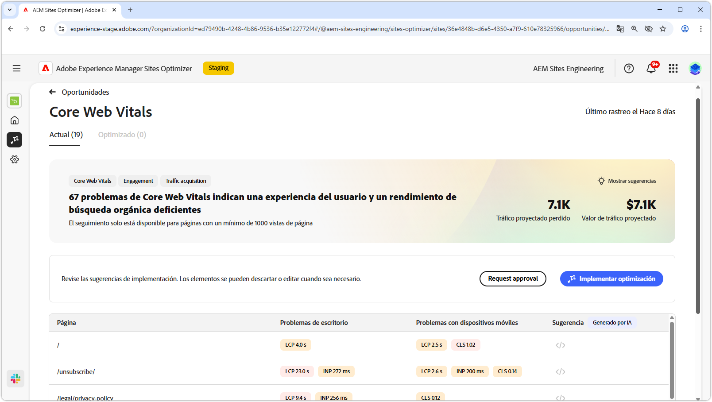
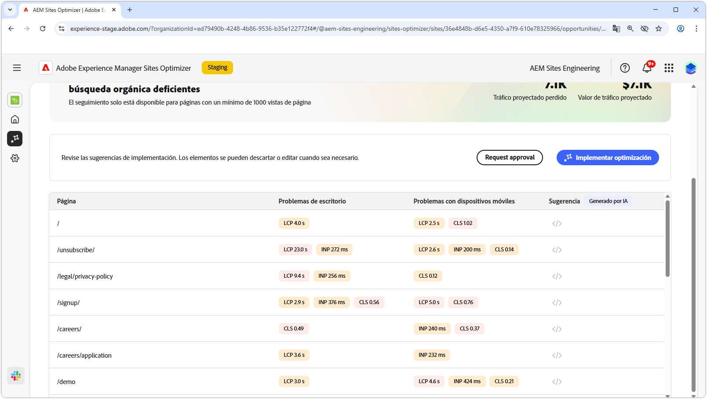
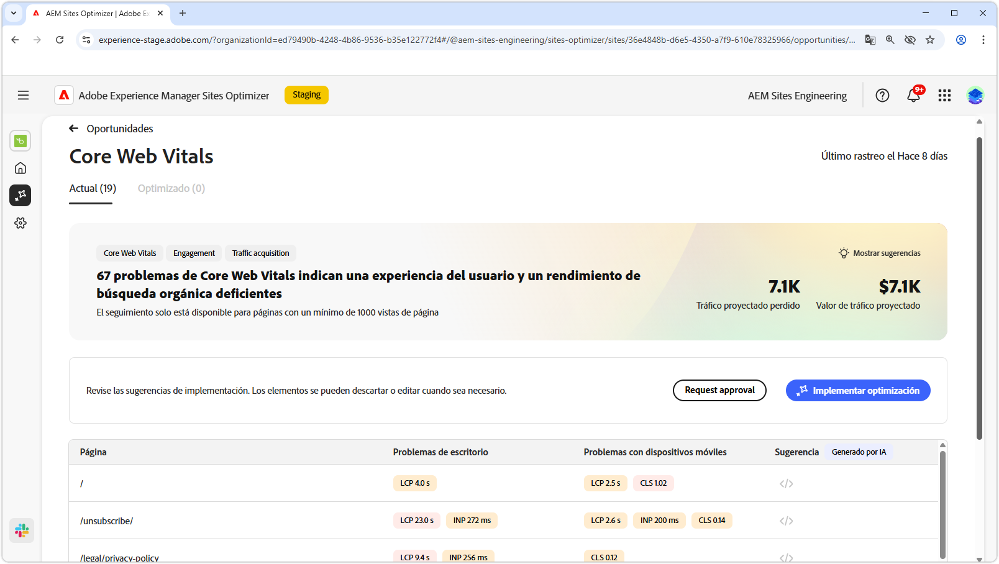

# Oportunidad de Core Web Vitals

{align="center"}

La oportunidad de Core Web Vitals identifica las páginas del sitio web que tienen un bajo rendimiento, lo que afecta a la experiencia del usuario y al rendimiento de la búsqueda orgánica. Estos problemas pueden surgir de factores como fuentes personalizadas, dependencias de JavaScript no optimizadas y scripts de terceros. Core Web Vitals mide la rapidez con la que se carga el contenido, la estabilidad del diseño de la página y la capacidad de respuesta de la página a las interacciones del usuario.

AEM Sites Optimizer detecta las páginas afectadas por estos problemas, proporciona recomendaciones de IA específicas en el nivel de código y aplica correcciones a través de los flujos de trabajo de desarrollo existentes. Tenga en cuenta que solo se pueden analizar las páginas con al menos 1000 vistas de página.

## Identificación automática

{align="center"}

AEM Sites Optimizer supervisa continuamente el rendimiento del sitio mediante [Telemetría operativa](https://experienceleague.adobe.com/en/docs/experience-manager-cloud-service/content/sites/operational-telemetry-for-aem-as-a-cloud-service) para detectar regresiones en las métricas de Core Web Vitals, como Pintado de contenido más grande (LCP), Cambio de diseño acumulativo (CLS) e Interacción con Pintado siguiente (INP). Utiliza datos de usuarios reales para identificar regresiones de rendimiento y prioriza problemas en función de su impacto en la experiencia del usuario.

AEM Sites Optimizer muestra la lista de todos los problemas actuales, detallados por dispositivos móviles y de escritorio. La columna **Página** indica la entrada de página afectada y los problemas se clasifican por LCP, INP y CLS.

## Sugerencia automática

{align="center"}

Para cada problema identificado, AEM Sites Optimizer genera recomendaciones prescriptivas a nivel de código para mejorar el rendimiento de Core Web Vitals. Evalúa la implementación subyacente accediendo al repositorio de código. Esto permite al sistema analizar cómo se implementan los componentes, los scripts y los estilos, así como identificar la causa raíz de los problemas de rendimiento. En función de este análisis, el sistema proporciona recomendaciones específicas y genera parches de código que especifican los cambios necesarios para mejorar el rendimiento. Cada recomendación se puede revisar antes de aplicarla.

Al hacer clic en el botón de sugerencia, aparece una nueva ventana que contiene las métricas de rendimiento LCP, INP y CLS como categorías. Puede cambiar entre estas categorías para ver la lista de problemas específicos. Cada categoría puede contener varios problemas, por lo que asegúrese de desplazarse hacia abajo para ver la lista completa de problemas y recomendaciones. Además, hay dos indicadores de rendimiento para móviles y equipos de escritorio para cada métrica.

## Optimización automática

[!BADGE Ultimate]{type=Positive tooltip="Ultimate"}

{align="center"}

Una vez que las recomendaciones se hayan revisado y aprobado, puede hacer clic en **Implementar optimización**. AEM Sites Optimizer genera parches de código basados en los problemas identificados y los pone a disposición a través de procesos de control de versiones. El proceso de optimización incluye los siguientes pasos:

* **Creación de problema**: crea un problema de GitHub etiquetado para cada corrección, incluida una descripción clara y una URL afectada para la visibilidad.
* **Envío de solicitud de extracción**: abre automáticamente una solicitud de extracción vinculada con la corrección de código exacta, lista para revisión, pruebas y combinación.
* **Seguimiento del estado**: Rastrea cada corrección hasta su finalización e indica los intentos parciales o fallidos de seguimiento.

Antes de que estas actualizaciones estén disponibles, AEM Sites Optimizer realiza una validación para garantizar que las correcciones solucionen el problema subyacente y no introduzcan regresiones. Todas las actualizaciones siguen las prácticas de desarrollo estándar, que requieren revisión y aprobación antes de fusionarse en producción.

Esto garantiza que las optimizaciones de rendimiento sean precisas, validadas e integradas en los procesos de desarrollo y gobernanza existentes.
