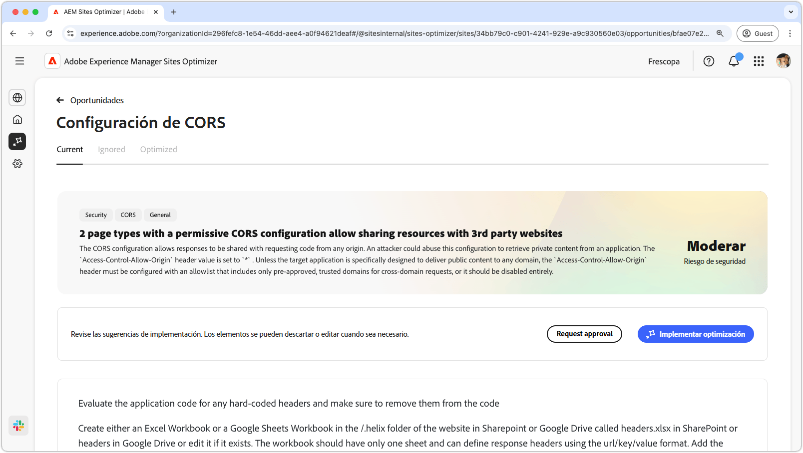
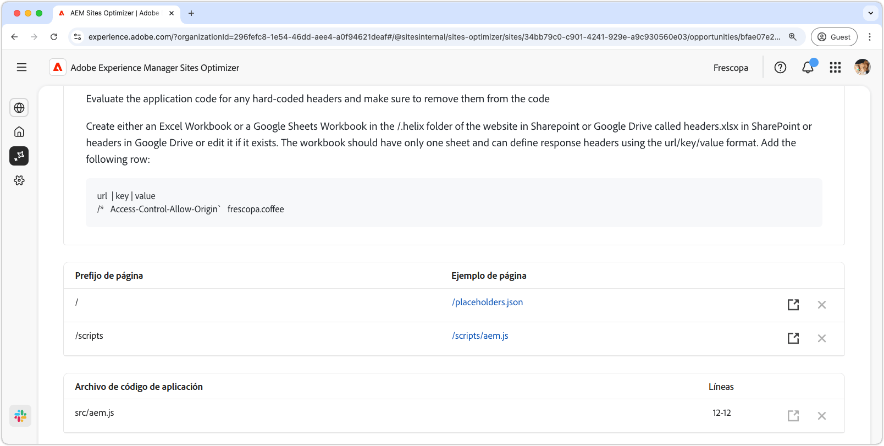
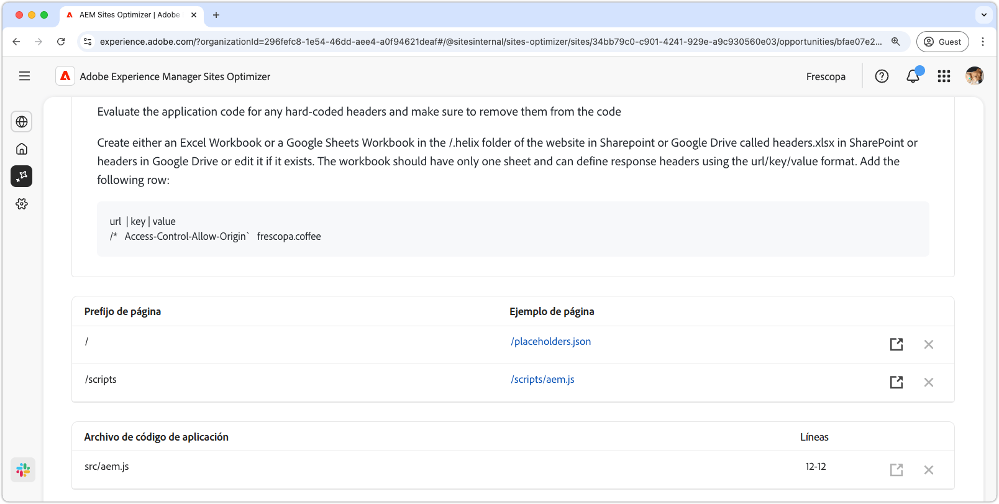

# Oportunidad de configuración de CORS

{align="center"}

Configurar correctamente CORS (Cross-Origin Resource Sharing) es esencial para proteger las aplicaciones web frente al acceso no autorizado a los datos. Cuando el encabezado `Access-Control-Allow-Origin` está establecido en `*`, cualquier dominio puede solicitar y recibir respuestas, lo que podría exponer la información confidencial a los atacantes. Esta funcionalidad presenta una oportunidad para reforzar la seguridad implementando una lista de permitidos controlada de dominios de confianza o la desactivación de CORS donde no es necesario. Garantizar una configuración de CORS segura ayuda a proteger el contenido privado y, al mismo tiempo, mantiene un acceso sin problemas para los usuarios autorizados.

## Identificación automática

{align="center"}

La identificación automática analiza su sitio web en busca de configuraciones incorrectas de CORS y detecta las direcciones URL que son susceptibles de acceso no autorizado. Estas direcciones URL se enumeran en la tabla de arriba, junto con los siguientes detalles:

* **Prefijo de página**: el prefijo de ruta de URL que es vulnerable ante una configuración incorrecta de CORS.
* **Ejemplo de página**: Un ejemplo de URL susceptible de acceso no autorizado.

## Sugerencia automática

{align="center"}

La sugerencia automática proporciona **Archivos de código de aplicación** y sus **Líneas** que se revisarán y que pueden estar configurando políticas CORS laxas.

## Optimización automática

[!BADGE Ultimate]{type=Positive tooltip="Ultimate"}

>[!BEGINTABS]

>[!TAB Implementar optimización]

{{auto-optimize-deploy-optimization-slack}}

>[!TAB Solicitar aprobación]

{{auto-optimize-request-approval}}

>[!ENDTABS]
