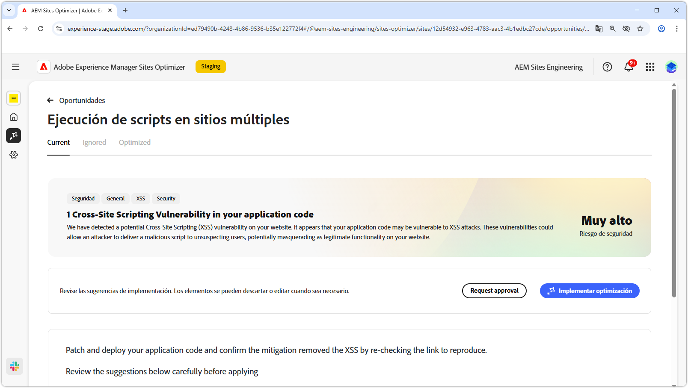
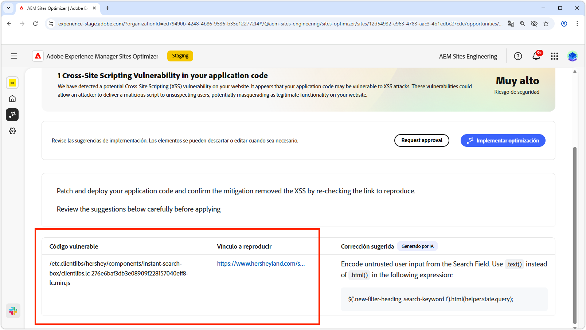
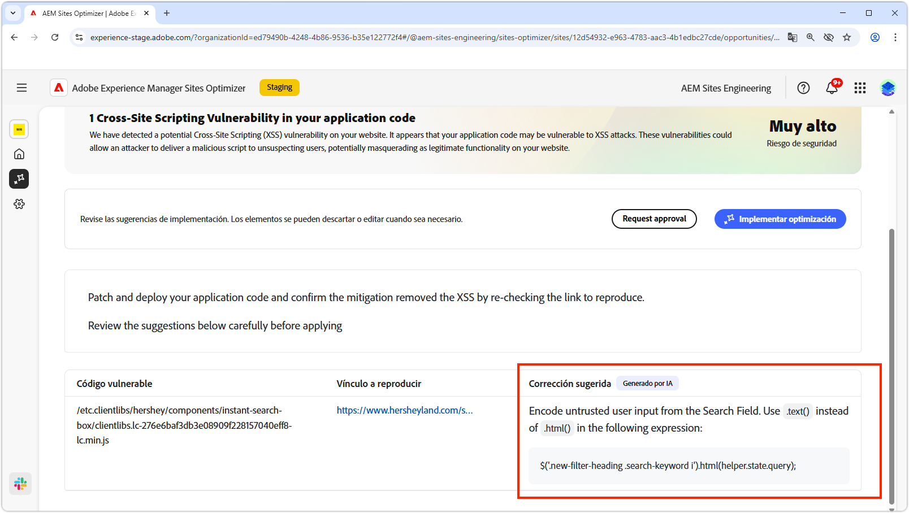

# Oportunidad de ejecución de scripts en sitios múltiples

{align="center"}

La oportunidad de ejecución de scripts en sitios múltiples identifica y corrige las vulnerabilidades del código del sitio que los atacantes podrían aprovechar para insertar scripts maliciosos en páginas web que otros usuarios veían. Estos scripts pueden robar información confidencial, como las cookies de sesión, o realizar acciones en nombre del usuario, como cambiar su contraseña.

## Identificar automáticamente

{align="center"}

* **Código vulnerable**: cualquier código que sea vulnerable a ataques de scripts entre sitios.
* **Vínculo para reproducir**: el vínculo a la página donde se encontró la vulnerabilidad.

## Sugerir automáticamente

{align="center"}

* **Corrección sugerida**: Una sugerencia generada por IA sobre cómo corregir la vulnerabilidad.

## Optimización automática

[!BADGE Ultimate]{type=Positive tooltip="Ultimate"}

>[!BEGINTABS]

>[!TAB Implementar optimización]

{{auto-optimize-deploy-optimization-slack}}

>[!TAB Solicitar aprobación]

{{auto-optimize-request-approval}}

>[!ENDTABS]
