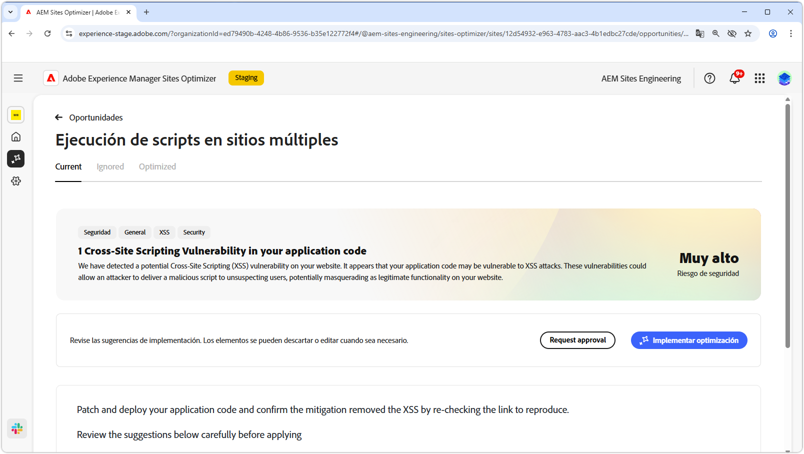
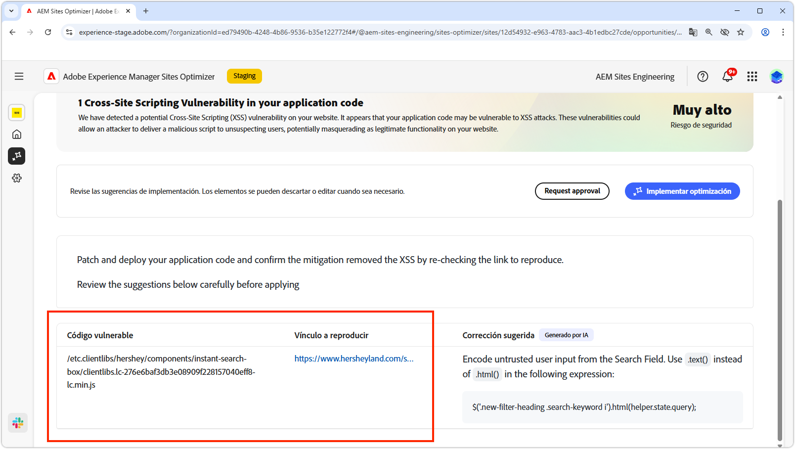
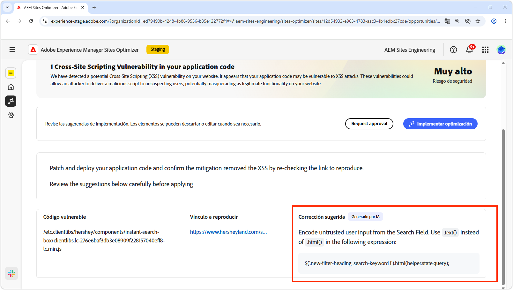

# Oportunidad de ejecución de scripts en sitios múltiples

{align="center"}

La oportunidad para la ejecución de scripts en sitios múltiples identifica las vulnerabilidades en el código del sitio. A continuación, soluciona problemas que los atacantes podrían aprovechar para insertar secuencias de comandos malintencionadas en las páginas web que ven otros usuarios. Estos scripts pueden robar información confidencial, como las cookies de sesión, o realizar acciones en nombre del usuario, como cambiar su contraseña.

## Identificación automática

{align="center"}

* **Código vulnerable**: cualquier código que sea vulnerable a ataques de ejecución de scripts en sitios múltiples.
* **Vínculo para reproducir**: el vínculo a la página donde se encontró la vulnerabilidad.

## Sugerencia automática

{align="center"}

* **Corrección sugerida**: una sugerencia generada por la IA sobre cómo corregir la vulnerabilidad.

## Optimización automática

[!BADGE Ultimate]{type=Positive tooltip="Ultimate"}

>[!BEGINTABS]

>[!TAB Implementar optimización]

{{auto-optimize-deploy-optimization-slack}}

>[!TAB Solicitar aprobación]

{{auto-optimize-request-approval}}

>[!ENDTABS]
