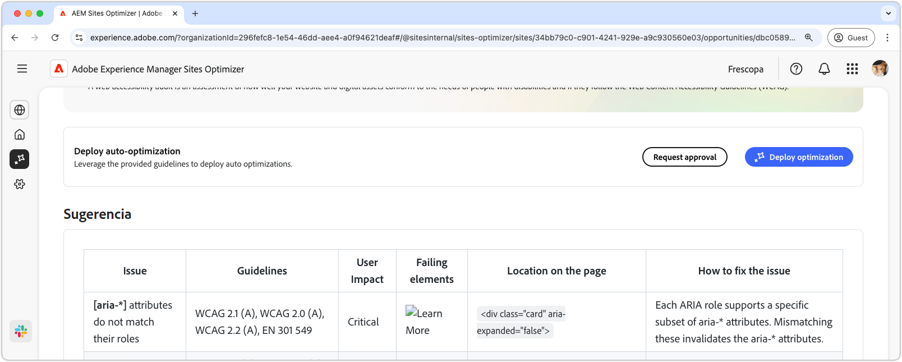

# Oportunidad de problemas de accesibilidad de formularios

 La funcionalidad Optimización de formularios está disponible en un programa de acceso anticipado. Puede escribir a aem-forms-ea@adobe.com desde su ID de correo electrónico oficial para unirse al programa de acceso anticipado y solicitar acceso a esta funcionalidad. 

{align="center"}

La oportunidad de problemas de accesibilidad identifica en qué medida su sitio web se ajusta a las necesidades de las personas con discapacidades y si siguen las [pautas de accesibilidad para el contenido web (WCAG)](https://www.w3.org/TR/WCAG21/). Al evaluar la conformidad de sus formularios con WCAG, contribuye a crear una experiencia de formularios inclusiva. Al hacerlo, las personas con problemas de visión, auditivos, cognitivos y motores pueden navegar, interactuar con los formularios y completarlos correctamente. No solo es esencial por motivos éticos, sino que también promueve el cumplimiento de los requisitos legales. También mejora las tasas de finalización de formularios y puede aumentar el alcance del público, lo que mejora tanto la experiencia del usuario como el rendimiento empresarial.

## Identificación automática

{align="center"}

La **oportunidad de problemas de accesibilidad de formularios** identifica los problemas de accesibilidad específicamente en sus formularios e incluye lo siguiente:

* **Problemas**: el problema de accesibilidad específico encontrado en sus formularios.
* **Criterios WCAG**: el [ID de las pautas WCAG](https://www.w3.org/TR/WCAG21/) que el problema del formulario infringe.
* **Nivel**: los [niveles de conformidad](https://www.w3.org/WAI/WCAG21/Understanding/conformance#levels) del problema.
* **Recomendación**: instrucciones específicas sobre cómo corregir el problema de accesibilidad en los formularios, incluidos ejemplos de código y prácticas recomendadas.
* **HTML origen**: el fragmento HTML del elemento del formulario en la página afectada por el problema.

## Sugerencia automática

{align="center"}

La sugerencia automática ofrece recomendaciones generadas por IA en el campo **Sugerencias** que proporcionan orientación normativa sobre qué hacer para solucionar el problema.

<!-- 

## Auto-optimize

[!BADGE Ultimate]{type=Positive tooltip="Ultimate"}

{align="center"}

Sites Optimizer Ultimate adds the ability to deploy auto-optimization for the form accessibility issues found.

>[!BEGINTABS]

>[!TAB Deploy optimization]

{{auto-optimize-deploy-optimization-slack}}

>[!TAB Request approval]

{{auto-optimize-request-approval}}

>[!ENDTABS]
-->

