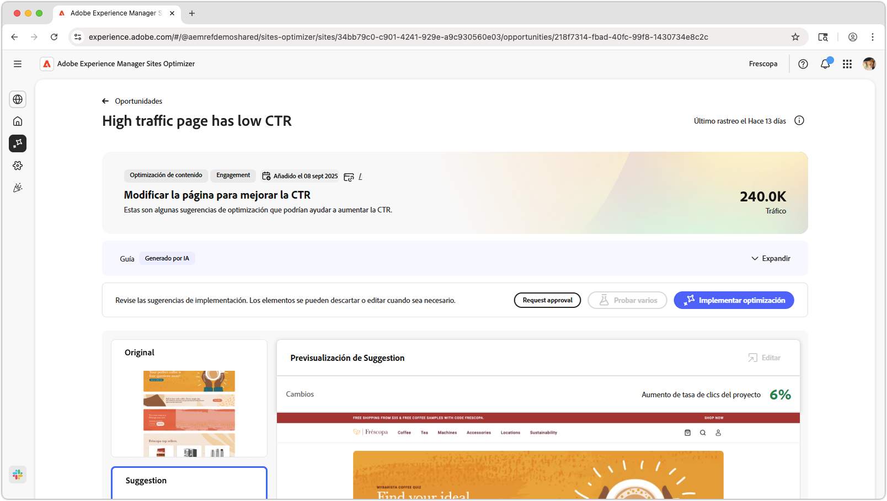
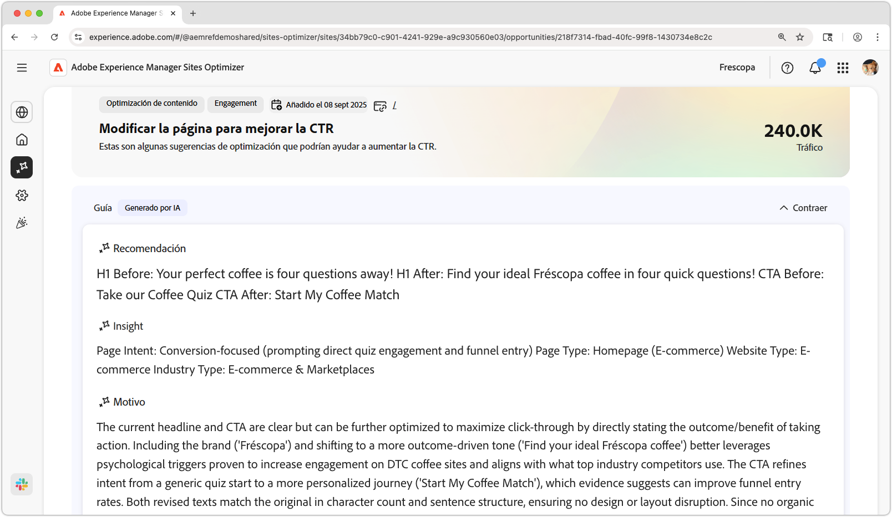
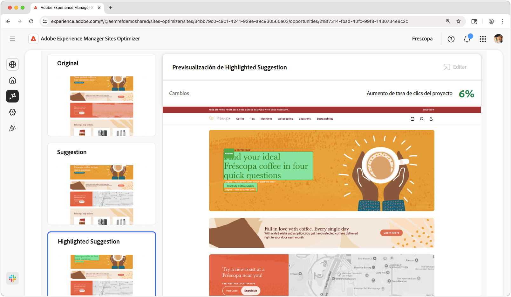
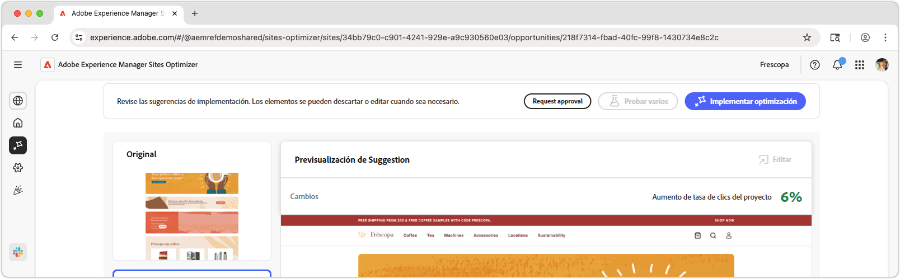

# La página de alto tráfico tiene una oportunidad de CTR baja

{align="center"}

La página de alto tráfico tiene una oportunidad de CTR baja que identifica las páginas del sitio web que reciben una cantidad significativa de tráfico, pero que tienen una tasa de clics baja (CTR). Al analizar estas páginas, puede descubrir posibles problemas que podrían estar dificultando la participación del usuario y tomar medidas para mejorar su rendimiento. Esta oportunidad es esencial para optimizar el contenido y el diseño de su sitio web, lo que a la larga conduce a tasas de conversión más altas y a mejores experiencias de usuario.

## Identificación automática

{align="center"}

La **página de alto tráfico tiene una oportunidad de CTR baja** identifica las páginas de alto tráfico con CTR bajo en su sitio web e incluye lo siguiente:

* **Recomendación**: acción sugerida para mejorar el CTR de la página.
* **Insight**: explicación de por qué la página tiene un CTR bajo.
* **Motivo**: el motivo de la recomendación.

## Sugerencia automática

{align="center"}

La sugerencia automática proporciona una sugerencia generada por IA sobre el aspecto que podría tener una experiencia web optimizada. Las sugerencias incluyen una vista **resaltada**, lo que facilita ver qué cambios se sugieren.

Se pueden seleccionar sugerencias para verlas en vista completa, su impacto proyectado sobre el CTR y la capacidad de editarlas antes de aplicarlas a la página.

## Optimización automática

[!BADGE Ultimate]{type=Positive tooltip="Ultimate"}

{align="center"}

Sites Optimizer Ultimate añade la capacidad de implementar la optimización automática para la optimización sugerida.

>[!BEGINTABS]

>[!TAB Implementar optimización]

{{auto-optimize-deploy-optimization-slack}}

>[!TAB Solicitar aprobación]

{{auto-optimize-request-approval}}

>[!ENDTABS]
