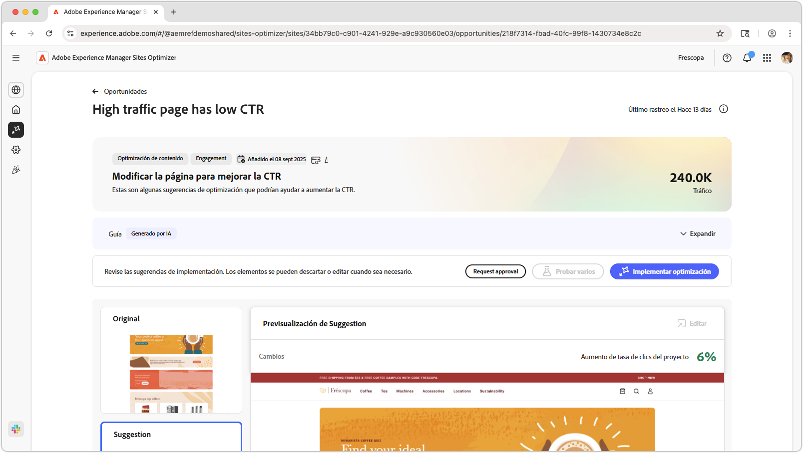
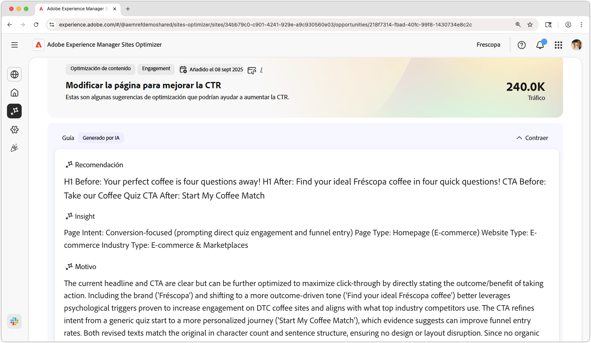
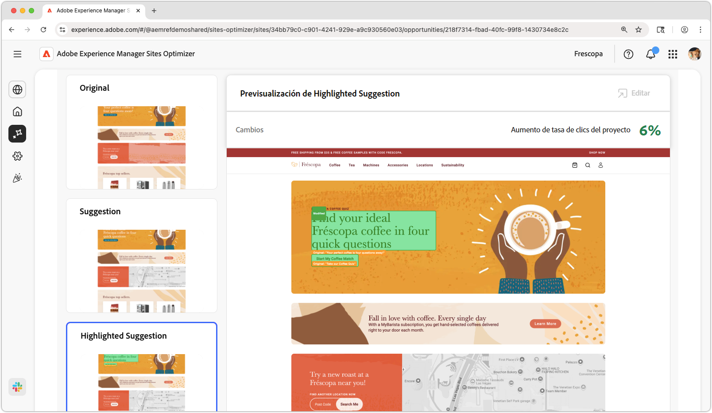
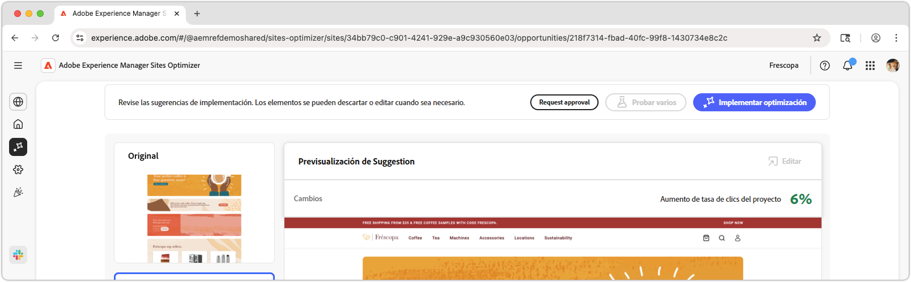

# La página de tráfico elevado tiene una oportunidad de CTR baja

{align="center"}

La página de tráfico alto tiene una oportunidad de CTR baja que identifica las páginas del sitio web que reciben una cantidad significativa de tráfico, pero que tienen una tasa de clics baja (CTR). Al analizar estas páginas, puede descubrir posibles problemas que podrían estar dificultando la participación del usuario y tomar medidas para mejorar su rendimiento. Esta oportunidad es esencial para optimizar el contenido y el diseño de su sitio web, lo que a la larga se traduce en tasas de conversión más altas y en mejores experiencias de usuario.

## Identificación automática

{align="center"}

La **página de tráfico elevado tiene oportunidad de CTR bajo** identifica las páginas de tráfico elevado con CTR bajo en su sitio web, e incluye lo siguiente:

* **Recomendación**: acción sugerida para mejorar la CTR de la página.
* **Datos**: explicación de por qué la página tiene una CTR baja.
* **Motivo**: el motivo de la recomendación.

## Sugerencia automática

{align="center"}

La sugerencia automática ofrece una sugerencia generada por IA sobre el aspecto que podría tener una experiencia web optimizada. Las sugerencias incluyen una vista con elementos **resaltados** para facilitar ver qué cambios se sugieren.

Se pueden seleccionar sugerencias para verlas en vista completa, su impacto estimado en la CTR y la capacidad de editarlas antes de aplicarlas a la página.

## Optimización automática

[!BADGE Ultimate]{type=Positive tooltip="Ultimate"}

{align="center"}

Sites Optimizer Ultimate brinda la posibilidad de implementar la optimización automática de las sugerencias.

>[!BEGINTABS]

>[!TAB Implementar optimización]

{{auto-optimize-deploy-optimization-slack}}

>[!TAB Solicitar aprobación]

{{auto-optimize-request-approval}}

>[!ENDTABS]
