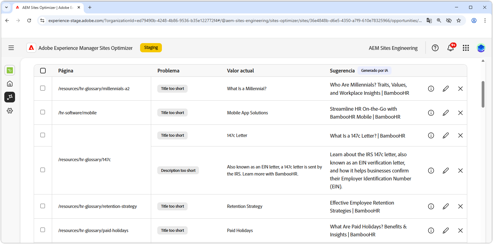

# Oportunidad de metadatos que faltan o no son válidos

{align="center"}

La oportunidad de metadatos no válidos o que faltan identifica los metadatos que faltan o son defectuosos en las páginas web. Corregir los problemas de metadatos impulsa la optimización de los motores de búsqueda, al mejorar la visibilidad de los contenidos, las clasificaciones en las búsquedas y la participación de los usuarios. Estos problemas pueden surgir de factores como etiquetas que faltan o no son válidas, descripciones demasiado largas o demasiado cortas, etc.

La oportunidad de metadatos no válidos o que faltan muestra un resumen en la parte superior de la página, que incluye una sinopsis del problema y su impacto en el sitio y en la empresa.

* **Tráfico proyectado perdido**: la pérdida de tráfico estimada debido a metadatos erróneos.
* **Valor de tráfico proyectado**: el valor estimado del tráfico perdido.

## Identificación automática

{align="center"}

La oportunidad de metadatos no válidos o que faltan enumera todos los metadatos erróneos de sus páginas e incluye lo siguiente:

* **Página**: la página que contiene los metadatos que faltan o no son válidos.
* **Problema**: indica el tipo de problema que afecta a la etiqueta de metadatos. Estos problemas pueden variar desde títulos que faltan hasta H1 duplicados, etc.
* **Valor**: el valor actual de la etiqueta de metadatos que debe cambiarse.
* **Sugerencia**: una sugerencia generada por la IA para actualizaciones de etiquetas adecuadas. Consulte la siguiente sección para obtener más información.

## Sugerencia automática

{align="center"}

La oportunidad de metadatos no válidos o que faltan también proporciona sugerencias generadas por la IA sobre cómo cambiar o actualizar las etiquetas de los metadatos. Estas sugerencias se basan en la etiqueta inicial que comprendía los metadatos erróneos y el contenido de la actualización sugerida.

>[!BEGINTABS]

>[!TAB Motivo de la IA]

Seleccionar  proporciona la razón de IA para la actualización sugerida.

>[!TAB Editar valor de metadatos sugerido]

{align="center"}

Si no está de acuerdo con la sugerencia generada por IA, puede editar el valor de metadatos sugerido seleccionando . Esta capacidad le permite introducir manualmente el valor que crea que es el más adecuado para los metadatos.  La ventana de edición contiene lo siguiente:

* **Ruta de acceso**: la ruta de acceso a la página que contiene los metadatos (o la falta de).
* **Descripción del problema**: indica el tipo de problema que afecta a la etiqueta de metadatos y una breve descripción.
* **Sugerencia para el valor de etiqueta**: sugerencia generada por la IA sobre cómo cambiar o actualizar la etiqueta de los metadatos. Por ejemplo, cuántos caracteres debe contener la actualización de la etiqueta, etc.
* **Contenido de la etiqueta original**: el valor de la etiqueta original.
* **Valor de etiqueta de destino**: edite este campo y añada manualmente el valor de etiqueta deseado. Al seleccionar **Guardar**, el valor se aplica a la actualización propuesta.
* **Sugerencia**: la sugerencia generada por la IA sobre cómo cambiar el valor.
* **Guardar**: guarda y aplica el valor en el campo **Valor de etiqueta de destino**.

>[!TAB Ignorar entradas]

Puede elegir ignorar las entradas con los metadatos rotos o no válidos de destino. Si selecciona , se eliminará la entrada de la lista de oportunidades. Las entradas ignoradas se pueden volver a activar desde la pestaña **Ignorado** en la parte superior de la página de la oportunidad.

>[!ENDTABS]

## Optimización automática

[!BADGE Ultimate]{type=Positive tooltip="Ultimate"}

{align="center"}

Sites Optimizer Ultimate añade la posibilidad de implementar la optimización automática para los problemas encontrados por la oportunidad de metadatos no válidos o que faltan. <!--- TBD-need more in-depth and opportunity specific information here. What does the auto-optimization do?-->

>[!BEGINTABS]

>[!TAB Implementar optimización]

{{auto-optimize-deploy-optimization-slack}}

>[!TAB Solicitar aprobación]

{{auto-optimize-request-approval}}

>[!ENDTABS]
