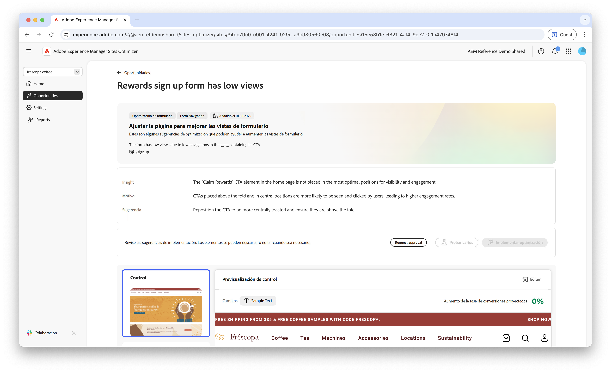
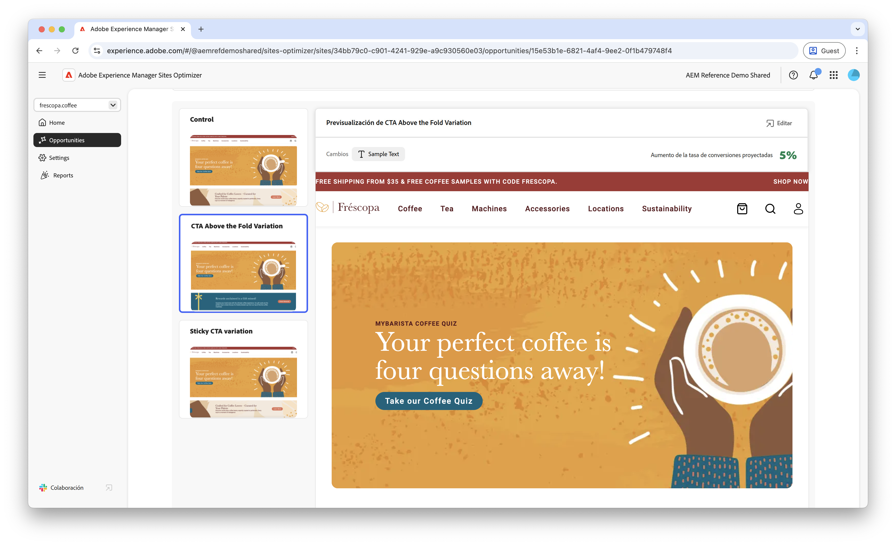
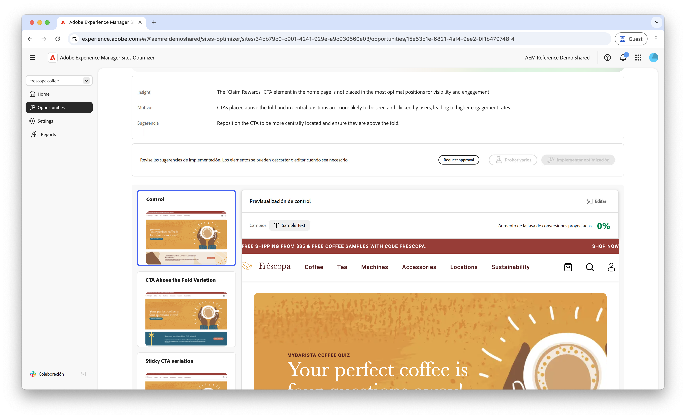

# Oportunidad de baja navegación de Forms

: la capacidad de Forms Optimizer está disponible en el programa de acceso anticipado. Puede escribir a aem-forms-ea@adobe.com desde su ID de correo electrónico oficial para unirse al programa de acceso anticipado y solicitar acceso a la capacidad. 

{align="center"}

La oportunidad de navegación baja identifica los formularios del sitio web que tienen tasas de navegación bajas. Este tipo de oportunidad le ayuda a comprender a qué formularios no están descubriendo los usuarios ni a qué usuarios no están accediendo, y le ofrece sugerencias sobre cómo mejorar su capacidad de detección.

## Identificación automática

{align="center"}

Cada página web con formularios con poca navegación aparece como su propia oportunidad **Navegación baja**. En la parte superior de la página de la oportunidad se muestra un breve resumen de la oportunidad y el motivo.

## Sugerencia automática

La sugerencia automática proporciona variaciones de formularios generadas por IA y diseñadas para aumentar la navegación a los formularios. Cada variación muestra el **aumento previsto de la tasa de conversión** en función de su potencial para mejorar la accesibilidad y la detección de formularios, lo que le ayuda a priorizar las sugerencias más efectivas.

>[!BEGINTABS]

>[!TAB Variación de control]

{align="center"}

La variación de control son los formularios originales que están activos actualmente en el sitio web. Esta variación se utiliza como línea de base para comparar el rendimiento de las variaciones sugeridas.

>[!TAB Variaciones sugeridas]

{align="center"}

Las variaciones sugeridas son variaciones de formularios generadas por IA y diseñadas para aumentar la navegación a los formularios. Cada variación muestra el **aumento previsto de la tasa de conversión** en función de su potencial para mejorar la accesibilidad y la detección de formularios, lo que le ayuda a priorizar las sugerencias más efectivas.

Haga clic en cada variación para previsualizarla en el lado derecho de la pantalla. En la parte superior de la vista previa, están disponibles las siguientes acciones e información:

* **Cambios**: un breve resumen de los cambios en esta variación respecto a la variación de **Control**.
* **Aumento previsto de la tasa de conversión**: el aumento estimado de la participación en los formularios si se implementa esta variación.
* **Editar**: haga clic para editar la variación en la creación de AEM.

>[!ENDTABS]

<!-- 

## Auto-optimize

[!BADGE Ultimate]{type=Positive tooltip="Ultimate"}

{align="center"}

Sites Optimizer Ultimate adds the ability to deploy auto-optimization for the issues found by the low navigation opportunity.

>[!BEGINTABS]

>[!TAB Test multiple]

>[!TAB Publish selected]

{{auto-optimize-deploy-optimization-slack}}

>[!TAB Request approval]

{{auto-optimize-request-approval}}

>[!ENDTABS]

-->
