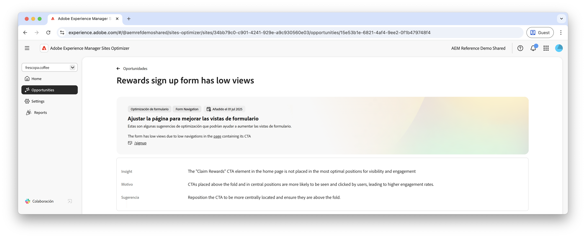
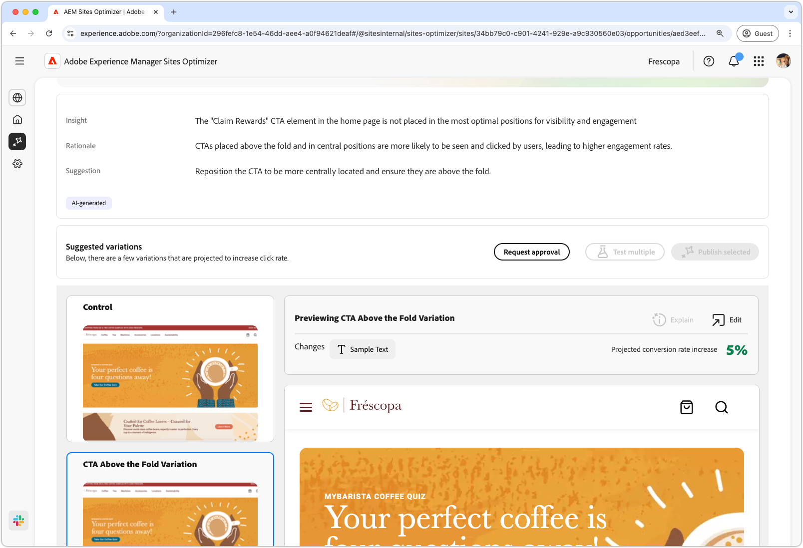

# Oportunidad de visualizaciones bajas

{align="center"}

La oportunidad de visualizaciones bajas identifica los formularios del sitio web que tienen pocas visualizaciones Esta oportunidad le ayuda a comprender qué formularios no funcionan bien y le ofrece sugerencias sobre cómo mejorar sus tasas de participación. Al optimizar las visualizaciones de los formularios, puede aumentar el número de envíos de formularios y mejorar el rendimiento general del sitio web.

## Identificación automática

{align="center"}

Cada página web con un formulario con visualizaciones bajas se enumera como su propia oportunidad de **Visualizaciones bajas**. En la parte superior de la página de la oportunidad se muestra un breve resumen de la oportunidad y el motivo de la IA.

## Sugerencia automática

{align="center"}

La sugerencia automática proporciona variaciones de páginas web generadas por IA y diseñadas para aumentar las visualizaciones de los formularios. Cada variación muestra el **aumento en la tasa de conversión del proyecto** en función de su potencial para mejorar la participación del formulario, lo que le ayuda a priorizar las sugerencias más efectivas.

>[!BEGINTABS]

>[!TAB Variación de control]

{align="center"}

La variación de control es el formulario original que se encuentra activo en el sitio web. Esta variación se utiliza como línea de base para comparar el rendimiento de las variaciones sugeridas.

>[!TAB Variaciones sugeridas]

{align="center"}

Las variaciones sugeridas son variaciones de páginas web generadas por IA y diseñadas para aumentar las visualizaciones de los formularios. Cada variación muestra el **aumento proyectado de la tasa de conversión** en función de su potencial para mejorar la participación del formulario, lo que le ayuda a priorizar las sugerencias más efectivas.

Haga clic en cada variación para previsualizarla en el lado derecho de la pantalla. En la parte superior de la vista previa, están disponibles las siguientes acciones e información:

* **Cambios**: un breve resumen de los cambios en esta variación respecto a la variación de **Control**.
* **Aumento de tasa de conversión proyectada**: el aumento estimado en la participación del formulario si se implementa esta variación.
* **Editar**: haga clic para editar la variación en la creación de AEM.

>[!ENDTABS]

## Optimización automática

[!BADGE Ultimate]{type=Positive tooltip="Ultimate"}

{align="center"}

Sites Optimizer Ultimate incorpora la posibilidad de implementar la optimización automática para los problemas encontrados por la oportunidad de visualizaciones bajas.

>[!BEGINTABS]

>[!TAB Probar varios]

>[!TAB Publicar seleccionado]

{{auto-optimize-deploy-optimization-slack}}

>[!TAB Solicitar aprobación]

{{auto-optimize-request-approval}}

>[!ENDTABS]
