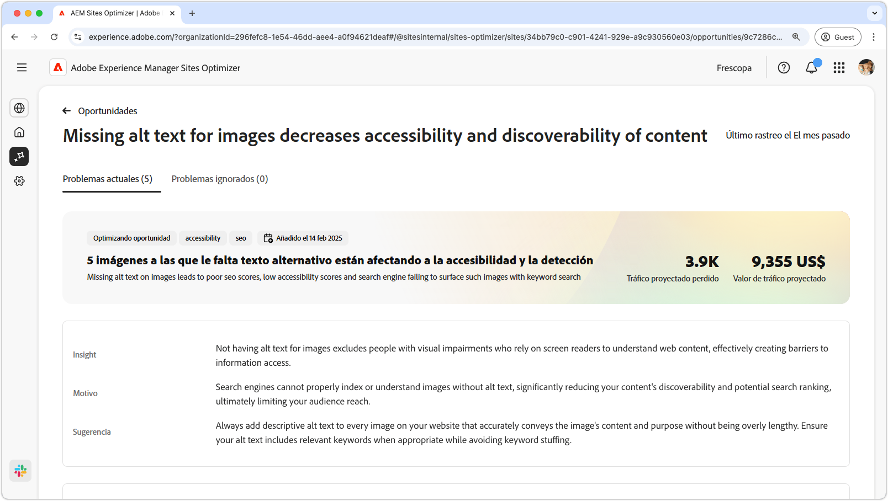
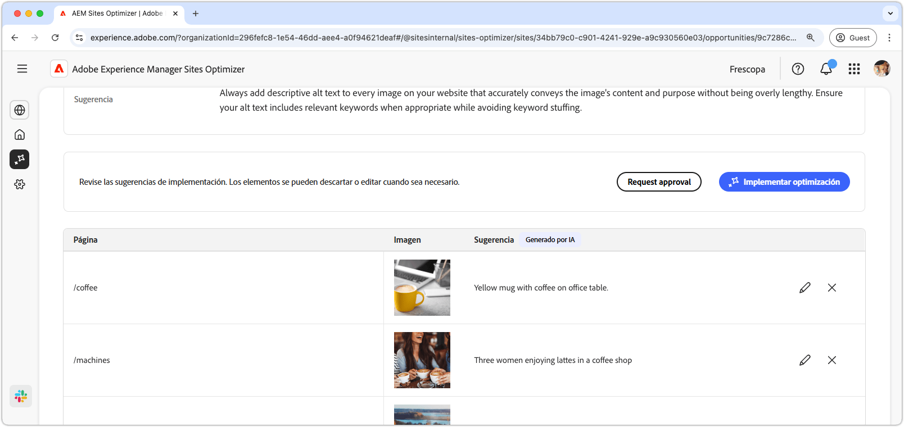
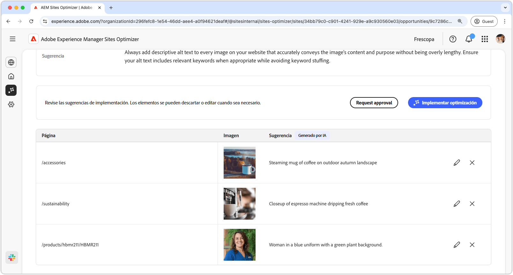
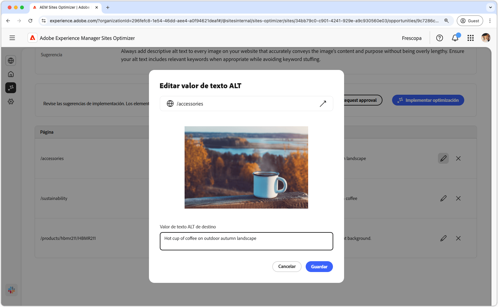
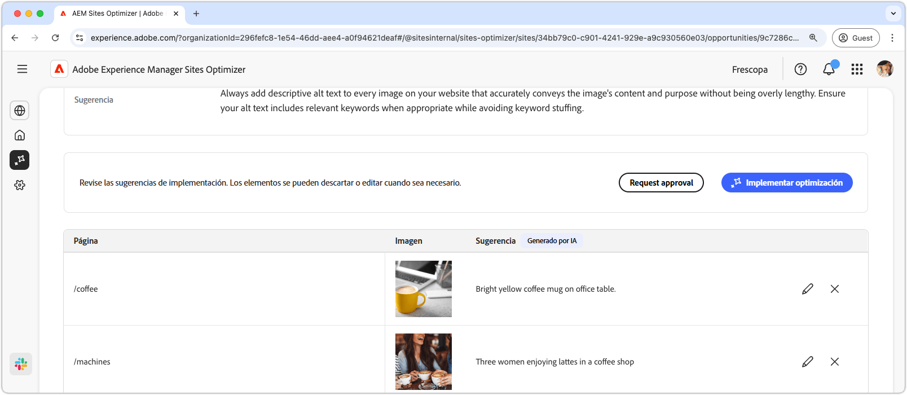

# Falta la oportunidad de texto alternativo

{align="center"}

La oportunidad de texto alternativo que falta identifica las imágenes sin texto alternativo descriptivo en el sitio web. Los motores de búsqueda no pueden indexar o comprender correctamente las imágenes sin texto alternativo, lo que reduce considerablemente la capacidad de detección del contenido y la clasificación de búsqueda potencial, lo que a la larga limita el alcance de la audiencia. Además, al no tener texto alternativo para las imágenes, se excluye a las personas con deficiencias visuales que dependen de los lectores de pantalla para comprender el contenido web, lo que crea barreras para el acceso a la información.

La oportunidad de texto alternativo que falta muestra un resumen en la parte superior de la página, incluida una sinopsis del problema y su impacto en el sitio y en la empresa.

* **Tráfico proyectado perdido** - La pérdida de tráfico estimada debido a la falta de texto alternativo.
* **Valor de tráfico proyectado** - Valor estimado del tráfico perdido.

También hay un campo adicional que muestra la justificación, la perspectiva y las sugerencias relacionadas con la oportunidad.

## Identificar automáticamente

{align="center"}

La oportunidad de texto alternativo que falta enumera todas las imágenes del sitio web a las que les falta texto alternativo. Esta sección contiene las siguientes categorías:

* **Página**: ruta a la página que contiene el texto alternativo que falta.
* **Imagen**: en la imagen falta el texto alternativo descriptivo.
* **Sugerencia**: una sugerencia generada por IA para el texto alternativo.

## Sugerir automáticamente

{align="center"}

La sugerencia automática proporciona sugerencias generadas por IA para el texto alternativo de las imágenes. Las sugerencias generadas por IA están diseñadas para ayudarle a agregar texto alternativo rápidamente a las imágenes sin tener que analizar manualmente cada imagen.

>[!BEGINTABS]

>[!TAB Editar el texto alternativo que falta]

{align="center"}

Si no está de acuerdo con la sugerencia generada por IA, puede editar el texto alternativo sugerido seleccionando el **icono de edición**. Esto le permite ajustar manualmente el texto que crea que es el mejor ajuste para la imagen. La ventana de edición contiene lo siguiente:

* **Ruta de página**: campo de solo lectura que muestra la ruta a la página donde se produce el problema de texto alternativo que falta. Haga clic en la flecha situada junto a la ruta para abrir la página correspondiente.
* **Imagen**: vista previa de solo lectura de la imagen que requiere texto alternativo.
* **Texto ALT de destino**: campo editable en el que puede escribir manualmente un texto alternativo descriptivo para la imagen. Asegúrese de que el texto alternativo transmita claramente el contenido y el propósito de la imagen de forma concisa. Cuando sea relevante, incluya palabras clave de forma natural sin sobrecargarlas.

>[!TAB Omitir entradas]

Puede elegir ignorar las entradas de la lista de oportunidades. Si se selecciona el **icono de omitir**, se eliminará la entrada de la lista. Las entradas ignoradas se pueden volver a activar desde la ficha **Ignorado** en la parte superior de la página de la oportunidad.

>[!ENDTABS]

## Optimización automática

[!BADGE Ultimate]{type=Positive tooltip="Ultimate"}

{align="center"}

Sites Optimizer Ultimate agrega la capacidad de implementar la optimización automática para los problemas que encuentra la oportunidad de texto alternativo que falta. <!--- TBD-need more in-depth and opportunity specific information here. What does the auto-optimization do?-->

>[!BEGINTABS]

>[!TAB Implementar optimización]

{{auto-optimize-deploy-optimization-slack}}

>[!TAB Solicitar aprobación]

{{auto-optimize-request-approval}}

>[!ENDTABS]
