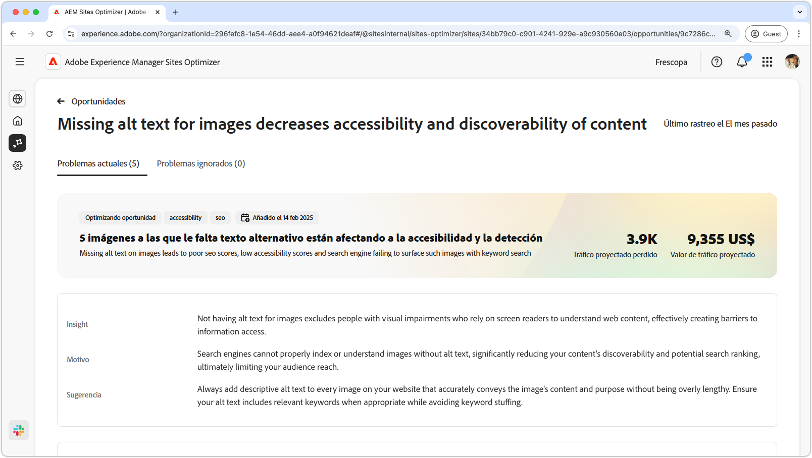
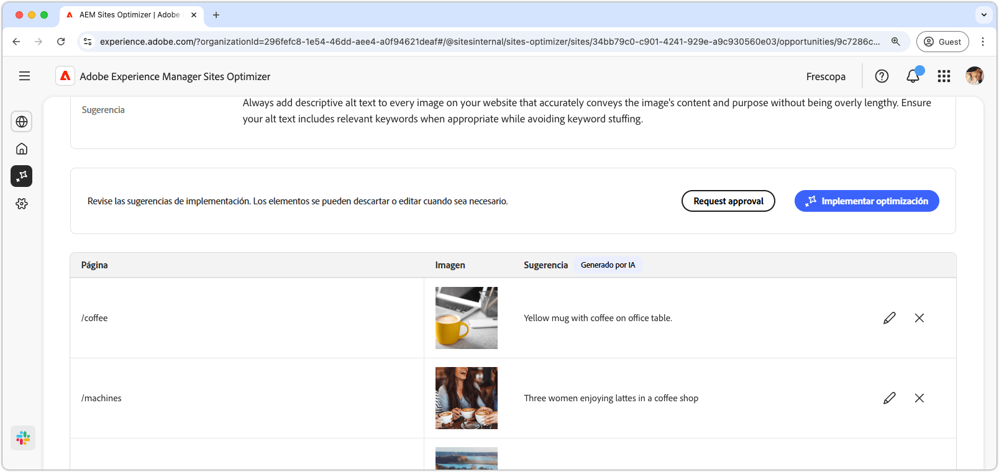
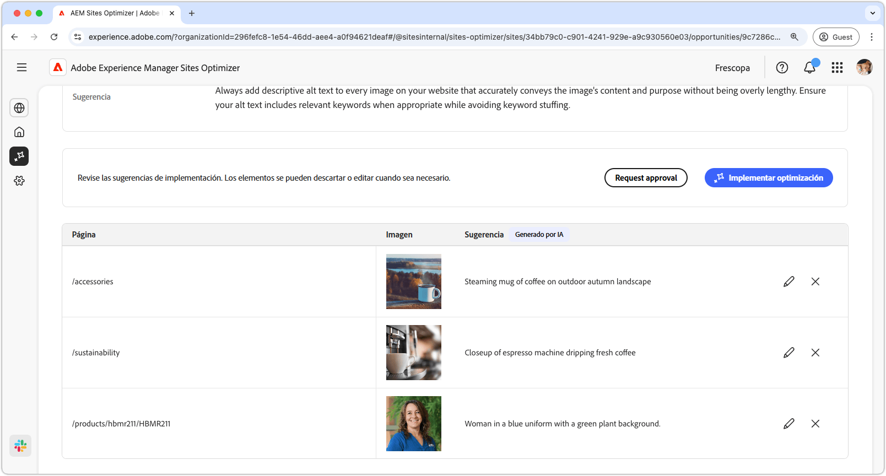
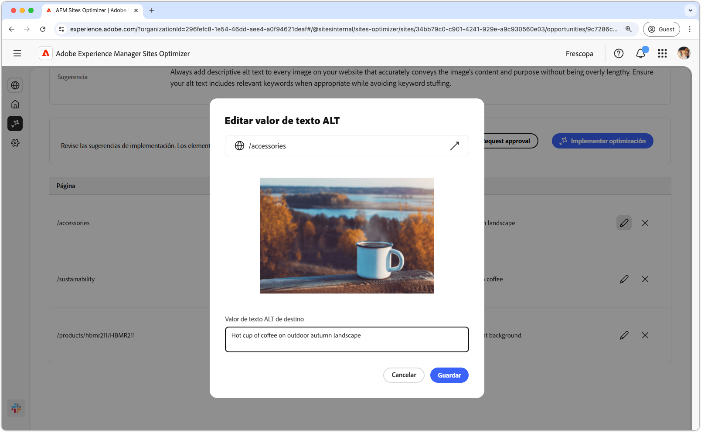
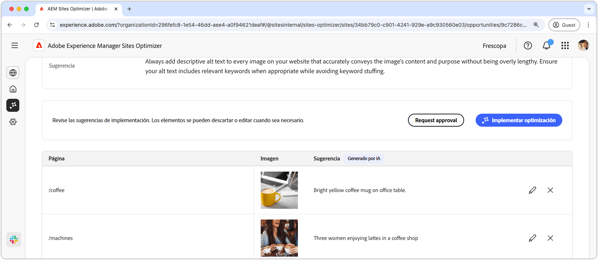

# Oportunidad de texto alternativo que falta

{align="center"}

La oportunidad de texto alternativo que falta identifica las imágenes del sitio web que no tienen texto alternativo descriptivo. Sin texto alternativo, los usuarios que dependen de los lectores de pantalla no pueden interpretar el contenido visual, lo que crea barreras de accesibilidad. También limita la manera en que los motores de búsqueda entienden e indexan las imágenes, lo que reduce la capacidad de detección de contenido y el rendimiento de la búsqueda. AEM Sites Optimizer identifica los problemas de texto alternativo que faltan, proporciona recomendaciones de IA específicas y permite una implementación con un solo clic para solucionarlos, todo en una sola vista centralizada.

## Identificación automática

{align="center"}

AEM Sites Optimizer explora su sitio web mediante una auditoría de varios pasos que combina la rastrea del sitio, los datos del tráfico de usuarios reales y el análisis de IA para identificar imágenes que requieren texto alternativo pero no lo tienen definido. También evalúa las imágenes de la página para determinar si es necesario un texto alternativo, excluyendo las imágenes decorativas o no informativas de acuerdo con las Directrices de accesibilidad al contenido web (WCAG). Las imágenes se analizan en función de su función y relevancia dentro de la página priorizando las correcciones que tienen el mayor impacto en la accesibilidad y la SEO.

Esta oportunidad proporciona una lista de los problemas identificados, entre los que se incluyen:

* **Página**: ruta a la página que contiene el texto alternativo que falta.
* **Imagen**: imagen en la que falta el texto alternativo descriptivo.

## Sugerencia automática

{align="center"}

Para cada problema identificado, AEM Sites Optimizer sugiere un texto alternativo descriptivo para la imagen. Utiliza modelos de visión de IA para analizar la imagen y generar una descripción que refleje su contenido y función dentro de la página. Las recomendaciones son concisas, relevantes y están alineadas con las prácticas recomendadas de accesibilidad. Cada sugerencia se puede revisar y editar antes de aplicarla.

>[!BEGINTABS]

>[!TAB Editar texto alternativo que falta]

{align="center"}

Si no está de acuerdo con la sugerencia generada por IA, puede editar el texto alternativo sugerido seleccionando el **icono de edición**. Esta función le permite ajustar manualmente el texto que piensa que es el más adecuado para la imagen. La ventana de edición contiene lo siguiente:

* **Ruta de página**: campo de solo lectura que muestra la ruta a la página donde se produce el problema de texto alternativo que falta. Haga clic en la flecha situada junto a la ruta para abrir la página correspondiente.
* **Imagen**: vista previa de solo lectura de la imagen que requiere texto alternativo.
* **Texto ALT de destino**: un campo editable en el que puede escribir manualmente un texto alternativo descriptivo para la imagen. Asegúrese de que el texto alternativo transmita claramente el contenido y el propósito de la imagen de forma concisa. Cuando sea relevante, incluya palabras clave de forma natural sin sobrecargarlas.

>[!TAB Ignorar entradas]

Puede elegir omitir las entradas de la lista de oportunidades. Si se selecciona el , se eliminará la entrada de la lista. Las entradas ignoradas se pueden volver a activar desde la pestaña **Ignorado** en la parte superior de la página de la oportunidad.

>[!ENDTABS]

## Optimización automática

[!BADGE Ultimate]{type=Positive tooltip="Ultimate"}

{align="center"}

Una vez que las sugerencias se hayan revisado y aprobado, puede hacer clic en **Implementar optimización**. A continuación, AEM Sites Optimizer aplica las correcciones en el entorno de creación, en función de cómo se administre el texto alternativo en la implementación. El autor de AEM puede publicar los cambios desde el sistema de administración de contenido (CMS).

Según la configuración, las actualizaciones se pueden aplicar directamente al contenido de la página, los metadatos de los recursos o los modelos de contenido de soporte. El proceso de optimización incluye los siguientes pasos:

* **Validación**: garantiza que las actualizaciones se apliquen de forma segura sin afectar a la funcionalidad existente.
* **Implementación**: aplica las actualizaciones a través de procesos existentes, como actualizaciones de contenido en AEM o integración con API de contenido.
* **Comprobación de permisos** - Comprueba que el usuario tiene los permisos adecuados para aplicar los cambios. Si no es así, se pueden utilizar resultados alternativos, como actualizaciones descargables, para el traspaso.

Las actualizaciones se versiones donde se admiten, lo que proporciona visibilidad y capacidad de reversión. Esto garantiza que las actualizaciones de texto alternativo se apliquen con precisión, se alineen con las implementaciones existentes y sean coherentes con los estándares de gobernanza y accesibilidad.

AEM Sites Optimizer aplica automáticamente las actualizaciones de texto alternativo en función de su configuración, de la siguiente manera:

>[!BEGINTABS]

>[!TAB Edge Delivery Services]

Actualiza el documento de origen (por ejemplo, Google Docs o SharePoint).

>[!TAB AEM as a Cloud Service]

Escribe actualizaciones directamente a través de la API de contenido con soporte de versiones y reserva.

>[!TAB Administración de recursos digitales (opcional)]

Actualiza el texto alternativo de nivel de recurso donde corresponda.

>[!ENDTABS]
