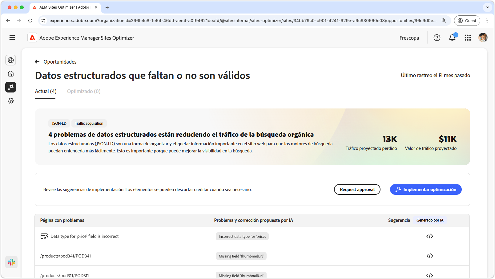
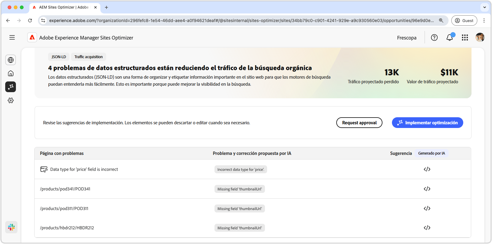
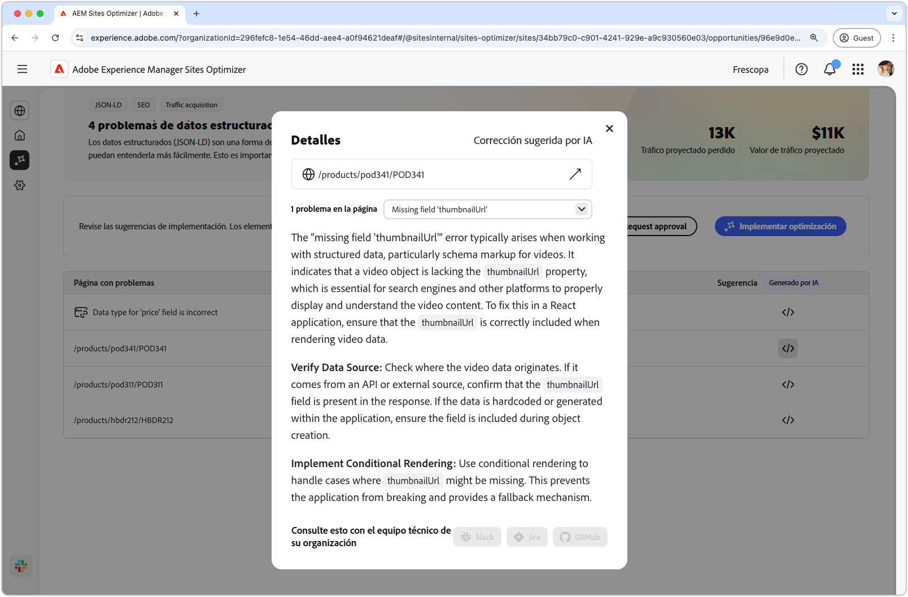
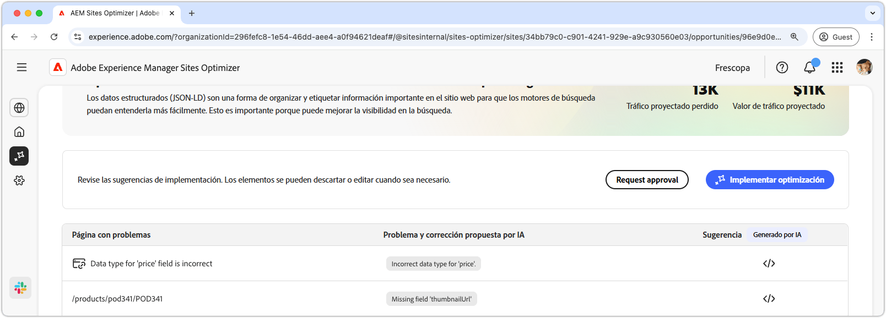

# Oportunidad de datos estructurados que faltan o no son válidos

{align="center"}

La oportunidad de datos estructurados que faltan o no son válidos identifica los datos estructurados que faltan o son defectuosos en el formato estandarizado Json-LD. Los datos estructurados son una forma de organizar, describir y etiquetar información importante en el sitio web. Ayuda a los motores de búsqueda a interpretar el contenido de sus páginas y mejora la visibilidad de los resultados de búsqueda. Unos mejores resultados de búsqueda pueden hacer que más usuarios visiten su sitio web.

La oportunidad de datos estructurados que faltan o no son válidos muestra un resumen en la parte superior de la página, que incluye una sinopsis del problema y su impacto en el sitio y en la empresa.

* **Tráfico proyectado perdido**: la pérdida de tráfico estimada debido a datos estructurados erróneos.
* **Valor de tráfico proyectado**: el valor estimado del tráfico perdido.

## Identificación automática

{align="center"}

La oportunidad de datos estructurados que faltan o no son válidos enumera todos los problemas detectados en las páginas y contiene las siguientes categorías:

* **Página con problemas**: la página que contiene los datos estructurados que faltan o no son válidos.
* **Problema y corrección propuesta por IA**: indica el tipo de problema de datos estructurados que afecta a la página.
* **Sugerencia**: una sugerencia generada por IA para actualizaciones de datos estructurados adecuadas. Consulte la siguiente sección para obtener más información.

## Sugerencia automática

{align="center"}

La oportunidad de datos estructurados no válidos o que faltan también proporciona sugerencias generadas por IA sobre cómo cambiar o actualizar los datos estructurados. Al hacer clic en el botón de sugerencias, aparece una nueva ventana que contiene lo siguiente:

* **Ruta de página**: campo que contiene la ruta a la página con datos estructurados no válidos o que faltan.
* **Problemas**: un campo que contiene el número de problemas y un menú desplegable que enumera todos los problemas.
* **Campo de sugerencias**: una descripción generada por IA y sugerencias para actualizaciones de datos estructurados adecuadas. Puede desplazarse hacia abajo para ver las sugerencias y los problemas adicionales.

## Optimización automática

[!BADGE Ultimate]{type=Positive tooltip="Ultimate"}

{align="center"}

Sites Optimizer Ultimate añade la posibilidad de implementar la optimización automática para los problemas encontrados por la oportunidad de datos estructurados no válidos o que faltan. <!--- TBD-need more in-depth and opportunity specific information here. What does the auto-optimization do?-->

>[!BEGINTABS]

>[!TAB Implementar optimización]

{{auto-optimize-deploy-optimization-slack}}

>[!TAB Solicitar aprobación]

{{auto-optimize-request-approval}}

>[!ENDTABS]
