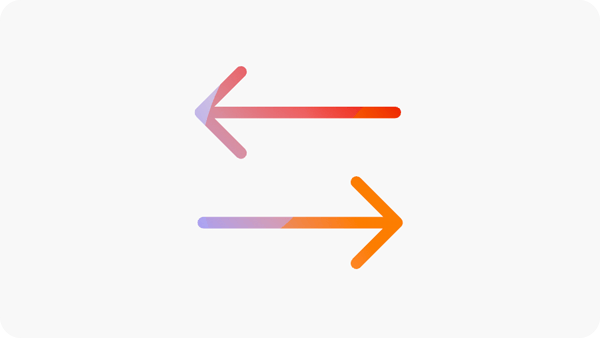

# Documentación sobre oportunidades

{align="center"}

Sites Optimizer se compone de un conjunto cada vez mayor de oportunidades con tecnología IA de Adobe, diseñadas para identificar y sugerir mejoras para su sitio web. Cada oportunidad ofrece información sobre el valor potencial empresarial, destaca las áreas que requieren atención y proporciona recomendaciones prácticas para la optimización. Haga clic en cada oportunidad para explorar los problemas identificados, las mejoras sugeridas y las directrices paso a paso sobre cómo implementar estos cambios para mejorar el rendimiento del sitio web y la experiencia del usuario.

Las oportunidades están disponibles mediante la opción de menú **Oportunidades** en la navegación persistente de [Site Optimizer.](/help/documentation/basics.md#navigation)

## Estado de la oportunidad

Utilice las pestañas de la parte superior para organizar y filtrar las oportunidades por estado.

>[!BEGINTABS]

>[!TAB Actual]

{align="center"}

Oportunidades que están pendientes en este momento.

>[!TAB Ignorado]

{align="center"}

Oportunidades que se han ignorado. Las oportunidades ignoradas se pueden restaurar desde esta vista.

>[!TAB Optimizado]

Una lista histórica de oportunidades que se han optimizado.

>[!ENDTABS]

## Oportunidades

Con un [estado de oportunidad](#opportunity-status) seleccionado, puede ver una lista de oportunidades. Puede filtrar la lista de oportunidades de las siguientes maneras:

* **Búsqueda**: búsqueda de oportunidades por **palabras clave, etiquetas o URL**.
* **Tipo de oportunidad**: use el menú desplegable **Tipo** para filtrarlas por [tipo de oportunidad](/help/opportunity-types/overview.md).

### Detalles de la oportunidad

{align="center"}

Cada oportunidad proporciona una breve descripción del problema, su impacto potencial en su sitio y un vínculo a todos los detalles. También puede ver su estado, que indica si se ha optimizado o si aún está pendiente.

* **Título de la oportunidad**: una breve descripción del problema y su impacto potencial en el rendimiento de su sitio.
* **Última actualización**: Sites Optimizer actualizó por última vez la oportunidad con nuevos datos en esta fecha.
* **Número de problemas**: el número de instancias del problema identificadas en el sitio.
* **Tipos de oportunidad** - Los [tipos de oportunidad](/help/opportunity-types/overview.md) de los que forma parte esta oportunidad, como la adquisición de tráfico, la participación, la conversión o el estado del sitio.

La información de resumen de cada oportunidad varía según el tipo y puede incluir detalles sobre el impacto en los ingresos, el tráfico, la participación del usuario o las amenazas a la seguridad.

Para ver los detalles de una oportunidad, haga clic en el botón **Detalles**.

Para excluir una oportunidad del panel de Sites Optimizer, haga clic en el botón **Ignorar**.  Esta acción mueve la oportunidad a la pestaña [**Ignorado**](#opportunity-status).

## Todas las oportunidades

Explore todas las oportunidades posibles disponibles en Sites Optimizer:

<!-- CARDS

* ./accessibility-issues.md
  {title=Accessibility issues}
  {image=../../assets/common/card-arrows.png} 
* ./broken-backlinks.md
  {title=Broken backlinks}
  {image=../../assets/common/card-arrows.png}
* ./broken-internal-links.md
  {title=Broken internal links}
  {image=../../assets/common/card-link.png}
* ./cors-configuration.md
  {title=CORS configuration}
  {image=../../assets/common/card-code.png}
* ./core-web-vitals.md
  {title=Core web vitals}
  {image=../../assets/common/card-performance.png}
* ./cross-site-scripting.md
  {title=Cross-site scripting}
  {image=../../assets/common/card-code.png}
* ./high-bounce-rate.md
  {title=High bounce rate}
  {image=../../assets/common/card-arrows.png}    
* ./invalid-or-missing-metadata.md
  {title=Invalid or missing metadata}
  {image=../../assets/common/card-code.png}
* ./low-conversions.md
  {title=Low conversions}
  {image=../../assets/common/card-bag.png}
* ./low-views.md
  {title=Low views}
  {image=../../assets/common/card-bag.png} 
* ./missing-alt-text.md
  {title=Missing alt text}
  {image=../../assets/common/card-arrows.png}
* ./missing-invalid-structured-data.md
  {title=Missing or invalid structured data}
  {image=../../assets/common/card-bag.png}
* ./sitemap-issues.md
  {title=Sitemap issues}
  {image=../../assets/common/card-relationship.png}
* ./website-permissions.md
  {title=Website permissions}
  {image=../../assets/common/card-people.png}
* ./website-vulnerabilities.md
  {title=Website vulnerabilities}
  {image=../../assets/common/card-puzzle.png}
  
--->
<!-- START CARDS HTML - DO NOT MODIFY BY HAND -->

    

        

            

                <figure class="image x-is-16by9">
                    
                </figure>
            

            

                

                    

                        <a href="./accessibility-issues.md" target="_blank" rel="referrer" title="Problemas de accesibilidad">Problemas de accesibilidad</a>
                    

                    
Obtenga información sobre la oportunidad de problemas de accesibilidad y cómo utilizarla para aumentar la seguridad de en el sitio web.

                

                <a href="./accessibility-issues.md" target="_blank" rel="referrer" class="spectrum-Button spectrum-Button--outline spectrum-Button--primary spectrum-Button--sizeM" style="align-self: flex-start; margin-top: 1rem;">
                    Más información
                </a>
            

        

    

    

        

            

                <figure class="image x-is-16by9">
                    
                </figure>
            

            

                

                    

                        <a href="./broken-backlinks.md" target="_blank" rel="referrer" title="Vínculos de retroceso rotos">Vínculos de retroceso rotos</a>
                    

                    
Obtenga información sobre la oportunidad de vínculos de retroceso rotos y cómo utilizarla para mejorar la adquisición de tráfico.

                

                <a href="./broken-backlinks.md" target="_blank" rel="referrer" class="spectrum-Button spectrum-Button--outline spectrum-Button--primary spectrum-Button--sizeM" style="align-self: flex-start; margin-top: 1rem;">
                    Más información
                </a>
            

        

    

    

        

            

                <figure class="image x-is-16by9">
                    
                </figure>
            

            

                

                    

                        <a href="./broken-internal-links.md" target="_blank" rel="referrer" title="Vínculos internos rotos">Vínculos internos rotos</a>
                    

                    
Obtenga información sobre la oportunidad de vínculos rotos y cómo utilizarla para mejorar la participación en el sitio web.

                

                <a href="./broken-internal-links.md" target="_blank" rel="referrer" class="spectrum-Button spectrum-Button--outline spectrum-Button--primary spectrum-Button--sizeM" style="align-self: flex-start; margin-top: 1rem;">
                    Más información
                </a>
            

        

    

    

        

            

                <figure class="image x-is-16by9">
                    
                </figure>
            

            

                

                    

                        <a href="./cors-configuration.md" target="_blank" rel="referrer" title="Configuración de CORS">Configuración de CORS</a>
                    

                    
Obtenga información sobre la oportunidad de configuración de CORS y aprenda a identificar y corregir las vulnerabilidades de seguridad del sitio.

                

                <a href="./cors-configuration.md" target="_blank" rel="referrer" class="spectrum-Button spectrum-Button--outline spectrum-Button--primary spectrum-Button--sizeM" style="align-self: flex-start; margin-top: 1rem;">
                    Más información
                </a>
            

        

    

    

        

            

                <figure class="image x-is-16by9">
                    
                </figure>
            

            

                

                    

                        <a href="./core-web-vitals.md" target="_blank" rel="referrer" title="Core Web Vitals">Core Web Vitals</a>
                    

                    
Obtenga información sobre la oportunidad de Core Web Vitals y cómo utilizarla para mejorar la adquisición de tráfico.

                

                <a href="./core-web-vitals.md" target="_blank" rel="referrer" class="spectrum-Button spectrum-Button--outline spectrum-Button--primary spectrum-Button--sizeM" style="align-self: flex-start; margin-top: 1rem;">
                    Más información
                </a>                    
            

        

    

    

        

            

                <figure class="image x-is-16by9">
                    
                </figure>
            

            

                

                    

                        <a href="./cross-site-scripting.md" target="_blank" rel="referrer" title="Ejecución de scripts en sitios múltiples">Ejecución de scripts en sitios múltiples</a>
                    

                    
Obtenga información sobre la oportunidad de ejecución de scripts en sitios múltiples e identifique y corrija las vulnerabilidades de seguridad del sitio.

                

                <a href="./cross-site-scripting.md" target="_blank" rel="referrer" class="spectrum-Button spectrum-Button--outline spectrum-Button--primary spectrum-Button--sizeM" style="align-self: flex-start; margin-top: 1rem;">
                    Más información
                </a>
            

        

    

    

        

            

                <figure class="image x-is-16by9">
                    
                </figure>
            

            

                

                    

                        <a href="./high-bounce-rate.md" target="_blank" rel="referrer" title="Tasa de salida hacia otro sitio alta">Tasa de salida hacia otro sitio alta</a>
                    

                    
Obtenga información sobre la oportunidad de vistas bajas y cómo utilizarla para mejorar la participación de los formularios en su sitio web.

                

                <a href="./high-bounce-rate.md" target="_blank" rel="referrer" class="spectrum-Button spectrum-Button--outline spectrum-Button--primary spectrum-Button--sizeM" style="align-self: flex-start; margin-top: 1rem;">
                    Más información
                </a>
            

        

    

    

        

            

                <figure class="image x-is-16by9">
                    
                </figure>
            

            

                

                    

                        <a href="./invalid-or-missing-metadata.md" target="_blank" rel="referrer" title="Metadatos que faltan o no son válidos">Metadatos que faltan o no son válidos</a>
                    

                    
Obtenga información sobre la oportunidad de metadatos no válidos o que faltan y cómo utilizarla para mejorar la adquisición de tráfico.

                

                <a href="./invalid-or-missing-metadata.md" target="_blank" rel="referrer" class="spectrum-Button spectrum-Button--outline spectrum-Button--primary spectrum-Button--sizeM" style="align-self: flex-start; margin-top: 1rem;">
                    Más información
                </a>
            

        

    

        

            

                <figure class="image x-is-16by9">
                    
                </figure>
            

            

                

                    

                        <a href="./low-conversions.md" target="_blank" rel="referrer" title="Conversiones bajas de Forms">Conversiones bajas de Forms</a>
                    

                    
Obtenga información sobre la oportunidad de conversiones bajas y cómo utilizarla para mejorar la participación de los formularios en su sitio web.

                

                <a href="./low-conversions.md" target="_blank" rel="referrer" class="spectrum-Button spectrum-Button--outline spectrum-Button--primary spectrum-Button--sizeM" style="align-self: flex-start; margin-top: 1rem;">
                    Más información
                </a>
            

        

    

    

        

            

                <figure class="image x-is-16by9">
                    
                </figure>
            

            

                

                    

                        <a href="./low-views.md" target="_blank" rel="referrer" title="Visualizaciones bajas">Vistas bajas de Forms</a>
                    

                    
Obtenga información sobre la oportunidad de vistas bajas de formularios y cómo utilizarla para mejorar la participación del formulario en el sitio web.

                

                <a href="./low-views.md" target="_blank" rel="referrer" class="spectrum-Button spectrum-Button--outline spectrum-Button--primary spectrum-Button--sizeM" style="align-self: flex-start; margin-top: 1rem;">
                    Más información
                </a>
            

        

    

    

        

            

                <figure class="image x-is-16by9">
                    
                </figure>
            

            

                

                    

                        <a href="./low-navigation.md" target="_blank" rel="referrer" title="Navegación baja de Forms">Navegación baja en Forms</a>
                    

                    
Obtenga información sobre la oportunidad de navegación baja de los formularios y cómo utilizarla para mejorar la participación del formulario en el sitio web.

                

                <a href="./low-navigation.md" target="_blank" rel="referrer" class="spectrum-Button spectrum-Button--outline spectrum-Button--primary spectrum-Button--sizeM" style="align-self: flex-start; margin-top: 1rem;">
                    Más información
                </a>
            

        

    

    

        

            

                <figure class="image x-is-16by9">
                    
                </figure>
            

            

                

                    

                        <a href="./forms-accessibility-issues.md" target="_blank" rel="referrer" title="Problemas de accesibilidad de Forms">Problemas de accesibilidad de Forms</a>
                    

                    
Obtenga información sobre la oportunidad de problemas de accesibilidad de los formularios y cómo utilizarla para mejorar la participación en el sitio web.

                

                <a href="./forms-accessibility-issues.md" target="_blank" rel="referrer" class="spectrum-Button spectrum-Button--outline spectrum-Button--primary spectrum-Button--sizeM" style="align-self: flex-start; margin-top: 1rem;">
                    Más información
                </a>
            

        

    

    

        

            

                <figure class="image x-is-16by9">
                    
                </figure>
            

            

                

                    

                        <a href="./missing-alt-text.md" target="_blank" rel="referrer" title="Texto alternativo que falta">Texto alternativo que falta</a>
                    

                    
Obtenga información sobre la oportunidad de texto alternativo que falta y cómo utilizarla para mejorar la participación en el sitio web.

                

                <a href="./missing-alt-text.md" target="_blank" rel="referrer" class="spectrum-Button spectrum-Button--outline spectrum-Button--primary spectrum-Button--sizeM" style="align-self: flex-start; margin-top: 1rem;">
                    Más información
                </a>
            

        

    

    

        

            

                <figure class="image x-is-16by9">
                    
                </figure>
            

            

                

                    

                        <a href="./missing-invalid-structured-data.md" target="_blank" rel="referrer" title="Datos estructurados que faltan o no son válidos">Datos estructurados que faltan o no son válidos</a>
                    

                    
Obtenga información sobre la oportunidad de datos estructurados que faltan o no son válidos y cómo utilizarlos para mejorar la adquisición de tráfico.

                

                <a href="./missing-invalid-structured-data.md" target="_blank" rel="referrer" class="spectrum-Button spectrum-Button--outline spectrum-Button--primary spectrum-Button--sizeM" style="align-self: flex-start; margin-top: 1rem;">
                    Más información
                </a>
            

        

    

    

        

            

                <figure class="image x-is-16by9">
                    
                </figure>
            

            

                

                    

                        <a href="./sitemap-issues.md" target="_blank" rel="referrer" title="Problemas del mapa del sitio">Problemas del mapa del sitio</a>
                    

                    
Obtenga información sobre la oportunidad de problemas del mapa del sitio y cómo utilizarla para mejorar la adquisición de tráfico.

                

                <a href="./sitemap-issues.md" target="_blank" rel="referrer" class="spectrum-Button spectrum-Button--outline spectrum-Button--primary spectrum-Button--sizeM" style="align-self: flex-start; margin-top: 1rem;">
                    Más información
                </a>
            

        

    

    

        

            

                <figure class="image x-is-16by9">
                    
                </figure>
            

            

                

                    

                        <a href="./website-permissions.md" target="_blank" rel="referrer" title="Permisos del sitio web">Permisos del sitio web</a>
                    

                    
Obtenga información sobre la oportunidad de permisos del sitio web y cómo utilizarla para aumentar la seguridad en el sitio web.

                

                <a href="./website-permissions.md" target="_blank" rel="referrer" class="spectrum-Button spectrum-Button--outline spectrum-Button--primary spectrum-Button--sizeM" style="align-self: flex-start; margin-top: 1rem;">
                    Más información
                </a>
            

        

    

    

        

            

                <figure class="image x-is-16by9">
                    
                </figure>
            

            

                

                    

                        <a href="./website-vulnerabilities.md" target="_blank" rel="referrer" title="Vulnerabilidades del sitio web">Vulnerabilidades del sitio web</a>
                    

                    
Obtenga información sobre la oportunidad de vulnerabilidades del sitio web y cómo utilizarla para aumentar la seguridad de en el sitio web.

                

                <a href="./website-vulnerabilities.md" target="_blank" rel="referrer" class="spectrum-Button spectrum-Button--outline spectrum-Button--primary spectrum-Button--sizeM" style="align-self: flex-start; margin-top: 1rem;">
                    Más información
                </a>
            

        

    

<!-- END CARDS HTML - DO NOT MODIFY BY HAND -->

