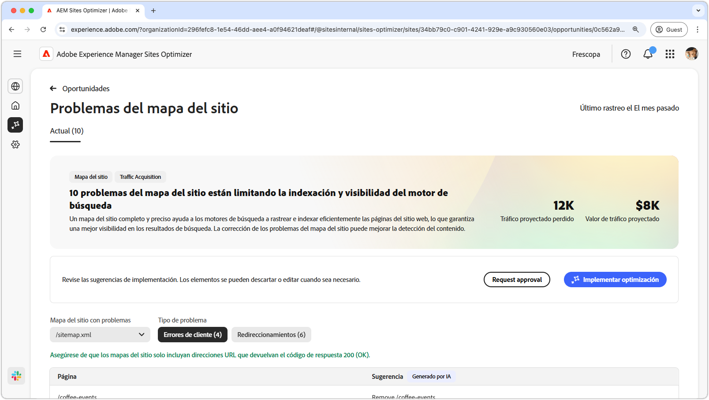
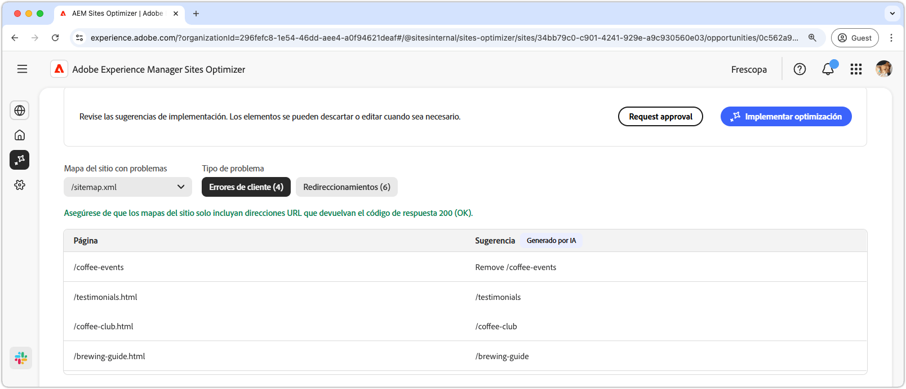
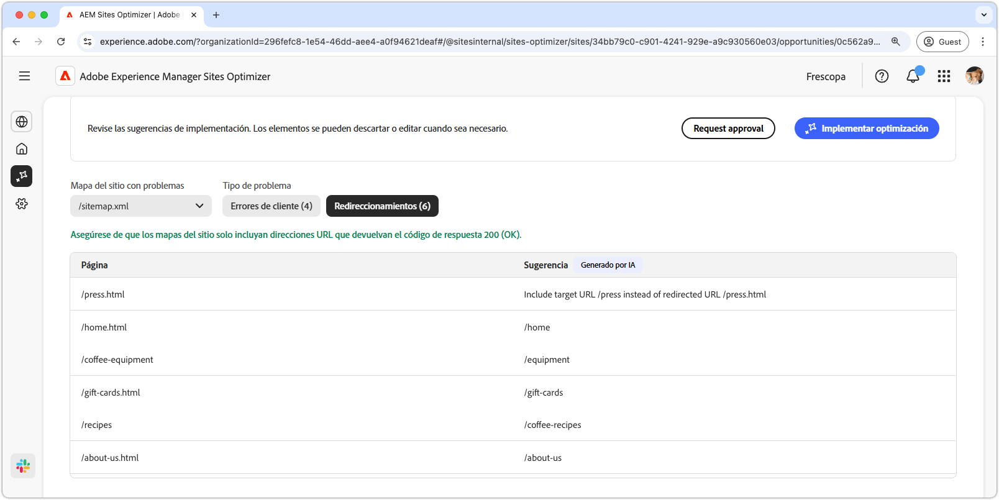
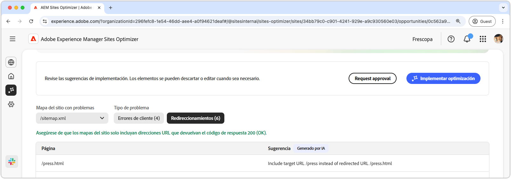

# Oportunidad de problemas de mapa

{align="center"}

Un mapa del sitio completo y preciso ayuda a los motores de búsqueda a rastrear e indexar de forma eficaz las páginas del sitio web, lo que garantiza una mejor visibilidad en los resultados de búsqueda. La oportunidad del mapa del sitio identifica posibles problemas con el mapa del sitio. La corrección de estos problemas puede mejorar en gran medida la indexación del motor de búsqueda y la capacidad de detección de contenido del sitio.

En la parte superior de la página se muestra un resumen que incluye una sinopsis del problema y su impacto en el sitio y en la empresa.

* **Tráfico proyectado perdido** - La pérdida de tráfico estimada debido a problemas con el mapa del sitio.
* **Valor de tráfico proyectado** - Valor estimado del tráfico perdido.

## Identificar automáticamente

Los problemas de mapas del sitio se pueden filtrar según los siguientes criterios:

* **Mapa del sitio con problemas**: URL del mapa del sitio analizada que contiene posibles problemas.
* **Tipo de problema** - El tipo de problema identificado en el mapa del sitio:
   * **Errores del cliente** - Entradas que no devuelven una respuesta de `200 Success`.
   * **Redirecciones**: redirecciones erróneas o mal configuradas.

>[!BEGINTABS]

>[!TAB Errores del cliente]

{align="center"}

Si las direcciones URL del mapa del sitio las devuelven, los motores de búsqueda pueden suponer que el mapa del sitio está obsoleto o que las páginas se eliminaron por error. El cliente indica que la solicitud del cliente (explorador o rastreador) no era válida. Los más comunes incluyen:

* **404 no encontrado** - La página solicitada no existe.
* **403 Prohibido**: el servidor deniega el acceso a la página solicitada.
* **410 se ha ido**: la página se eliminó intencionadamente y no se devolverá.
* **401 no autorizado**: se requiere autenticación, pero no se proporciona.

Estos errores pueden dañar el SEO, especialmente si las páginas importantes devuelven **404 o 410**, ya que los motores de búsqueda pueden desindexarlas.

Cada problema se muestra en una tabla, con la columna **Página** que identifica la entrada de mapa del sitio afectada:

* **Página**: URL de la entrada del mapa del sitio con un problema.

>[!TAB Redirecciones]

{align="center"}

Los mapas del sitio solo deben incluir direcciones URL de destino finales, no direcciones URL de redireccionamiento. Las redirecciones están pensadas para guiar a los usuarios y rastreadores a la ubicación correcta, pero pueden causar problemas si se configuran incorrectamente:

* **302 encontrado (redirección temporal)** - Puede causar problemas de SEO si se usa por error en lugar de **301**.
* **307 Redirección temporal**: similar a 302, pero conserva el método HTTP.
* **Bucles de redireccionamiento**: cuando una página redirige a sí misma o crea un bucle infinito.
* **Redirecciones interrumpidas**: cuando una redirección conduce a una página inexistente o 4xx.

Cada problema se muestra en una tabla, con la columna **Página** que identifica la entrada de mapa del sitio afectada:

* **Página**: URL de la entrada del mapa del sitio con un problema.

>[!ENDTABS]

## Sugerir automáticamente

Cada problema de mapa del sitio [ que cumple los criterios de filtro ](#auto-identify) se enumera en una tabla con las columnas siguientes:

* **Página**: URL de la entrada del mapa del sitio con un problema.
* **Sugerencia**: La corrección recomendada para el problema.

Las sugerencias suelen incluir una ruta de sitio actualizada para corregir la entrada del mapa del sitio. En algunos casos, también pueden proporcionar instrucciones más detalladas, como especificar el destino de redirección correcto.

## Optimización automática

[!BADGE Ultimate]{type=Positive tooltip="Ultimate"}

{align="center"}

Sites Optimizer Ultimate agrega la capacidad de implementar optimizaciones automáticas de mapas del sitio.

>[!BEGINTABS]

>[!TAB Implementar optimización]

{{auto-optimize-deploy-optimization-slack}}

>[!TAB Solicitar aprobación]

{{auto-optimize-request-approval}}

>[!ENDTABS]
