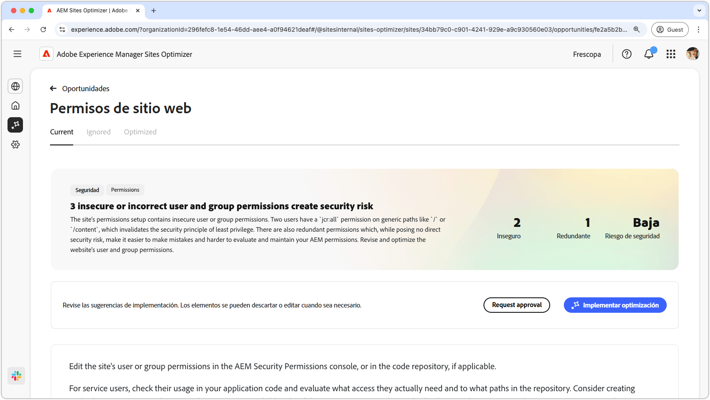
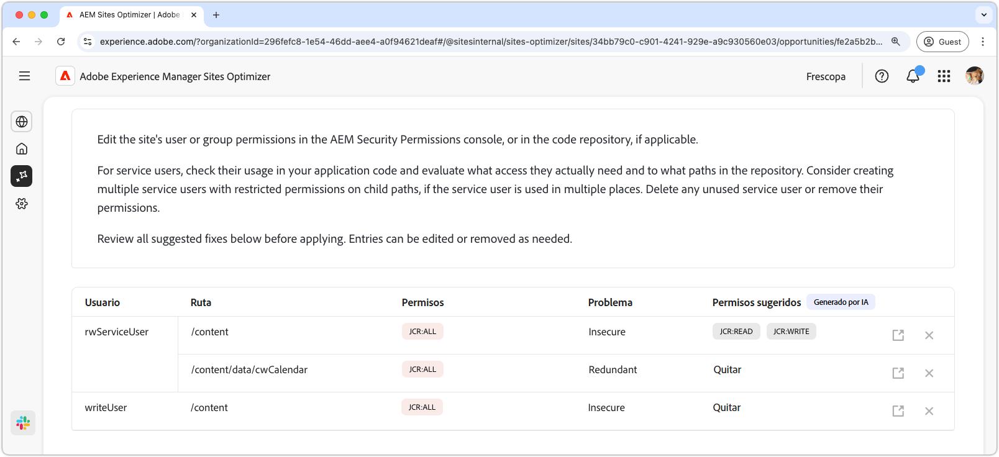
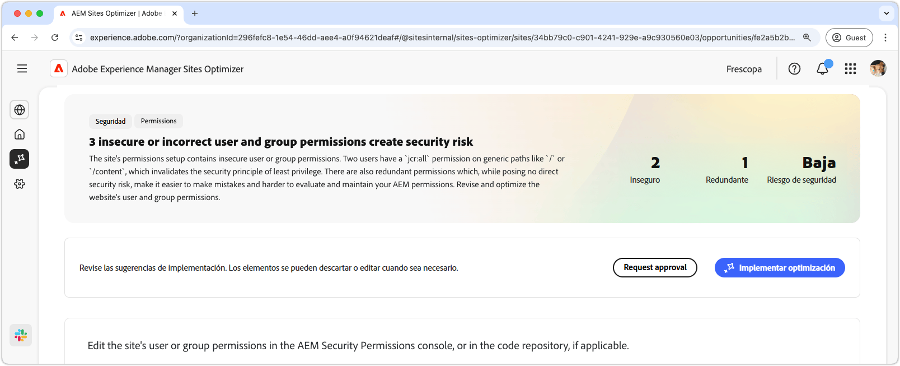

# Oportunidad de permisos de sitio web

{align="center"}

La oportunidad de permisos del sitio web optimiza los permisos del sitio web, lo que resulta crucial para mantener un entorno de AEM seguro y manejable. Esta oportunidad le permite restringir los controles de acceso eliminando los permisos demasiado amplios, como `jcr:all` en rutas genéricas como `/` o `/content`, y alineando el acceso de usuario con el principio de privilegios mínimos. Al optimizar los permisos y eliminar las redundancias, puede reducir los riesgos de seguridad, mejorar la capacidad de mantenimiento y evitar futuras configuraciones incorrectas. Realice acciones revisando y actualizando permisos en la consola Permisos de seguridad de AEM o en su repositorio de código, asegurándose de que los usuarios del servicio solo tengan el acceso que realmente necesitan.

## Identificar automáticamente

{align="center"}

La característica de **oportunidad de Permisos de sitios web** identifica y enumera automáticamente

* **Usuario** - La cuenta de usuario con el permiso sospechoso.
* **Ruta**: la ruta de acceso de AEM afectada por el permiso.
* **Permiso** - El permiso que es sospechoso.
* **Problema**: indica el tipo de problema que afecta el permiso.

## Sugerir automáticamente

{align="center"}

La sugerencia automática proporciona recomendaciones generadas por IA en el campo **Permisos sugeridos**, lo que le permite reemplazar cualquier permiso marcado con alternativas seguras.

## Optimizar automáticamente [!BADGE Ultimate]{type=Positive tooltip="Ultimate"}

{align="center"}

Sites Optimizer Ultimate añade la capacidad de implementar la optimización automática para las vulnerabilidades encontradas.

>[!BEGINTABS]

>[!TAB Implementar optimización]

{{auto-optimize-deploy-optimization-slack}}

>[!TAB Solicitar aprobación]

{{auto-optimize-request-approval}}

>[!ENDTABS]
