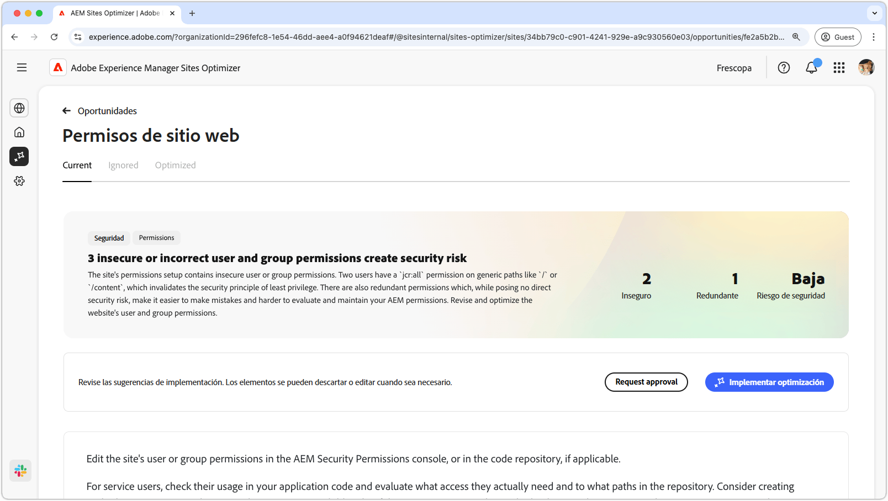
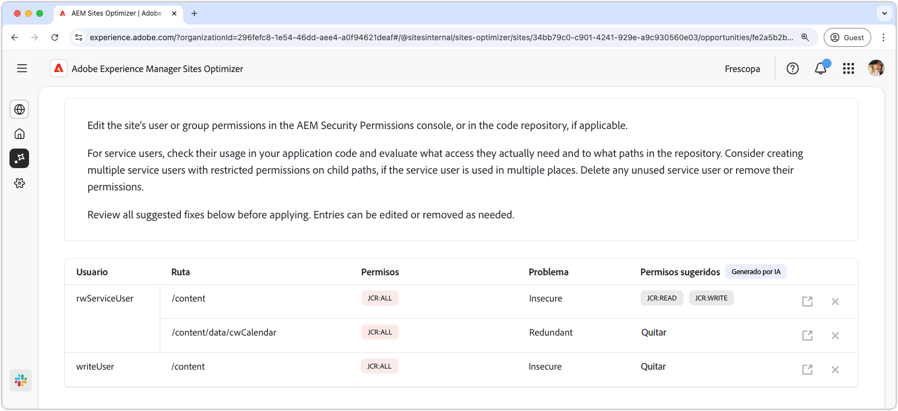
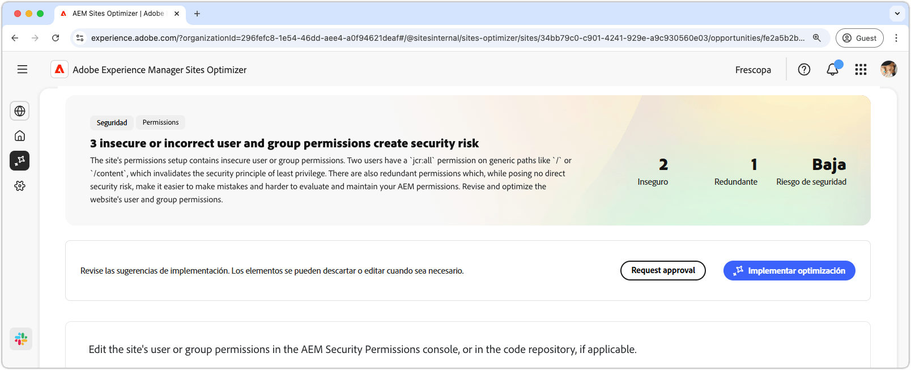

# Oportunidad de permisos del sitio web

{align="center"}

La oportunidad de permisos del sitio web optimiza los permisos del sitio web, lo que resulta crucial para mantener un entorno de AEM seguro y manejable. Esta oportunidad le permite restringir los controles de acceso, eliminando los permisos demasiado amplios, como, por ejemplo, `jcr:all` en rutas genéricas como `/` o `/content`, y alineando el acceso de usuario con el principio de privilegios mínimos. Al optimizar los permisos y eliminar las redundancias, puede reducir los riesgos de seguridad, mejorar la capacidad de mantenimiento y evitar futuras configuraciones incorrectas. Revise y actualice los permisos en la consola Permisos de seguridad de AEM o en su repositorio del código. Al hacerlo, se garantiza que los usuarios del servicio solo tengan el acceso que realmente necesitan.

## Identificación automática

{align="center"}

La característica de **oportunidad Permisos del sitio web** identifica y enumera automáticamente lo siguiente

* **Usuario**: la cuenta de usuario con el permiso sospechoso.
* **Ruta**: use las pestañas de la parte superior para organizar y filtrar oportunidades por el estado.
* **Permiso**: el permiso sospechoso.
* **Problema**: indica el tipo de problema que afecta al permiso.

## Sugerencia automática

{align="center"}

La sugerencia automática ofrece recomendaciones generadas por la IA en el campo **Permisos sugeridos**, lo que le permite reemplazar cualquier permiso marcado por alternativas seguras.

## Optimización automática

[!BADGE Ultimate]{type=Positive tooltip="Ultimate"}

{align="center"}

Sites Optimizer Ultimate añade la posibilidad de implementar la optimización automática para las vulnerabilidades encontradas.

>[!BEGINTABS]

>[!TAB Implementar optimización]

{{auto-optimize-deploy-optimization-slack}}

>[!TAB Solicitar aprobación]

{{auto-optimize-request-approval}}

>[!ENDTABS]
