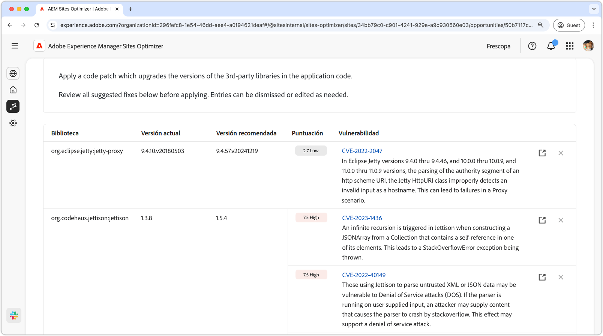

# Oportunidad de vulnerabilidades del sitio web

{align="center"}

La oportunidad de vulnerabilidades del sitio web identifica vulnerabilidades en seguridad en las bibliotecas de terceros utilizadas por el código de la aplicación. Estas vulnerabilidades podrían ser aprovechadas por un atacante malicioso, lo que aumenta el riesgo y disminuye la posición en materia de seguridad de su sitio web.

La oportunidad de vulnerabilidades del sitio web muestra un resumen en la parte superior de la página, que incluye lo siguiente:

* **Problemas encontrados**: número de vulnerabilidades encontradas, clasificadas por el riesgo de seguridad que representan (bajo, medio, alto).
* **Riesgo de seguridad añadido**: el riesgo de seguridad general para su sitio web basado en las vulnerabilidades encontradas por la oportunidad.

## Identificación automática

{align="center"}

La característica **Oportunidad de vulnerabilidades del sitio web** identifica y enumera automáticamente las vulnerabilidades que se encuentran en las bibliotecas de terceros utilizadas por el código de la aplicación. Proporciona los siguientes detalles:

* **Biblioteca**: la biblioteca de terceros que contiene la vulnerabilidad. Una sola biblioteca puede tener varias vulnerabilidades.
* **Versión actual**: la versión de la biblioteca que se está usando actualmente.
* **Versión recomendada**: la versión sugerida que resuelve la vulnerabilidad.
* **Puntuación**: la clasificación de gravedad de la vulnerabilidad, también resumida en la parte superior de la página.
* **Vulnerabilidad**: el identificador de vulnerabilidad, una breve descripción y un vínculo a la base de datos nacional de vulnerabilidades (NVD) para obtener más detalles. Para acceder al vínculo de NVD, haga clic en el identificador o en el vínculo situado junto a la descripción.

## Sugerencia automática

{align="center"}

La sugerencia automática proporciona sugerencias generadas por IA para la **versión recomendada** de la biblioteca vulnerable a la que debería actualizarse. Cada entrada tiene una **puntuación** que indica su gravedad general, lo que ayuda a priorizar las vulnerabilidades más críticas.

>[!BEGINTABS]

>[!TAB Detalles de la vulnerabilidad]

Cada vulnerabilidad contiene un vínculo a la información detallada de la [Base de datos nacional de vulnerabilidades (NVD)](https://nvd.nist.gov/). Al hacer clic en el identificador de vulnerabilidad o en el elemento de vínculo a la derecha de la descripción, se le redirigirá a la página de NVD correspondiente a esa vulnerabilidad.

>[!TAB Ignorar entradas]

Puede elegir ignorar las entradas de la lista de vulnerabilidades. Si se selecciona el **icono de ignorar**, se eliminará la entrada de la lista. Las entradas ignoradas se pueden volver a activar desde la pestaña **Ignorado** en la parte superior de la página de la oportunidad.<!---right now it does not seem to be implemented, but the page description mentions this functionality-->

>[!ENDTABS]

## Optimización automática

[!BADGE Ultimate]{type=Positive tooltip="Ultimate"}

{align="center"}

Sites Optimizer Ultimate añade la posibilidad de implementar la optimización automática para las vulnerabilidades encontradas.

>[!BEGINTABS]

>[!TAB Implementar optimización]

{{auto-optimize-deploy-optimization-slack}}

>[!TAB Solicitar aprobación]

{{auto-optimize-request-approval}}

>[!ENDTABS]