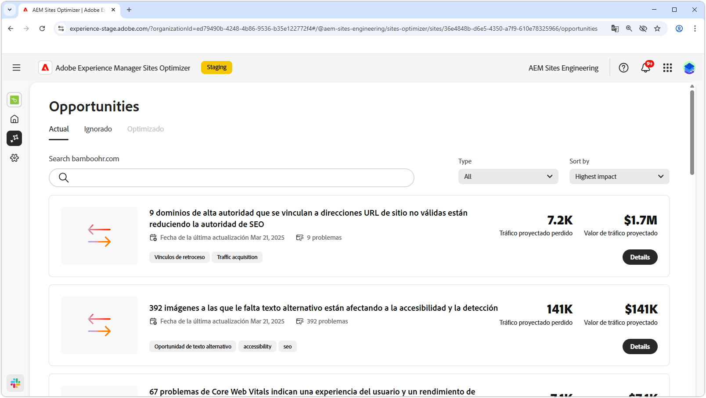

# Documentación de Sites Optimizer

{align="center"}

Le damos la bienvenida a la documentación de Sites Optimizer. Aquí encontrará información sobre cómo utilizar Sites Optimizer para optimizar AEM Sites.

## Conceptos básicos de Site Optimizer

Explore la documentación de AEM Sites Optimizer para obtener más información sobre los componentes clave de la interfaz de usuario, como el panel de inicio, las configuraciones de los ajustes y la lista de oportunidades para obtener información sobre la optimización.

<!-- CARDS 

* ./basics.md
  {title = Basics}
  {image = ./assets/basics/card.png}
* ./opportunities/overview.md
  {title = Opportunities}
* ./settings.md
  {title = Settings}

-->
<!-- START CARDS HTML - DO NOT MODIFY BY HAND -->

    

        

            

                <figure class="image x-is-16by9">
                    
                </figure>
            

            

                

                    

                        <a href="./basics.md" target="_blank" rel="referrer" title="Conceptos básicos">Conceptos básicos</a>
                    

                    
Obtenga información sobre los conceptos básicos de Sites Optimizer y cómo navegar por él.

                

                <a href="./basics.md" target="_blank" rel="referrer" class="spectrum-Button spectrum-Button--outline spectrum-Button--primary spectrum-Button--sizeM" style="align-self: flex-start; margin-top: 1rem;">
                    Más información
                </a>
            

        

    

    

        

            

                <figure class="image x-is-16by9">
                    
                </figure>
            

            

                

                    

                        <a href="./opportunities/overview.md" target="_blank" rel="referrer" title="Oportunidades">Oportunidades</a>
                    

                    
Obtenga información sobre todas las oportunidades disponibles de Site Optimizer y cómo utilizarlas para mejorar el rendimiento del sitio.

                

                <a href="./opportunities/overview.md" target="_blank" rel="referrer" class="spectrum-Button spectrum-Button--outline spectrum-Button--primary spectrum-Button--sizeM" style="align-self: flex-start; margin-top: 1rem;">
                    Más información
                </a>
            

        

    

    

        

            

                <figure class="image x-is-16by9">
                    
                </figure>
            

            

                

                    

                        <a href="./settings.md" target="_blank" rel="referrer" title="Configuración">Configuración</a>
                    

                    
Obtenga información sobre cómo configurar los valores de Sites Optimizer e integrarlo con otras herramientas.

                

                <a href="./settings.md" target="_blank" rel="referrer" class="spectrum-Button spectrum-Button--outline spectrum-Button--primary spectrum-Button--sizeM" style="align-self: flex-start; margin-top: 1rem;">
                    Más información
                </a>
            

        

    

<!-- END CARDS HTML - DO NOT MODIFY BY HAND -->

