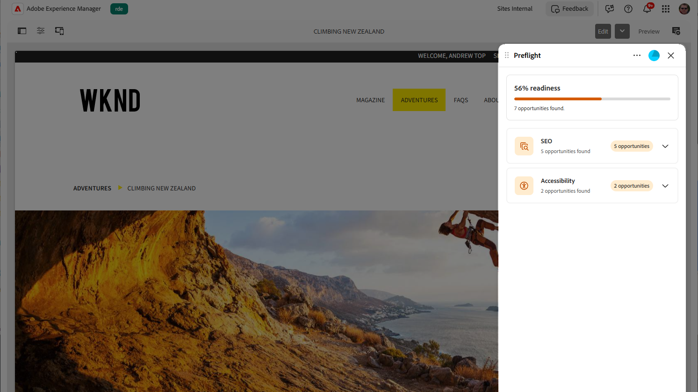
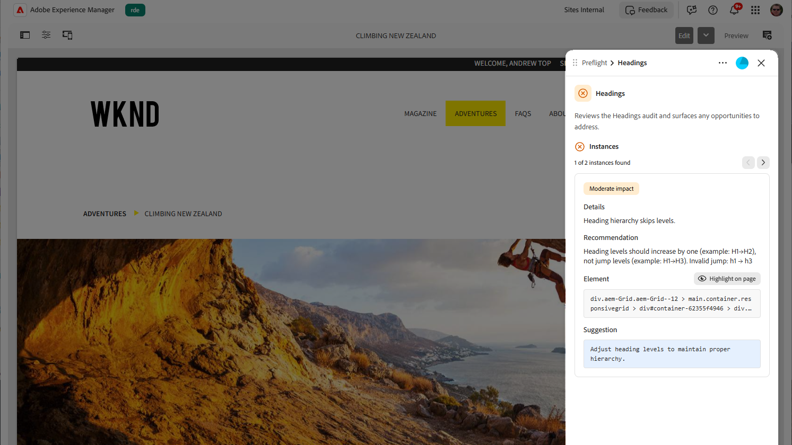

# Resultados de la auditoría en Preflight

Cuando se completan las auditorías, Comprobación preliminar muestra los resultados en el panel de preparación. El panel muestra un medidor de disponibilidad general y las oportunidades que encontró, agrupadas por categoría de auditoría. Dentro de cada categoría, las auditorías individuales identifican elementos específicos que se deben revisar o corregir.

## Barra de herramientas

La barra de herramientas situada en la parte superior del panel de preparación proporciona acciones para la ejecución actual. **Más acciones** (**...**) ofertas de menú:

* **Volver a analizar**: inicia una nueva ejecución de auditoría en la página actual. Volver a analizar siempre descarta los resultados mostrados y ejecuta cada auditoría de nuevo, por lo que debe utilizarlo siempre que desee resultados nuevos; por ejemplo, después de editar la página.
* **Exportar (CSV)**: descargue los resultados actuales como archivo CSV, incluidas las oportunidades y los metadatos de la ejecución de auditoría actual.

## Medidor de preparación

En la parte superior del tablero, el indicador de disponibilidad refleja los resultados generales de la auditoría. Muestra una puntuación de preparación como porcentaje, basada en la proporción de auditorías que finalizaron sin oportunidades, junto con el número total de oportunidades encontradas en todas las auditorías. El medidor de disponibilidad le ayuda a medir el estado general de la página de un vistazo.

{align="center"}

Mientras las auditorías siguen ejecutándose, el indicador de disponibilidad muestra una barra de progreso con un estado corto debajo que muestra el paso actual. Cuando se completan las auditorías, el medidor muestra el porcentaje de disponibilidad final y el recuento de oportunidades.

## Categorías de auditoría

Los grupos de comprobaciones relacionaron auditorías en categorías como **SEO** y **Accesibilidad**. Cada categoría aparece como una tarjeta que muestra el número de oportunidades encontradas o indica que todas sus auditorías pasaron sin oportunidades.

Expanda una categoría para ver sus auditorías individuales. Cada auditoría muestra si se aprobaron o encontraron oportunidades, una breve descripción y un recuento de las oportunidades encontradas. Seleccione una auditoría que haya encontrado oportunidades para abrir su página de detalles.

Para obtener la lista completa de categorías de auditoría y las auditorías de cada una, vea [Categorías de auditoría de comprobación preliminar](./overview.md#preflight-audit-categories).

## Detalles de la oportunidad

La página de detalles muestra las oportunidades que encontró la auditoría seleccionada. Cuando el mismo problema se produce en más de un lugar, cada ocurrencia se denomina instancia. Utilice el navegador (**Instancia anterior** y **Instancia siguiente**) para avanzar por ellos; muestra su posición, por ejemplo *1 de 5 instancias encontradas*.

{align="center"}

Cada oportunidad incluye:

* Un distintivo de gravedad o impacto que indica la importancia de la oportunidad.
* Detalles sobre la oportunidad, como una descripción del problema, una recomendación y, para accesibilidad, la regla WCAG y el nivel de conformidad relacionados.
* Una sección **Element** que muestra el elemento afectado en la página, con un botón **Resaltar en la página**.
* Una sección **Sugerencia** con una corrección recomendada. Cuando AI genera la sugerencia, se marca como una sugerencia generada por IA y puede incluir una breve justificación que explique la corrección sugerida.

## Resaltar en la página

Una vez completadas las auditorías, puede localizar y comprender rápidamente una oportunidad resaltándola directamente en la página.

La comprobación preliminar resalta el elemento afectado en el contexto y conecta el resultado del panel con la ubicación exacta del contenido. Esto facilita la revisión y la resolución de oportunidades sin buscar manualmente en la página.

1. Abra el panel Comprobaciones en el contexto de la página que desea auditar y seleccione **Analizar página** para ejecutar las auditorías.
1. Seleccione una auditoría en el panel de preparación y, a continuación, seleccione una oportunidad para revisarla.
1. Seleccione **Resaltar en la página**. La vista previa se desplaza automáticamente al área relevante y resalta el elemento correspondiente, para que pueda identificar y optimizar fácilmente la oportunidad en contexto.

## ID de trabajo

Cada ejecución de comprobaciones tiene un ID de trabajo único, que se muestra en la parte inferior del panel. Resulta principalmente útil cuando un administrador soluciona problemas en una ejecución específica. Pase el ratón sobre el ID y seleccione el icono de copia que aparece a su derecha; el ID se copia en el portapapeles y aparece un mensaje de confirmación. Incluya este ID cuando informe de un problema.
