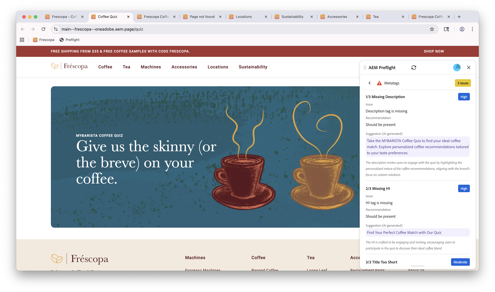

# Oportunidades de Preflight

{align="center"}

Las oportunidades de Preflight de Sites Optimizer están compuestas por un conjunto de evaluaciones que analizan diferentes aspectos del contenido y la estructura del sitio web antes de la publicación de la página web. Estas evaluaciones ayudan a identificar posibles problemas y proporcionan recomendaciones procesables para mejorar la calidad general y el rendimiento del sitio.

## Configuración de Preflight

Siga los pasos de la guía [Configuración de Preflight](./setup.md) para configurar la extensión de comprobaciones en su sitio web.

## Oportunidades de Preflight

<!-- CARDS
* ./accessibility.md
* ./h1-count.md
* ./links.md
* ./meta-data.md
* ./readability.md
-->
<!-- START CARDS HTML - DO NOT MODIFY BY HAND -->

    

        

            

                <figure class="image x-is-16by9">
                    
                </figure>
            

            

                

                    

                        <a href="./accessibility.md" target="_blank" rel="referrer" title="Oportunidad de accesibilidad de Preflight">Oportunidad de accesibilidad de Preflight</a>
                    

                    
Obtenga información acerca de la oportunidad de accesibilidad de las comprobaciones en Sites Optimizer.

                

                <a href="./accessibility.md" target="_blank" rel="referrer" class="spectrum-Button spectrum-Button--outline spectrum-Button--primary spectrum-Button--sizeM" style="align-self: flex-start; margin-top: 1rem;">
                    Más información
                </a>
            

        

    

    

        

            

                <figure class="image x-is-16by9">
                    
                </figure>
            

            

                

                    

                        <a href="./h1-count.md" target="_blank" rel="referrer" title="Oportunidad de recuento H1 de Preflight">Oportunidad de recuento H1 de Preflight</a>
                    

                    
Obtenga información acerca de la oportunidad de accesibilidad de las comprobaciones en Sites Optimizer.

                

                <a href="./h1-count.md" target="_blank" rel="referrer" class="spectrum-Button spectrum-Button--outline spectrum-Button--primary spectrum-Button--sizeM" style="align-self: flex-start; margin-top: 1rem;">
                    Más información
                </a>
            

        

    

    

        

            

                <figure class="image x-is-16by9">
                    
                </figure>
            

            

                

                    

                        <a href="./links.md" target="_blank" rel="referrer" title="Oportunidad de vínculos de Preflight">Oportunidad de vínculos de Preflight</a>
                    

                    
Obtenga información acerca de la oportunidad Vínculos de Preflight en Sites Optimizer.

                

                <a href="./links.md" target="_blank" rel="referrer" class="spectrum-Button spectrum-Button--outline spectrum-Button--primary spectrum-Button--sizeM" style="align-self: flex-start; margin-top: 1rem;">
                    Más información
                </a>
            

        

    

    

        

            

                <figure class="image x-is-16by9">
                    
                </figure>
            

            

                

                    

                        <a href="./meta-data.md" target="_blank" rel="referrer" title="Oportunidad de metadatos de Preflight">Oportunidad de metadatos de Preflight</a>
                    

                    
Obtenga información acerca de la oportunidad de metadatos de comprobaciones en Sites Optimizer.

                

                <a href="./meta-data.md" target="_blank" rel="referrer" class="spectrum-Button spectrum-Button--outline spectrum-Button--primary spectrum-Button--sizeM" style="align-self: flex-start; margin-top: 1rem;">
                    Más información
                </a>
            

        

    

    

        

            

                <figure class="image x-is-16by9">
                    
                </figure>
            

            

                

                    

                        <a href="./readability.md" target="_blank" rel="referrer" title="Oportunidad de legibilidad de Preflight">Oportunidad de legibilidad de Preflight</a>
                    

                    
Obtenga información acerca de la oportunidad Legibilidad de las comprobaciones en Sites Optimizer.

                

                <a href="./readability.md" target="_blank" rel="referrer" class="spectrum-Button spectrum-Button--outline spectrum-Button--primary spectrum-Button--sizeM" style="align-self: flex-start; margin-top: 1rem;">
                    Más información
                </a>
            

        

    

<!-- END CARDS HTML - DO NOT MODIFY BY HAND -->
