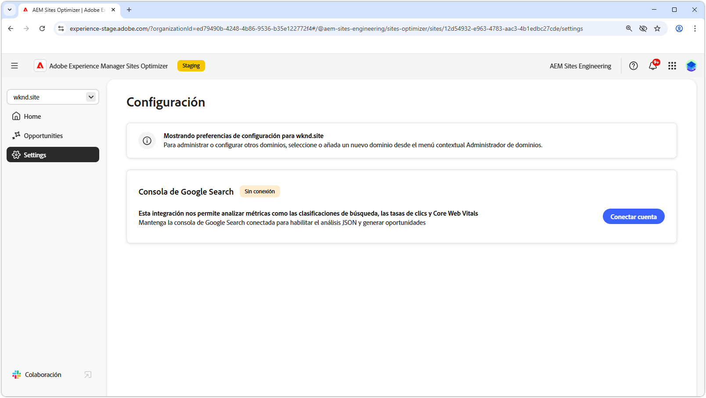
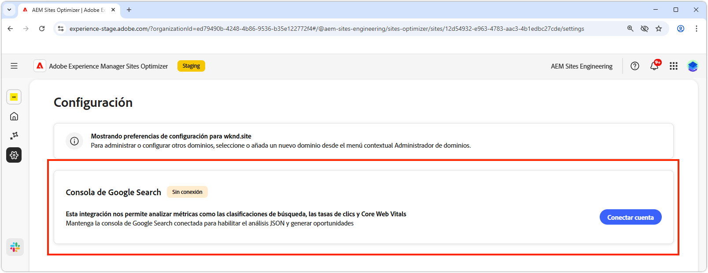
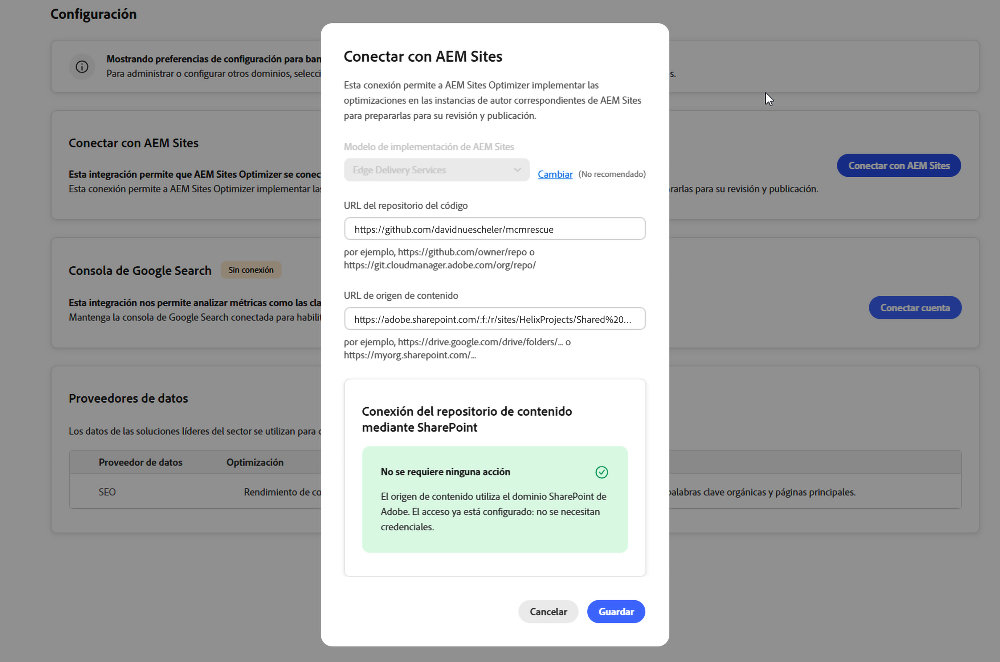
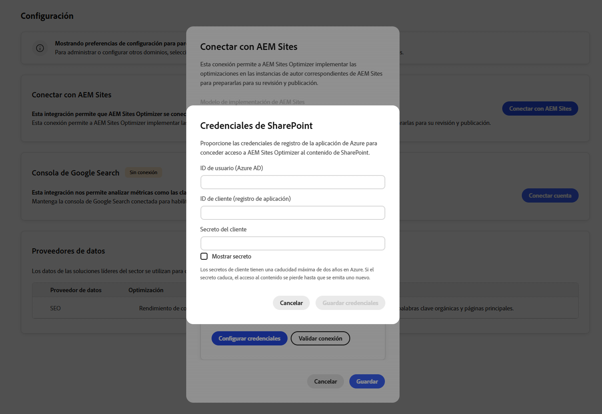
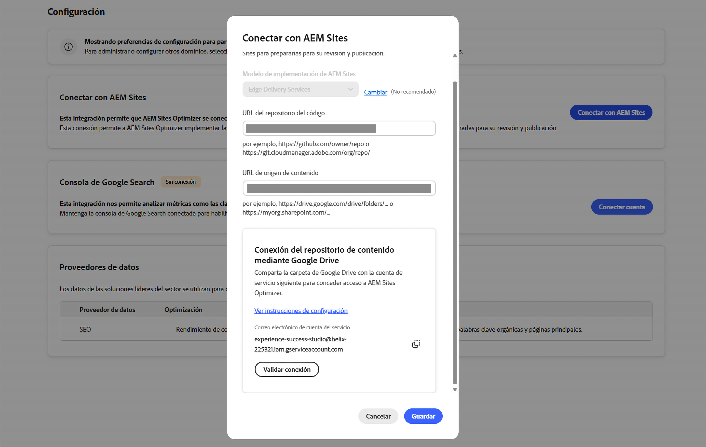

# Configuración de Sites Optimizer

{align="center"}

La configuración de Sites Optimizer es el repositorio central para configurar la experiencia de Sites Optimizer.

## Consola de Google Search

{align="center"}

El conector de configuración de Google Search Console en AEM Sites Optimizer permite realizar el análisis de métricas clave de optimización de los motores de búsqueda, como clasificaciones de búsqueda, tasas de clics y Core Web Vitals. Al mantener Google Search Console conectada, puede aprovechar el análisis JSON para descubrir oportunidades de optimización y mejorar el rendimiento del sitio.

Para configurar este conector, debe tener credenciales con acceso administrativo a Google Search Console para el dominio.

## Conectar con AEM Sites

En esta guía se explica cómo conectar el sitio de Edge Delivery Services (EDS) existente a AEM Sites Optimizer. Antes de empezar, asegúrese de que el sitio de EDS ya esté configurado y en funcionamiento; esta conexión se ha diseñado específicamente para que AEM Sites Optimizer acceda al contenido.

La conexión requiere dos pasos:

1. Proporcione la URL del repositorio de código y la URL del origen de contenido.
2. Conceda el acceso a AEM Sites Optimizer a su origen de contenido.

### Paso 1: Vincular el repositorio de código y el origen de contenido

En AEM Sites Optimizer, vaya a **Configuración → Conectar con AEM Sites** e introduzca lo siguiente:

- **URL del repositorio de código**: la URL de GitHub de su sitio EDS, por ejemplo:
  `https://github.com/owner/repo`

- **URL del origen de contenido**: la URL de la carpeta de SharePoint o de la carpeta de Google Drive que sirve de reserva de su sitio EDS, por ejemplo:
  `https://drive.google.com/drive/folders/...` o `https://myorg.sharepoint.com/...`

Cuando haya introducido la URL del origen de contenido, AEM Sites Optimizer detectará el tipo de origen de contenido y mostrará las instrucciones de acceso pertinentes a continuación.

### Paso 2: Conceder acceso al origen de contenido

Siga la sección que coincide con el origen del contenido.

#### SharePoint: dominio de Adobe

{align="center"}

Si la URL del origen de contenido utiliza el dominio de SharePoint de Adobe, no se requiere ninguna otra acción. El acceso ya se ha configurado. Haga clic en **Guardar** para completar la conexión.

#### SharePoint: dominio personalizado

Si la URL del origen de contenido utiliza el dominio SharePoint de su organización, debe registrar una aplicación de Azure y proporcionar sus credenciales a AEM Sites Optimizer.

##### Lo que necesitará

- Permiso para registrar aplicaciones en Azure Portal o un contacto que pueda registrar aplicaciones en su nombre.
- Derechos de administrador del inquilino para conceder el consentimiento de la API o de un administrador que pueda aprobar el consentimiento de la API en su nombre.

##### Paso 2a: Registrar una aplicación en Azure

1. Vaya a **Azure Portal → Microsoft Entra ID → Registros de aplicación → Nuevo registro**.
2. Asígnele un nombre, por ejemplo: `AEM Sites Optimizer`.
3. Deje todos los demás valores predeterminados y haga clic en **Registrarse**.
4. En la página **Información general**, anote lo siguiente:
   - **ID de aplicación (cliente)**
   - **ID de directorio (inquilino)**

##### Paso 2b: Añadir permisos de API

1. Vaya a **Permisos de API → Añadir un permiso → Microsoft Graph → Permisos de aplicación**.
2. Añada lo siguiente:
   - `Sites.Selected`: acceso con ámbito a colecciones de sitios de SharePoint específicas.
   - `Files.SelectedOperations.Selected`: acceso a archivos sin un usuario que ha iniciado sesión.
3. Haga clic en **Conceder consentimiento de administrador** para ambos.

{align="center"}

>[!NOTE]
>
>La concesión del consentimiento de administrador requiere derechos de administrador del inquilino. Si no los tiene, pídale al administrador de TI o de Azure que complete este paso antes de continuar.

##### Paso 2c: Crear un secreto de cliente

{align="center"}

1. Vaya a **Certificados y secretos → Nuevo secreto de cliente**.
2. Establezca una descripción y una caducidad y, a continuación, haga clic en **Añadir**.
3. Copie el valor secreto inmediatamente; solo se muestra una vez.

##### Paso 2d: Conceder acceso a la aplicación a su sitio de SharePoint

Puede conceder acceso a la aplicación mediante Microsoft Graph Explorer, PowerShell o llamadas directas a la API de Graph.

Vaya a [Microsoft Graph Explorer](https://developer.microsoft.com/graph/graph-explorer), inicie sesión con su cuenta de Microsoft y ejecute las siguientes solicitudes:

1. Busque el ID del sitio:

```
GET https://graph.microsoft.com/v1.0/sites/{tenant}.sharepoint.com:/sites/{site-name}
```

1. Copie el `id` de la respuesta y, a continuación, conceda acceso a nivel de sitio:

```
POST https://graph.microsoft.com/v1.0/sites/{siteId}/permissions
```

Cuerpo:

```json
{
  "roles": ["write"],
  "grantedToIdentities": [{
    "application": {
      "id": "{your-client-id}",
      "displayName": "{Your app name}"
    }
  }]
}
```

##### Paso 2e: introducir las credenciales en AEM Sites Optimizer

{align="center"}

Cuando vuelva al cuadro de diálogo **Conectar con AEM Sites**, escriba lo siguiente en **Conexión del repositorio de contenido mediante SharePoint**:

- **ID de inquilino (Azure AD)** — en Registro de la aplicación → Información general.
- **ID de cliente (registro de la aplicación)** — en Registro de la aplicación → Información general.
- **Secreto de cliente** — creado en el Paso 2c.

Haga clic en **Validar conexión** para confirmar el acceso y, a continuación, haga clic en **Guardar**.

#### Google Drive

{align="center"}

1. En Google Drive, haga clic con el botón derecho del ratón en la carpeta que contiene su sitio EDS y seleccione **Compartir**.
2. En el campo **Añadir personas y grupos**, escriba el correo electrónico de la cuenta de servicio que se muestra en el cuadro de diálogo **Conectar con AEM Sites**:
   `experience-success-studio@helix-225321.iam.gserviceaccount.com`
3. Establezca el nivel de permiso en **Editor**.
4. Desmarque **Notificar a las personas** y haga clic en **Compartir**.

Una vez completado el uso compartido, haga clic en **Validar conexión** en el cuadro de diálogo y, a continuación, haga clic en **Guardar**.
