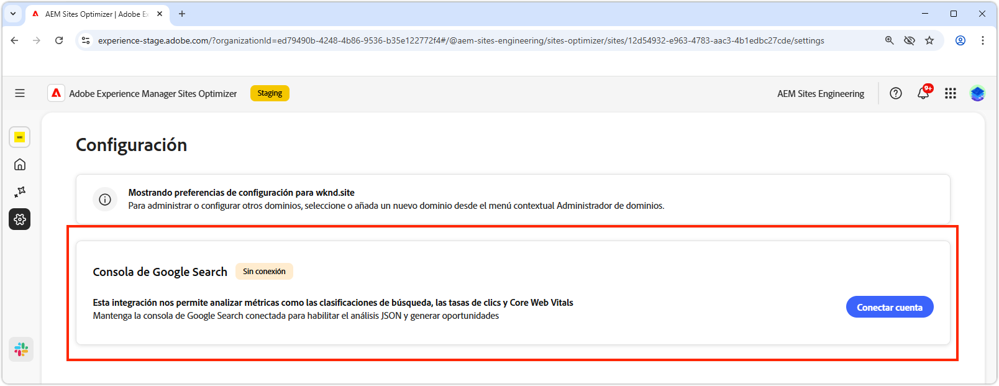

# Configuración de Sites Optimizer

{align="center"}

La configuración de Site Optimizer es el sistema centralizado para configurar la experiencia de Sites Optimizer.

## Consola de Google Search

{align="center"}

El conector de configuración de Google Search Console en AEM Sites Optimizer permite el análisis de métricas clave de SEO, como clasificaciones de búsqueda, tasas de pulsaciones y elementos vitales web principales. Al mantener Google Search Console conectada, puede aprovechar el análisis JSON para descubrir oportunidades de optimización y mejorar el rendimiento del sitio.

Para configurar este conector, debe tener credenciales con acceso administrativo a la consola de búsqueda de Google para el dominio.
