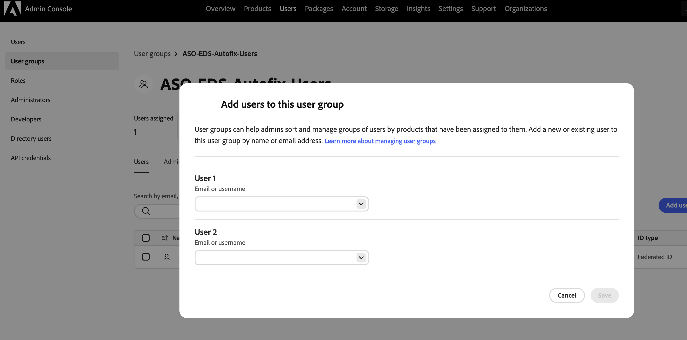

# Versión de prueba de Sites Optimizer

Empiece a usar Sites Optimizer con esta versión de prueba para los clientes existentes de **AEM Sites (Edge Delivery Services, Cloud Services y Managed Services)**. Los datos de dominio ya están previamente incorporados, por lo que puede empezar a optimizar de inmediato. El siguiente vídeo le guía a través de la experiencia de la versión de prueba y le muestra cómo empezar.

>[!IMPORTANT]
>
>Antes de empezar, asegúrese de que su sitio cumple estos requisitos:
>
>* Se basa en AEM Sites (Edge Delivery Services, Cloud Service o Managed Services).
>* Es un sitio de producción, no de desarrollo, control de calidad, ensayo, creación o vista previa del entorno.
>* Es de acceso público y no está detrás de un inicio de sesión.
>* Utiliza la entrega de front-end de AEM Sites. Actualmente no se admite la entrega sin encabezado.

>[!VIDEO](https://video.tv.adobe.com/v/3483253/?learn=on&enablevpops)

>[!TIP]
>
> Póngase en contacto con [siteoptimizer-now@adobe.com](mailto:siteoptimizer-now@adobe.com) si tiene preguntas o solicitudes.

## Empiece su versión de prueba ahora mismo.

Siga estos pasos para empezar a usar la versión de prueba:

1. Inicie sesión con su ID de organización de IMS de AEM Sites en [www.sitesoptimizer.live](http://www.sitesoptimizer.live/).
2. Vea las métricas clave como las vistas de página, el tiempo de carga y la tasa de participación, junto con las principales oportunidades de optimización clasificadas por orden de prioridad en función del impacto.
3. Explore los tres tipos de oportunidades disponibles: [vínculos secundarios rotos](./opportunities/broken-backlinks.md), [Core Web Vitals](./opportunities/core-web-vitals.md) y [falta texto alternativo](./opportunities/missing-alt-text.md).
4. Para cada oportunidad, revise hasta tres problemas identificados. Utilice sugerencias generadas por IA e implemente optimizaciones directamente en su entorno de AEM cuando esté listo.
5. Aproveche más oportunidades actualizando a la licencia completa en cualquier momento.

## Qué incluye la versión de prueba

En la versión de prueba se incluye lo siguiente:

* Tres tipos de oportunidad: [vínculos rotos](./opportunities/broken-backlinks.md), [Core Web Vitals](./opportunities/core-web-vitals.md) y [falta texto alternativo](./opportunities/missing-alt-text.md).
* Hasta tres problemas por oportunidad al mes.
* Flujo de trabajo completo por problema: identificación automática, sugerencia automática y optimización automática.
  * **Identificación automática**: detecta problemas en el sitio utilizando varias fuentes de datos.
  * **Sugerencia automática**: proporciona recomendaciones prescriptivas generadas por IA para cada problema.
  * **Optimización automática**: después de la aprobación, implemente correcciones directamente en el entorno de creación. Las actualizaciones siguen sus flujos de trabajo existentes, lo que permite que su equipo revise y publique a través de AEM.

## Permitir que Sites Optimizer acceda al sitio

Sites Optimizer analiza el sitio para identificar oportunidades de optimización. Si el sitio se encuentra detrás de un firewall, una red de distribución de contenido (CDN) u otra configuración de seguridad que bloquee clientes no reconocidos, el analizador no podrá llegar a las páginas. Cuando esto sucede, la incorporación muestra un mensaje de **Acción necesaria** que indica que Sites Optimizer no puede acceder al sitio web y el análisis se detiene hasta que se permite el acceso.

{align="center"}

Para permitir el acceso al analizador, realice la lista de permitidos de lo siguiente en la configuración del cortafuegos, del proveedor de alojamiento o de la seguridad. Para los sitios de AEM Cloud Service, agregue una regla de permiso para el analizador a las [reglas de filtro de tráfico de CDN](https://experienceleague.adobe.com/es/docs/experience-manager-cloud-service/content/security/traffic-filter-rules-including-waf) en Cloud Manager, que pueden coincidir tanto en la dirección del agente de usuario como en la dirección IP. Si restringe el acceso mediante [listas de permitidos IP de Cloud Manager](https://experienceleague.adobe.com/es/docs/experience-manager-cloud-service/content/implementing/using-cloud-manager/ip-allow-lists/introduction), agregue también las direcciones IP del analizador a la lista de permitidos aplicada.

* **User-Agent**: el analizador se identifica a sí mismo con un User-Agent que contiene el token `Spacecat/1.0`. Lista de permitidos este token, idealmente como una coincidencia &quot;contiene&quot;, para que siga funcionando incluso si cambia la cadena completa del agente de usuario.
* **Direcciones IP del escáner**: Lista de permitidos las direcciones IP salientes del escáner.

La pantalla de incorporación muestra las direcciones IP y del agente de usuario exactas a la lista de permitidos, cada una con un botón **Copiar**, para que pueda copiar los valores actuales directamente en la configuración.

Después de lista de permitidos el escáner, seleccione **Actualizar** en la pantalla de incorporación. Una vez concedido el acceso, el análisis se reanuda automáticamente y muestra las oportunidades de optimización.

>[!NOTE]
>
>Estas direcciones IP solo se utilizan para analizar el sitio. La inclusión en la lista de permitidos no concede ningún otro acceso.

## Habilitar la corrección automática para sitios de prueba de Edge Delivery

Descubra cómo los clientes de prueba habilitan la acción **Implementar para crear** para sugerencias de corrección automática en sitios de Edge Delivery Services (EDS) creados en Google Drive o SharePoint.

>[!NOTE]
>
>Este requisito solo se aplica a las organizaciones de prueba cuyos sitios se hayan creado en Google Drive o SharePoint. Los clientes de pago y los sitios creados en Crosswalk o Dark Alley no se ven afectados.

Los clientes de prueba deben formar parte del grupo de IMS **ASO-EDS-Autofix-Users**. Si el grupo no existe, el administrador de su organización puede crearlo y agregarle.

1. Inicie sesión en [Adobe Admin Console](https://adminconsole.adobe.com/).
1. Seleccione **Usuarios** > **Grupos de usuarios**.
1. Seleccione **Agregar grupo de usuarios**.
1. Para **nombre de grupo de usuarios**, escriba exactamente:

   ```
   ASO-EDS-Autofix-Users
   ```

   >[!IMPORTANT]
   >
   > El nombre del grupo debe coincidir exactamente, incluyendo mayúsculas. Coincide con la distinción entre mayúsculas y minúsculas, por lo que no funciona un formato de mayúsculas y minúsculas diferente (por ejemplo, `ASO-EDS-Autofix-users`). No cambie el nombre del grupo después de crearlo.

1. Seleccione **Guardar**.

   {align="center"}

1. Abra el nuevo grupo y seleccione **Agregar usuarios**.
1. Escriba la dirección de correo electrónico o el nombre de usuario de cada persona que pueda implementar las correcciones automáticas y, a continuación, seleccione **Guardar**.

   {align="center"}

Si es miembro del grupo, el botón **Implementar en autor** está habilitado. Si todavía no eres miembro, **Implementar en autor** se deshabilitará con información sobre herramientas que te pedirá que te pongas en contacto con el administrador para agregarte al grupo. Cuando el administrador le añada al grupo, cierre la sesión y vuelva a iniciarla en Sites Optimizer para que su sesión recoja la nueva pertenencia al grupo.

## Preguntas frecuentes

Lea lo siguiente para obtener respuestas a las preguntas frecuentes sobre la versión de prueba de AEM Sites Optimizer.

+++¿Qué es AEM Sites Optimizer?

[AEM Sites Optimizer](/help/home.md) es una aplicación basada en la inteligencia artificial que identifica problemas en el sitio web, ofrece recomendaciones prescriptivas y le ayuda a solucionar dichos problemas para aumentar la adquisición de tráfico, la participación y la conversión.

+++
+++¿Quién puede participar en esta versión de prueba?

Los clientes de AEM Sites existentes (Edge Delivery Services, Cloud Services y Managed Services).

+++
+++¿Cómo puedo acceder a la versión de prueba?

Vaya a [www.sitesoptimizer.live](http://www.sitesoptimizer.live/) e inicie sesión con su identificador de organización de IMS de AEM Sites.

+++
+++¿La versión de prueba tiene algún coste?

No. Esta versión de prueba está disponible sin coste alguno para los clientes de AEM Sites existentes.

+++
+++¿Hay alguna fecha de caducidad?

No. La versión de prueba no tiene una duración determinada. Su uso está limitado por el número de tipos de oportunidades y de problemas disponibles.
+++
+++¿Qué ocurre cuando se han solucionado todos los problemas?

Sites Optimizer identifica continuamente los problemas que afectan al rendimiento. En la versión de prueba gratuita, los problemas solo se añaden mensualmente. Actualice para una auditoría y optimización continuas.

+++
+++¿Cómo puedo acceder a más oportunidades?

Use la actualización o póngase en contacto con las CTA (llamadas a la acción) de ventas disponibles a través de la experiencia del producto o envíe un correo electrónico a [siteoptimizer-now@adobe.com](mailto:siteoptimizer-now@adobe.com).

+++
+++Estoy en el grupo ASO-EDS-Autofix-Users, pero la opción Implementar en autor sigue deshabilitada. ¿Qué debería comprobar?

Cerrar sesión y volver a iniciarla: la pertenencia a un grupo se lee al iniciar sesión. Confirme también que el nombre del grupo está escrito y escrito exactamente `ASO-EDS-Autofix-Users` con mayúsculas y que se creó en la misma organización a la que pertenece el sitio.

+++
+++¿Se aplica el requisito del grupo ASO-EDS-Autofix-Users a todos los sitios de Edge Delivery Services?

No. Solo se aplica a los sitios de prueba creados en **Google Drive** o **SharePoint**. Los sitios creados en **Crosswalk** o **Dark Alley**, y todos los sitios **pagados**, no se ven afectados.

+++
+++Sites Optimizer dice que no puede acceder a mi sitio. ¿Qué debo hacer?

Es probable que el sitio esté detrás de una configuración de firewall, CDN o seguridad que bloquee el analizador. Lista de permitidos el agente de usuario del analizador (el token `Spacecat/1.0`) y las direcciones IP en su configuración de seguridad o, para los sitios de AEM Cloud Service, en las listas de permitidos de CDN de Cloud Manager. Luego selecciona **Actualizar**. Ver [Permitir que Sites Optimizer acceda a tu sitio](#allow-sites-optimizer-to-access-your-site).

+++

<!--
CARDS
* ./opportunities/core-web-vitals.md
  {title=Core web vitals}
  {image=../assets/common/card-performance.png}
* ./opportunities/missing-alt-text.md
  {title=Missing alt text}
  {image=../assets/common/card-arrows.png}
* ./opportunities/broken-backlinks.md
  {title=Broken backlinks}
  {image=../assets/common/card-arrows.png}
-->

<!-- START CARDS HTML - DO NOT MODIFY BY HAND -->
<div class="columns">
    <div class="column is-half-tablet is-half-desktop is-one-third-widescreen" aria-label="Core web vitals">
        <div class="card" style="height: 100%; display: flex; flex-direction: column; height: 100%;">
            <div class="card-image">
                <figure class="image x-is-16by9">
                    <a href="./opportunities/core-web-vitals.md" title="Core Web Vitals" target="_blank" rel="referrer">
                        
                    </a>
                </figure>
            </div>
            <div class="card-content is-padded-small" style="display: flex; flex-direction: column; flex-grow: 1; justify-content: space-between;">
                <div class="top-card-content">
                    <p class="headline is-size-6 has-text-weight-bold">
                        <a href="./opportunities/core-web-vitals.md" target="_blank" rel="referrer" title="Core Web Vitals">Core Web Vitals</a>
                    </p>
                    <p class="is-size-6">Obtenga información sobre la oportunidad de Core Web Vitals y cómo utilizarla para mejorar la adquisición de tráfico.</p>
                </div>
                <a href="./opportunities/core-web-vitals.md" target="_blank" rel="referrer" class="spectrum-Button spectrum-Button--outline spectrum-Button--primary spectrum-Button--sizeM" style="align-self: flex-start; margin-top: 1rem;">
                   <span class="spectrum-Button-label has-no-wrap has-text-weight-bold">Más información</span>
                </a>
            </div>
        </div>
    </div>
    <div class="column is-half-tablet is-half-desktop is-one-third-widescreen" aria-label="Missing alt text">
        <div class="card" style="height: 100%; display: flex; flex-direction: column; height: 100%;">
            <div class="card-image">
                <figure class="image x-is-16by9">
                    <a href="./opportunities/missing-alt-text.md" title="Texto alternativo que falta" target="_blank" rel="referrer">
                        
                    </a>
                </figure>
            </div>
            <div class="card-content is-padded-small" style="display: flex; flex-direction: column; flex-grow: 1; justify-content: space-between;">
                <div class="top-card-content">
                    <p class="headline is-size-6 has-text-weight-bold">
                        <a href="./opportunities/missing-alt-text.md" target="_blank" rel="referrer" title="Texto alternativo que falta">Texto alternativo que falta</a>
                    </p>
                    <p class="is-size-6">Obtenga información sobre la oportunidad de texto alternativo que falta y cómo utilizarla para mejorar la participación en el sitio web.</p>
                </div>
                <a href="./opportunities/missing-alt-text.md" target="_blank" rel="referrer" class="spectrum-Button spectrum-Button--outline spectrum-Button--primary spectrum-Button--sizeM" style="align-self: flex-start; margin-top: 1rem;">
                   <span class="spectrum-Button-label has-no-wrap has-text-weight-bold">Más información</span>
                </a>
            </div>
        </div>
    </div>
    <div class="column is-half-tablet is-half-desktop is-one-third-widescreen" aria-label="Broken backlinks">
        <div class="card" style="height: 100%; display: flex; flex-direction: column; height: 100%;">
            <div class="card-image">
                <figure class="image x-is-16by9">
                    <a href="./opportunities/broken-backlinks.md" title="Vínculos de retroceso rotos" target="_blank" rel="referrer">
                        
                    </a>
                </figure>
            </div>
            <div class="card-content is-padded-small" style="display: flex; flex-direction: column; flex-grow: 1; justify-content: space-between;">
                <div class="top-card-content">
                    <p class="headline is-size-6 has-text-weight-bold">
                        <a href="./opportunities/broken-backlinks.md" target="_blank" rel="referrer" title="Vínculos de retroceso rotos">Vínculos de retroceso rotos</a>
                    </p>
                    <p class="is-size-6">Obtenga información sobre la oportunidad de vínculos de retroceso rotos y cómo utilizarla para mejorar la adquisición de tráfico.</p>
                </div>
                <a href="./opportunities/broken-backlinks.md" target="_blank" rel="referrer" class="spectrum-Button spectrum-Button--outline spectrum-Button--primary spectrum-Button--sizeM" style="align-self: flex-start; margin-top: 1rem;">
                   <span class="spectrum-Button-label has-no-wrap has-text-weight-bold">Más información</span>
                </a>
            </div>
        </div>
    </div>
</div>
<!-- END CARDS HTML - DO NOT MODIFY BY HAND -->
