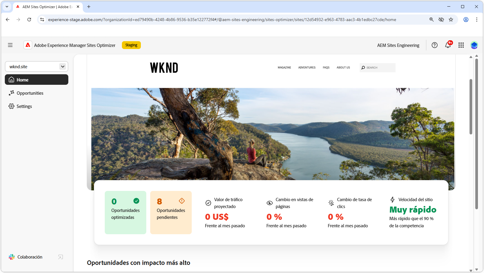

# AEM Sites Optimizer

>[!VIDEO](https://video.tv.adobe.com/v/3455088/?learn=on&enablevpops&captions=spa)

Adobe Experience Manager (AEM) Sites Optimizer es un servicio basado en la nube que analiza y mejora el rendimiento de los sitios web creados en AEM. Sites Optimizer identifica las áreas para mejorar la carga de página, el uso de componentes y la entrega de contenido. Esta funcionalidad ayuda a mejorar el rendimiento del sitio web, a la vez que reduce los costes de mantenimiento y actualización. Gracias a Sites Optimizer, puede garantizar una experiencia en línea fluida y fiable, lo que es importante para mantener la participación y las conversiones.

## Introducción a Sites Optimizer

<!-- CARDS 

* ./opportunity-types/overview.md
   {title=Opportunity types}
   {description = Learn about the available Site Optimizer opportunities and how to use them to improve your site's performance.}
* ./documentation/overview.md
  * {title=Documentation}
  * {description=Explore the Sites Optimizer documentation to learn about all its capabilities.}

-->
<!-- START CARDS HTML - DO NOT MODIFY BY HAND -->

    

        

            

                <figure class="image x-is-16by9">
                    
                </figure>
            

            

                

                    

                        <a href="./opportunity-types/overview.md" target="_blank" rel="referrer" title="Tipos de oportunidades">Tipos de oportunidades</a>
                    

                    
Obtenga información sobre las oportunidades disponibles de Site Optimizer y cómo utilizarlas para mejorar el rendimiento del sitio.

                

                <a href="./opportunity-types/overview.md" target="_blank" rel="referrer" class="spectrum-Button spectrum-Button--outline spectrum-Button--primary spectrum-Button--sizeM" style="align-self: flex-start; margin-top: 1rem;">
                    Más información
                </a>
            

        

    

    

        

            

                <figure class="image x-is-16by9">
                    
                </figure>
            

            

                

                    

                        <a href="./documentation/overview.md" target="_blank" rel="referrer" title="Documentación">Documentación</a>
                    

                    
Explore la documentación de Sites Optimizer para conocer todas sus funcionalidades.

                

                <a href="./documentation/overview.md" target="_blank" rel="referrer" class="spectrum-Button spectrum-Button--outline spectrum-Button--primary spectrum-Button--sizeM" style="align-self: flex-start; margin-top: 1rem;">
                    Más información
                </a>
            

        

    

<!-- END CARDS HTML - DO NOT MODIFY BY HAND -->

## Más información sobre Sites Optimizer

<!-- CARDS 
    * https://helpx.adobe.com/es/legal/product-descriptions/adobe-experience-manager-sites-optimizer.html
        {title=Packages and licensing}
        {description=Learn about AEM Sites Optimizer packages and licensing.}
        {image=https://business.adobe.com/products/experience-manager/sites/media_17296346c44dba1976d5fbac060205b5ec7df0164.png?width=2000&format=webply&optimize=medium}
        {cta=Learn more}
    * https://business.adobe.com/products/experience-manager/sites/optimizer.html
        {title=Explore the capabilities of AEM Sites Optimizer}
        {description=Learn what AEM Site Optimizer can do for your company.}
        {target=_blank}
        {cta=Learn more}
-->
<!-- START CARDS HTML - DO NOT MODIFY BY HAND -->

    

        

            

                <figure class="image x-is-16by9">
                    
                </figure>
            

            

                

                    

                        <a href="https://helpx.adobe.com/es/legal/product-descriptions/adobe-experience-manager-sites-optimizer.html" target="_blank" rel="referrer" title="Explore las funcionalidades de AEM Sites Optimizer">Explorar las capacidades de AEM Sites Optimizer</a>
                    

                    
Descubra lo que AEM Site Optimizer puede hacer por su compañía.

                

                <a href="https://helpx.adobe.com/es/legal/product-descriptions/adobe-experience-manager-sites-optimizer.html" target="_blank" rel="referrer" class="spectrum-Button spectrum-Button--outline spectrum-Button--primary spectrum-Button--sizeM" style="align-self: flex-start; margin-top: 1rem;">
                    Más información
                </a>
            

        

    

    

        

            

                <figure class="image x-is-16by9">
                    
                </figure>
            

            

                

                    

                        <a href="https://business.adobe.com/products/experience-manager/sites/optimizer.html" target="_blank" rel="referrer" title="Explore las funcionalidades de AEM Sites Optimizer">Explorar las capacidades de AEM Sites Optimizer</a>
                    

                    
Descubra lo que AEM Site Optimizer puede hacer por su compañía.

                

                <a href="https://business.adobe.com/products/experience-manager/sites/optimizer.html" target="_blank" rel="referrer" class="spectrum-Button spectrum-Button--outline spectrum-Button--primary spectrum-Button--sizeM" style="align-self: flex-start; margin-top: 1rem;">
                    Más información
                </a>
            

        

    

<!-- END CARDS HTML - DO NOT MODIFY BY HAND -->
