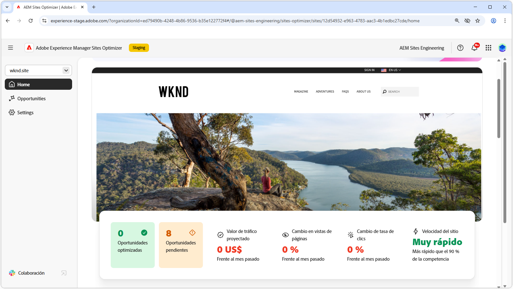

# AEM Sites Optimizer

{align="center"}

Adobe Experience Manager (AEM) Sites Optimizer es un servicio basado en la nube que analiza y mejora el rendimiento de los sitios web creados en AEM. Identifica las áreas en las que se puede mejorar la carga de páginas, el uso de componentes y la entrega de contenido, lo que le ayuda a mejorar el rendimiento del sitio web y a reducir los costes de mantenimiento y actualización. Al utilizar Sites Optimizer, puede garantizar una experiencia en línea fluida y fiable, lo que es importante para mantener la participación y las conversiones.

## Introducción a Sites Optimizer

<!-- CARDS 

* ./opportunity-types/overview.md
   {title=Opportunity types}
   {description = Learn about the available Site Optimizer opportunities and how to use them to improve your site's performance.}
* ./documentation/overview.md
  * {title=Documentation}
  * {description=Explore the Sites Optimizer documentation to learn about all its capabilities.}

-->
<!-- START CARDS HTML - DO NOT MODIFY BY HAND -->

    

        

            

                <figure class="image x-is-16by9">
                    
                </figure>
            

            

                

                    

                        <a href="./opportunity-types/overview.md" target="_blank" rel="referrer" title="Tipos de oportunidad">Tipos de oportunidad</a>
                    

                    
Obtenga información sobre las oportunidades disponibles de Site Optimizer y cómo utilizarlas para mejorar el rendimiento del sitio.

                

                <a href="./opportunity-types/overview.md" target="_blank" rel="referrer" class="spectrum-Button spectrum-Button--outline spectrum-Button--primary spectrum-Button--sizeM" style="align-self: flex-start; margin-top: 1rem;">
                    Más información
                </a>
            

        

    

    

        

            

                <figure class="image x-is-16by9">
                    
                </figure>
            

            

                

                    

                        <a href="./documentation/overview.md" target="_blank" rel="referrer" title="Documentación">Documentación</a>
                    

                    
Explore la documentación de Sites Optimizer para conocer todas sus funcionalidades.

                

                <a href="./documentation/overview.md" target="_blank" rel="referrer" class="spectrum-Button spectrum-Button--outline spectrum-Button--primary spectrum-Button--sizeM" style="align-self: flex-start; margin-top: 1rem;">
                    Más información
                </a>
            

        

    

<!-- END CARDS HTML - DO NOT MODIFY BY HAND -->
