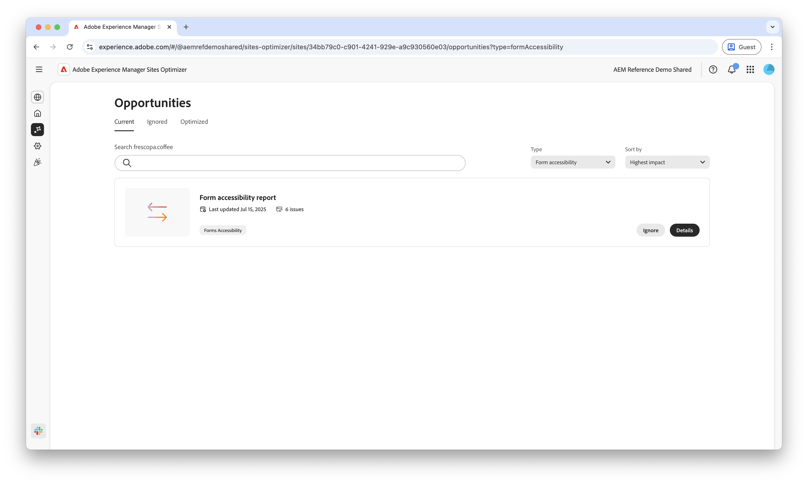

# Oportunidades de accesibilidad de Forms

: la funcionalidad Optimización de Forms está disponible en un programa de acceso anticipado. Puede escribir a aem-forms-ea@adobe.com desde su ID de correo electrónico oficial para unirse al programa de acceso anticipado y solicitar acceso a esta funcionalidad. 

{align="center"}

Las oportunidades de accesibilidad de formularios son esenciales para mejorar las interacciones de los usuarios y aumentar las conversiones. La evaluación del cumplimiento de las directrices de accesibilidad del contenido web (WCAG) en los formularios ayuda a garantizar una experiencia inclusiva para los usuarios con deficiencias visuales, auditivas, cognitivas y motoras. Esta funcionalidad no solo cumple con los requisitos éticos y legales, sino que también mejora las tasas de finalización de formularios y amplía la audiencia, lo que resulta en una mejor experiencia del usuario y resultados comerciales más sólidos.

## Oportunidades

<!-- CARDS
 
* ../documentation/opportunities/low-views.md
  {title=Low views}
  {image=../assets/common/card-bag.png}
* ../documentation/opportunities/low-conversions.md
  {title=Low conversions}
  {image=../assets/common/card-bag.png}

--->
<!-- START CARDS HTML - DO NOT MODIFY BY HAND -->

    

        

            

                <figure class="image x-is-16by9">
                    
                </figure>
            

            

                

                    

                        <a href="../documentation/opportunities/forms-accessibility-issues.md" target="_blank" rel="referrer" title="Problemas de accesibilidad de formularios">Problemas de accesibilidad de formularios</a>
                    

                    
Obtenga información sobre los problemas de accesibilidad de los formularios y cómo utilizarlos para mejorar la participación de los formularios en su sitio web.

                

                <a href="../documentation/opportunities/forms-accessibility-issues.md" target="_blank" rel="referrer" class="spectrum-Button spectrum-Button--outline spectrum-Button--primary spectrum-Button--sizeM" style="align-self: flex-start; margin-top: 1rem;">
                    Más información
                </a>
            

        

    

<!-- END CARDS HTML - DO NOT MODIFY BY HAND -->
