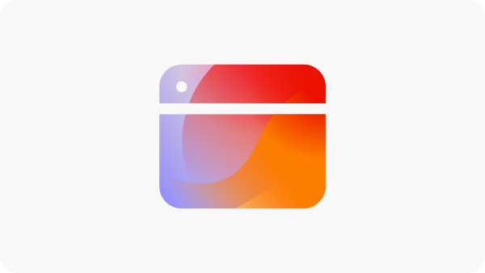

# Oportunidades de optimización de formularios

 La capacidad de optimización de formularios está disponible en el programa de acceso anticipado. Puede escribir a aem-forms-ea@adobe.com desde su ID de correo electrónico oficial para unirse al programa de acceso anticipado y solicitar acceso a esta funcionalidad. 

<!-- [!VIDEO](https://video.tv.adobe.com/v/3469472/) -->

{align="center"}

Las oportunidades de optimización de formularios permiten a las organizaciones mejorar sistemáticamente las interacciones de los usuarios y aumentar las conversiones de los formularios. Al detectar problemas como vistas bajas, conversiones bajas y tasas de navegación bajas, los equipos pueden realizar ajustes basados en datos en el diseño, la ubicación y el contenido del formulario. Estas optimizaciones ayudan a optimizar la experiencia del usuario, lo que facilita a los visitantes la cumplimentación de formularios y la obtención de los resultados deseados. El uso de la información de optimización de formularios permite identificar y resolver de forma continua las lagunas de rendimiento, lo que da como resultado formularios más eficaces y mejores resultados empresariales.

## Oportunidades

<!-- CARDS
 
* ../documentation/opportunities/low-views.md
  {title=Low views}
  {image=../assets/common/card-bag.png}
* ../documentation/opportunities/low-conversions.md
  {title=Low conversions}
  {image=../assets/common/card-bag.png}

--->
<!-- START CARDS HTML - DO NOT MODIFY BY HAND -->

    

        

            

                <figure class="image x-is-16by9">
                    
                </figure>
            

            

                

                    

                        <a href="../documentation/opportunities/low-views.md" target="_blank" rel="referrer" title="Visualizaciones bajas">Visualizaciones bajas</a>
                    

                    
Obtenga información sobre la oportunidad de visualizaciones bajas y cómo utilizarla para mejorar la participación de los formularios en su sitio web.

                

                <a href="../documentation/opportunities/low-views.md" target="_blank" rel="referrer" class="spectrum-Button spectrum-Button--outline spectrum-Button--primary spectrum-Button--sizeM" style="align-self: flex-start; margin-top: 1rem;">
                    Más información
                </a>
            

        

    

    

        

            

                <figure class="image x-is-16by9">
                    
                </figure>
            

            

                

                    

                        <a href="../documentation/opportunities/low-conversions.md" target="_blank" rel="referrer" title="Conversiones bajas">Conversiones bajas</a>
                    

                    
Obtenga información sobre la oportunidad de conversiones bajas y cómo utilizarla para mejorar la participación del formulario en su sitio web.

                

                <a href="../documentation/opportunities/low-conversions.md" target="_blank" rel="referrer" class="spectrum-Button spectrum-Button--outline spectrum-Button--primary spectrum-Button--sizeM" style="align-self: flex-start; margin-top: 1rem;">
                    Más información
                </a>
            

        

    

    

        

            

                <figure class="image x-is-16by9">
                    
                </figure>
            

            

                

                    

                        <a href="../documentation/opportunities/low-navigation.md" target="_blank" rel="referrer" title="Problemas de accesibilidad">Navegación baja</a>
                    

                    
Obtenga información sobre la oportunidad de visualizaciones bajas y cómo utilizarla para mejorar la participación de los formularios en su sitio web.

                

                <a href="../documentation/opportunities/low-navigation.md" target="_blank" rel="referrer" class="spectrum-Button spectrum-Button--outline spectrum-Button--primary spectrum-Button--sizeM" style="align-self: flex-start; margin-top: 1rem;">
                    Más información
                </a>
            

        

    

<!-- END CARDS HTML - DO NOT MODIFY BY HAND -->
