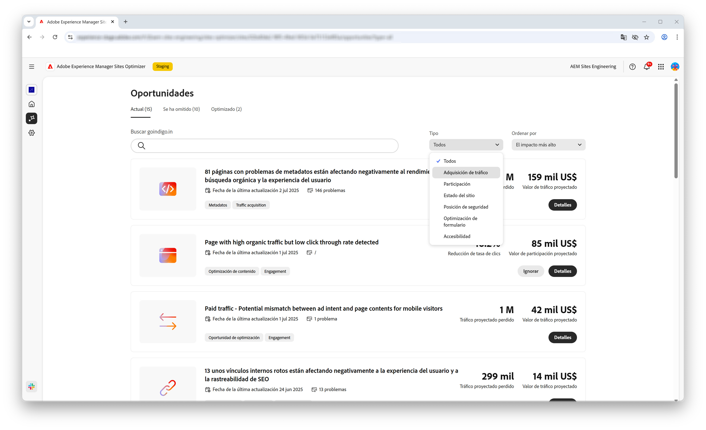
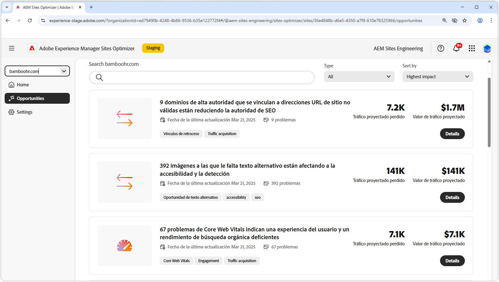
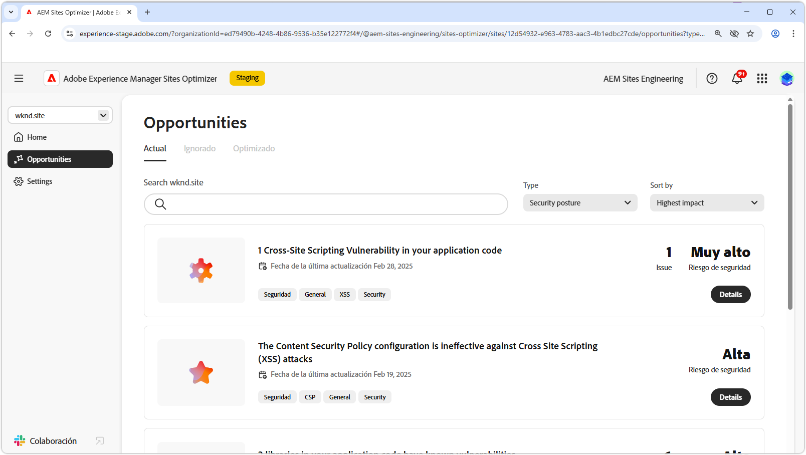
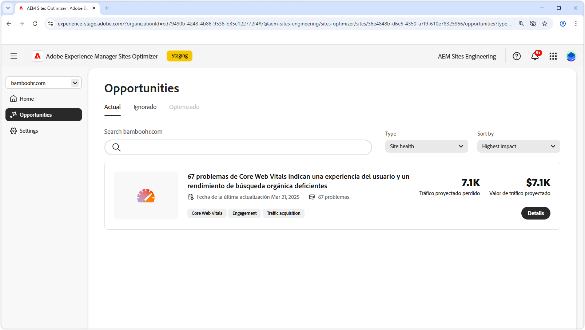
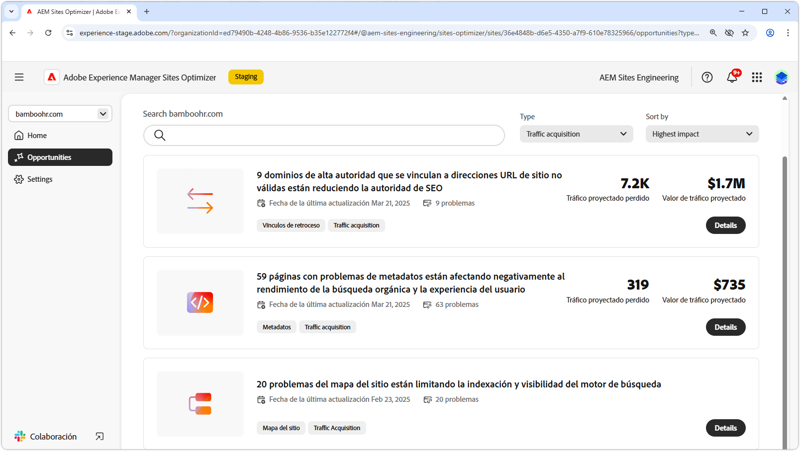
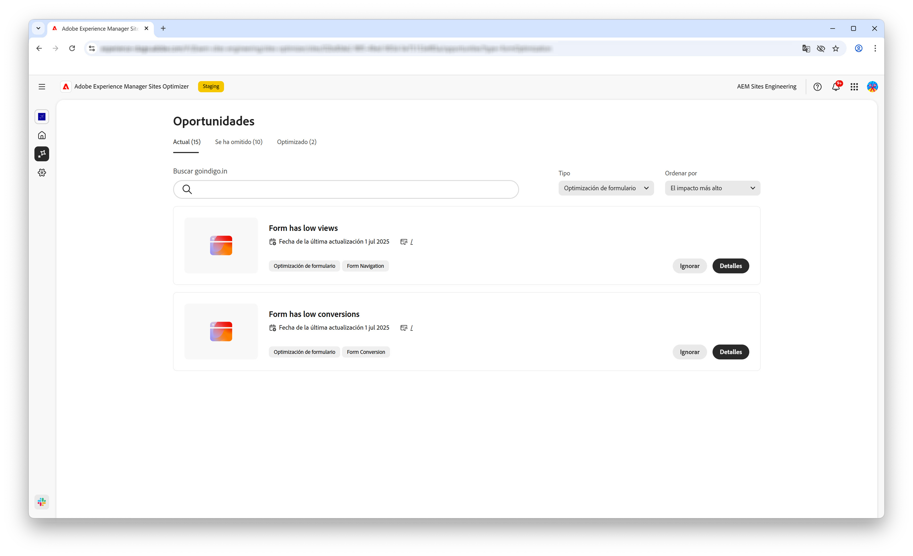

# Tipos de oportunidades

{align="center"}

AEM Sites Optimizer proporciona información y recomendaciones valiosas para ayudarle a mejorar el rendimiento, la facilidad de uso y la seguridad de su sitio web. Esta información se agrupa en las siguientes áreas de oportunidad clave:

* Participación
* Adquisición de tráfico
* Posición de seguridad
* Estado del sitio
* Preflight

Cada categoría resalta una manera diferente de mejorar el sitio. Una categoría puede aumentar la interacción del visitante. Otra puede mejorar la capacidad de detección. Otras se centran en reforzar la seguridad o en mantener la estabilidad del sitio. Preflight le ayuda a analizar y optimizar las páginas antes de publicarlas.

Aprovechar estas oportunidades mejora la experiencia del usuario, atrae al público adecuado y mantiene el sitio seguro y fiable. La mejora de la participación y la adquisición de tráfico fomenta la interacción y la visibilidad, mientras que una posición de seguridad sólida y el estado saludable del sitio ayudan a garantizar la confianza y la estabilidad. El análisis de comprobaciones garantiza que el contenido esté optimizado antes de publicarse. Explore los vínculos siguientes para ver las oportunidades organizadas por categoría y descubrir formas de mejorar el sitio.

## Tipos de oportunidades

<!-- CARDS 

* ./engagement.md
   { title = Engagement }
* ./security-posture.md
   { title = Security posture }
* ./site-health.md
   { title = Site health }
* ./traffic-acquisition.md
   { title = Traffic acquisition }
* ./form-optimization.md
   { title = Forms Optimization }
* ./preflight.md
   { title = Preflight }

-->
<!-- START CARDS HTML - DO NOT MODIFY BY HAND -->

    

        

            

                <figure class="image x-is-16by9">
                    
                </figure>
            

            

                

                    

                        <a href="./engagement.md" target="_blank" rel="referrer" title="Participación">Participación</a>
                    

                    
Obtenga información sobre cómo mejorar la participación con Sites Optimizer.

                

                <a href="./engagement.md" target="_blank" rel="referrer" class="spectrum-Button spectrum-Button--outline spectrum-Button--primary spectrum-Button--sizeM" style="align-self: flex-start; margin-top: 1rem;">
                    Más información
                </a>
            

        

    

    

        

            

                <figure class="image x-is-16by9">
                    
                </figure>
            

            

                

                    

                        <a href="./security-posture.md" target="_blank" rel="referrer" title="Posición de seguridad">Posición de seguridad</a>
                    

                    
Obtenga información sobre cómo mejorar la seguridad de su sitio con Sites Optimizer.

                

                <a href="./security-posture.md" target="_blank" rel="referrer" class="spectrum-Button spectrum-Button--outline spectrum-Button--primary spectrum-Button--sizeM" style="align-self: flex-start; margin-top: 1rem;">
                    Más información
                </a>
            

        

    

    

        

            

                <figure class="image x-is-16by9">
                    
                </figure>
            

            

                

                    

                        <a href="./site-health.md" target="_blank" rel="referrer" title="Estado del sitio">Estado del sitio</a>
                    

                    
Obtenga información sobre cómo mejorar el estado del sitio con Sites Optimizer.

                

                <a href="./site-health.md" target="_blank" rel="referrer" class="spectrum-Button spectrum-Button--outline spectrum-Button--primary spectrum-Button--sizeM" style="align-self: flex-start; margin-top: 1rem;">
                    Más información
                </a>
            

        

    

    

        

            

                <figure class="image x-is-16by9">
                    
                </figure>
            

            

                

                    

                        <a href="./traffic-acquisition.md" target="_blank" rel="referrer" title="Adquisición de tráfico">Adquisición de tráfico</a>
                    

                    
Obtenga información sobre cómo aumentar la adquisición de tráfico con Sites Optimizer.

                

                <a href="./traffic-acquisition.md" target="_blank" rel="referrer" class="spectrum-Button spectrum-Button--outline spectrum-Button--primary spectrum-Button--sizeM" style="align-self: flex-start; margin-top: 1rem;">
                    Más información
                </a>
            

        

    

    

        

            

                <figure class="image x-is-16by9">
                    
                </figure>
            

            

                

                    

                        <a href="./form-optimization.md" target="_blank" rel="referrer" title="Optimización de formularios">Optimización de formularios</a>
                    

                    
Obtenga información sobre cómo mejorar la conversión de formularios con la optimización de formularios.

                

                <a href="./form-optimization.md" target="_blank" rel="referrer" class="spectrum-Button spectrum-Button--outline spectrum-Button--primary spectrum-Button--sizeM" style="align-self: flex-start; margin-top: 1rem;">
                    Más información
                </a>
            

        

    

    

        

            

                <figure class="image x-is-16by9">
                    
                </figure>
            

            

                

                    

                        <a href="./form-optimization.md" target="_blank" rel="referrer" title="Accesibilidad a formularios">Accesibilidad de formularios</a>
                    

                    
Obtenga información sobre cómo mejorar la accesibilidad de los formularios con la optimización de formularios.

                

                <a href="./form-optimization.md" target="_blank" rel="referrer" class="spectrum-Button spectrum-Button--outline spectrum-Button--primary spectrum-Button--sizeM" style="align-self: flex-start; margin-top: 1rem;">
                    Más información
                </a>
            

        

    

    

        

            

                <figure class="image x-is-16by9">
                    
                </figure>
            

            

                

                    

                        <a href="./preflight.md" target="_blank" rel="referrer" title="Preflight">Preflight</a>
                    

                    
Obtenga información acerca del análisis de preflight y cómo configurar oportunidades de preflight en Sites Optimizer.

                

                <a href="./preflight.md" target="_blank" rel="referrer" class="spectrum-Button spectrum-Button--outline spectrum-Button--primary spectrum-Button--sizeM" style="align-self: flex-start; margin-top: 1rem;">
                    Más información
                </a>
            

        

    

     

<!-- END CARDS HTML - DO NOT MODIFY BY HAND -->

 Las funcionalidades de optimización de Forms y accesibilidad de Forms están disponibles en el programa de acceso anticipado. Puede escribir a aem-forms-ea@adobe.com desde su ID de correo electrónico oficial para unirse al programa de acceso anticipado y solicitar acceso a esta funcionalidad. 
