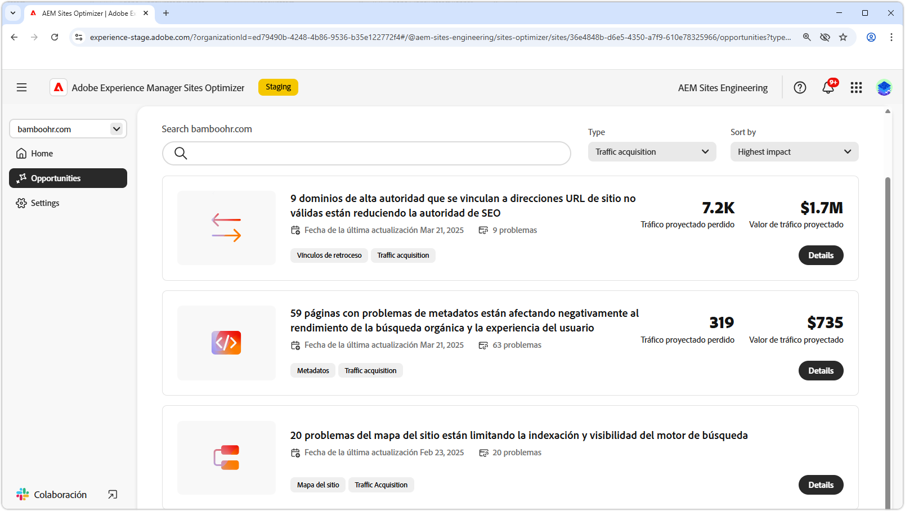

# Oportunidades de adquisición de tráfico

{align="center"}

La adquisición de tráfico es esencial para atraer clientes potenciales a su sitio web y crear oportunidades para las ventas o la generación de posibles clientes. Al aprovechar estrategias como la optimización de los motores de búsqueda (SEO), las empresas pueden mejorar la visibilidad de la búsqueda y facilitar a los usuarios el descubrimiento de su contenido. Un flujo continuo de visitantes no solo aumenta la conciencia y la confianza de la marca, sino que también proporciona una valiosa perspectiva del comportamiento del usuario, lo que ayuda a los equipos a refinar sus ofertas y mejorar la experiencia general. El uso de las perspectivas de AEM Sites Optimizer permite una optimización continua, lo que garantiza un crecimiento sostenido y tasas de conversión mejoradas a lo largo del tiempo.

## Oportunidades

<!-- CARDS
 
* ../documentation/opportunities/broken-backlinks.md
  {title=Broken backlinks}
  {image=../assets/common/card-arrows.png}
* ../documentation/opportunities/invalid-or-missing-metadata.md
  {title=Invalid or missing metadata}
  {image=../assets/common/card-code.png}
* ../documentation/opportunities/missing-invalid-structured-data.md
  {title=Missing or invalid structured data}
  {image=../assets/common/card-bag.png}
* ../documentation/opportunities/sitemap-issues.md
  {title=Sitemap issues}
  {image=../assets/common/card-relationship.png}

--->
<!-- START CARDS HTML - DO NOT MODIFY BY HAND -->

    

        

            

                <figure class="image x-is-16by9">
                    
                </figure>
            

            

                

                    

                        <a href="../documentation/opportunities/broken-backlinks.md" target="_blank" rel="referrer" title="Vínculos de retroceso rotos">Vínculos secundarios rotos</a>
                    

                    
Obtenga información acerca de la oportunidad de vínculos rotos y cómo utilizarla para mejorar la adquisición de tráfico.

                

                <a href="../documentation/opportunities/broken-backlinks.md" target="_blank" rel="referrer" class="spectrum-Button spectrum-Button--outline spectrum-Button--primary spectrum-Button--sizeM" style="align-self: flex-start; margin-top: 1rem;">
                    Más información
                </a>
            

        

    

    

        

            

                <figure class="image x-is-16by9">
                    
                </figure>
            

            

                

                    

                        <a href="../documentation/opportunities/invalid-or-missing-metadata.md" target="_blank" rel="referrer" title="Metadatos que faltan o no son válidos">Faltan metadatos o no son válidos</a>
                    

                    
Obtenga información sobre la oportunidad de metadatos no válida o que falta y cómo utilizarla para mejorar la adquisición de tráfico.

                

                <a href="../documentation/opportunities/invalid-or-missing-metadata.md" target="_blank" rel="referrer" class="spectrum-Button spectrum-Button--outline spectrum-Button--primary spectrum-Button--sizeM" style="align-self: flex-start; margin-top: 1rem;">
                    Más información
                </a>
            

        

    

    

        

            

                <figure class="image x-is-16by9">
                    
                </figure>
            

            

                

                    

                        <a href="../documentation/opportunities/missing-invalid-structured-data.md" target="_blank" rel="referrer" title="Datos estructurados que faltan o no son válidos">Faltan datos estructurados o no son válidos</a>
                    

                    
Obtenga información sobre la oportunidad de datos estructurados que falta o que no es válida y cómo utilizarla para mejorar la adquisición de tráfico.

                

                <a href="../documentation/opportunities/missing-invalid-structured-data.md" target="_blank" rel="referrer" class="spectrum-Button spectrum-Button--outline spectrum-Button--primary spectrum-Button--sizeM" style="align-self: flex-start; margin-top: 1rem;">
                    Más información
                </a>
            

        

    

    

        

            

                <figure class="image x-is-16by9">
                    
                </figure>
            

            

                

                    

                        <a href="../documentation/opportunities/sitemap-issues.md" target="_blank" rel="referrer" title="Problemas del mapa del sitio">Problemas de mapa del sitio</a>
                    

                    
Obtenga información acerca de la oportunidad de problemas de mapa del sitio y cómo utilizarla para mejorar la adquisición de tráfico.

                

                <a href="../documentation/opportunities/sitemap-issues.md" target="_blank" rel="referrer" class="spectrum-Button spectrum-Button--outline spectrum-Button--primary spectrum-Button--sizeM" style="align-self: flex-start; margin-top: 1rem;">
                    Más información
                </a>
            

        

    

<!-- END CARDS HTML - DO NOT MODIFY BY HAND -->
